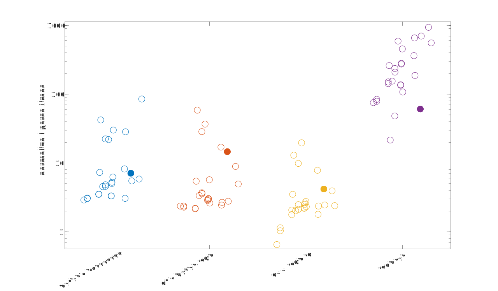

# Turtle JSON Speed #

September 23, 2018 - Status: Incomplete

In a previous article I documented [a JSON parser that I wrote in C for Matlab](../2018_01_Turtle_JSON_Intro).

The previous article focused on techniques I used to make the parser fast, but didn't include any performance information. For those writing performant C code, that post might be interesting, but I realized that many people probably wanted to know how well the parser performs relative to other Matlab JSON parsers.

For now the only test I'm showing is how long it takes to read a JSON structure into Matlab objects. I've included a variety of JSON files that I've found over the web. These files encompass a variety of sizes and types (mostly strings, lots of objects, lots of numbers, etc.).

## The Parsers ##

The benchmark currently includes 5 parsers:

1. [Turtle JSON!](https://github.com/JimHokanson/turtle_json)
2. Matlab's built in parsing - The Matlab parser changed quite a bit from ~2014 - 2016, but was officially released in 2016b in what I assume is a relatively stable version. Note, this may be wrong :/ . For this testing I used 2017a (my mac), and 2017b (Windows).  
3. [JSONLab](https://github.com/fangq/jsonlab) - This appears to be the main JSON parser that people use that is written in Matlab. This is the slowest parsing option but I thought it would be interesting to see how it compares. Also, as positives for this repo, this code supports handling binary JSON and writes Matlab variables to JSON in a way that clarifies the format of the data and data type. These properties can be ambiguous with JSON data, leading to variations in how the data are returned to the user.
4. [C. Panton's Matlab JSON (JSON-C wrapper)](https://github.com/christianpanton/matlab-json)
5. [O. Woodford's C++ JSON IO (nlohmann/json wrapper)](https://www.mathworks.com/matlabcentral/fileexchange/59166-c-json-io)

## The Files ##

The files were found online at various places. They can all [be found here.](https://drive.google.com/open?id=0B7to9gBdZEyGMExwTFA0ZWh1OTA)

Of note:

1. 1.json - This is a relatively well known test file from https://github.com/kostya/benchmarks/tree/master/json
2. XJ30\_NaCl500mM4uL6h\_10m45x10s40s_Ea.json - This is a a file generated for analysis of worm (C. Elegans) movement and was the main motivator for writing this code. I will be referencing it again later on.

## The Test ##

All files were tested using run\_bench.m found at:
https://github.com/JimHokanson/turtle_json_benchmark/

Files were read from disk and parsed into a Matlab structure. For those requiring an input string, rather than a file name, the file was first read into memory and then passed to the parsing function. For the files supporting a file name as input, the file name was passed directly to the parser. In both cases the file was read as part of the timing process.

No verification of the output was done. The parsers all produce slightly different outputs mainly due to the lack of direct translation between JSON and Matlab structures. This comes through in mainly three ways: 1) whether to collapse homogenous arrays or objects; 2) the shape of 1-d arrays (column vs row vectors) and 3) whether unicode is handled or not. The Turtle JSON parser exposes options for how the output should be returned, which can make it behave more like the other parsers (although there are some open issues on this front). From what I can tell the others do not have parsing options (other than 1 option in JSONLab). Thus you're stuck with what they give you and have to try and post-process accordingly.

All files were parsed one at a time by all parsers. This process was repeated 8 times and the smallest of either all 8 timing values or the last 7 timing values was the output variable. For parse times less than 10 ms, the parsing process was repeated 2000 times (within the rep) and the average loop time logged. Parsing times less than 100 ms (but above 10 ms) were parsed 200 times. This was done to try and get better estimates of the parse time for smaller files. Thus for a small file that took less than 5 ms to parse (for example), it would have been parsed 8*2000 times with 8 values logged, all corresponding to the average parse time (not total parse time for the 2000 tries).

It should come as no surprise that JSONLab, a pure Matlab implementation, is the slowest by far. For some files the parse time for this parser was hardcoded at 1 hour (3600 seconds) to reduce test time. My impression is that this is an underestimate but I haven't actually tested it! For reference the current test takes roughly 2-3 hours to run.

## The Results ##

Parse times have been computed in 3 different environments: 

|      Name         |         CPU          | cores |       Memory         |     OS     |  SIMD  |
|:-----------------:|:--------------------:|:-----:|:--------------------:|:----------:|:------:|
| Turtle            | i5-3570 @ 3.4GHz     |   2   |  Dual Chan DDR3 1333 |    Win 7   |   AVX  |  
| Paladin           | i7-4770 @ 3.4GHz     |   4   |  Dual Chan DDR3 1333 |  Win 10    |   AVX2 |
| Jim's Macbook     | m3-6Y30 @ 1.1GHz     |   2   |  Dual Chan DDR3 1866 |  Mac OS    |   AVX2 |

Each dot corresponds to the parse time of a single file normalized to the time it took Turtle JSON to parse the same file. A value of 1 indicates the same execution time. A value less than 1 indicates that the other parser runs faster. A value greater than 1 indicates that the other parser runs slower. For example, a value of 10 indicates that the other parser takes 10x as long to run as Turtle JSON.

The figures also display some variation on the x-axis. The location on the x-axis is log-scaled by how long it took Turtle JSON to parse the file, with the fastest parse times on the left and the slowest parse times on the right. Put another way, values on the left may have only taken a couple of milliseconds to parse, and values to the right might take closer to a second to parse.

Here's the parse time results from my computer named Turtle. Turtle JSON was named after this computer and as my attempt at humor in honor of all the "fast" JSON parser names.

Nearly raw data (rounded to nearest 0.1 ms) are available at [Turtle_Comp_TJ_Bench.csv](Turtle_Comp_TJ_Bench.csv).

Three things should be noted from this figure:

First, in general Turtle JSON is consistently faster than the other parsers. There is only one exception where the C++ JSON IO parser is slightly faster. This is because of my two step parsing method where I return token parsing information back to Matlab using Matlab's memory management.

Second, there is a noticeable trend whereby Turtle JSON is faster, relative to the other parsers, for files that take longer to parse. This can be seen by the trend of the scatter points moving from lower left to upper right. Again, "left" means a small parse time for Turtle JSON and "right" means a longer parse time for Turtle JSON. Back to the C++ JSON IO parser, this indicates that it is only faster for files that take very little time to parse (in this case, less than 1 ms to parse). This type of speed difference can be important if parsing many thousands of files at a time. The internal memory structure of Turtle JSON was recently rewritten (September 2018) to minimize these differences so that the parser is still a good choice across all file sizes.

Third, Turtle JSON is well designed for heavy number parsing. In particular, it is efficient at detecting numbers and then parsing them in parallel. This shows up in our highlighted file (dark circle) which was the impetus for designing the parser. In this example the parser is more than 10x faster than the other parsers. 

Here are the results for the other computers where the story is fairly similar:

[Paladin times - figure below:](Paladin_Comp_TJ_Bench.csv)

[Jim MacBook times - figure below:](Turtle_Comp_TJ_Bench.csv)

## 1.json speed ##

TODO

## Conclusions ##

Turtle JSON is consistently the fastest parser out of the available options. It provides additional customization options for returning data in the desired format. Give it a try!
