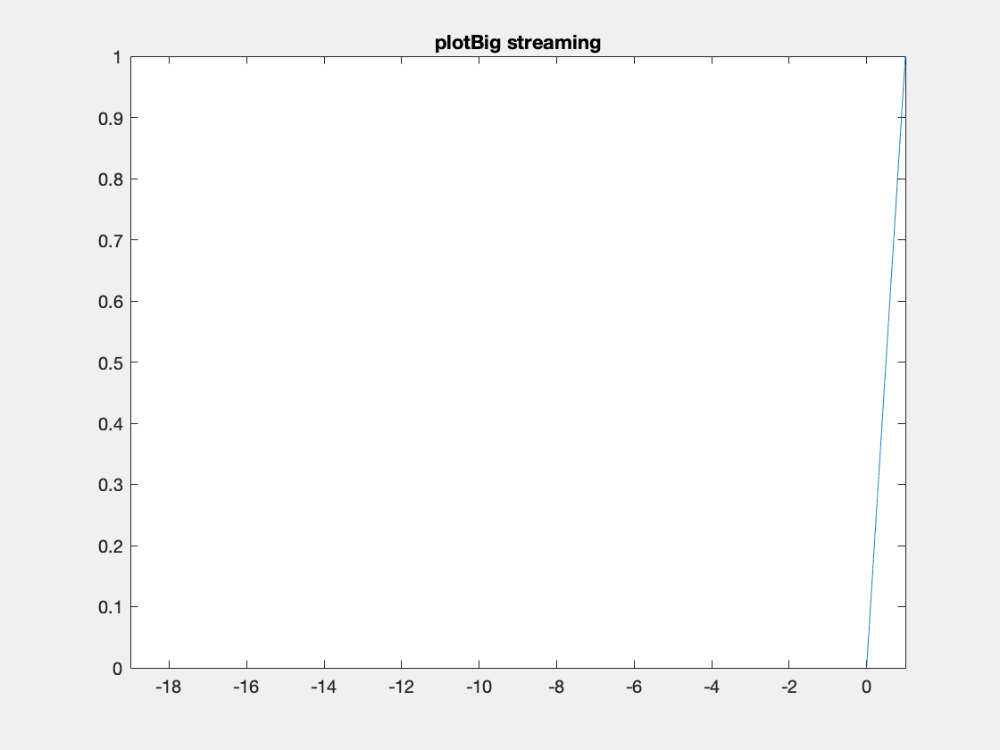
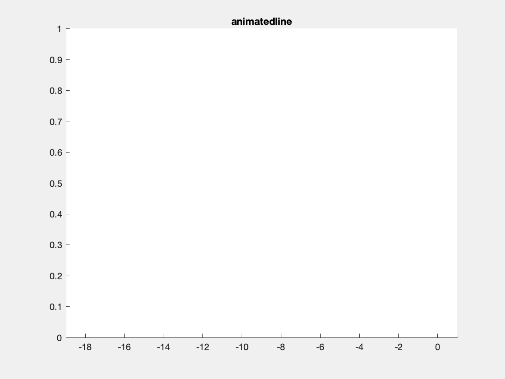
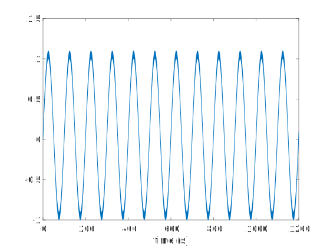
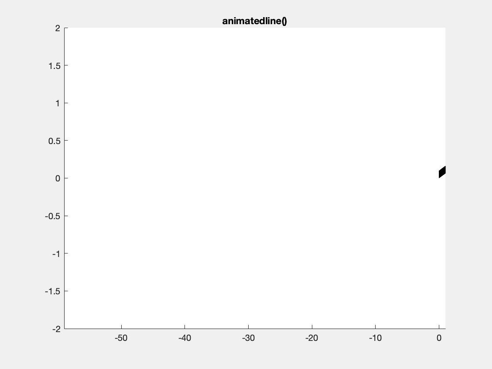
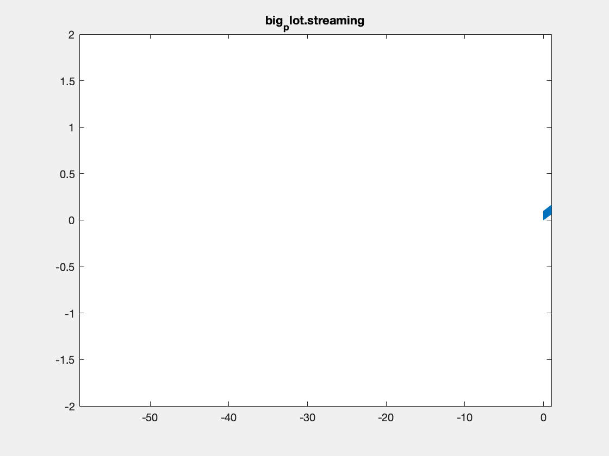
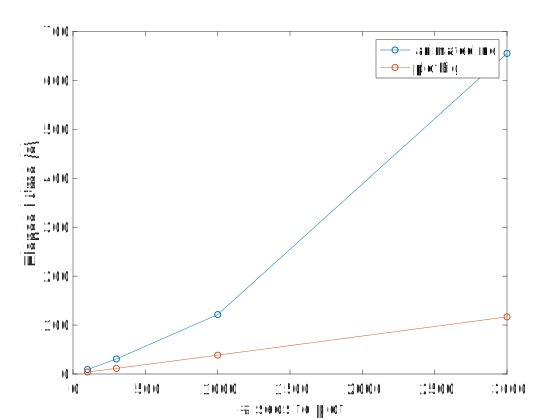
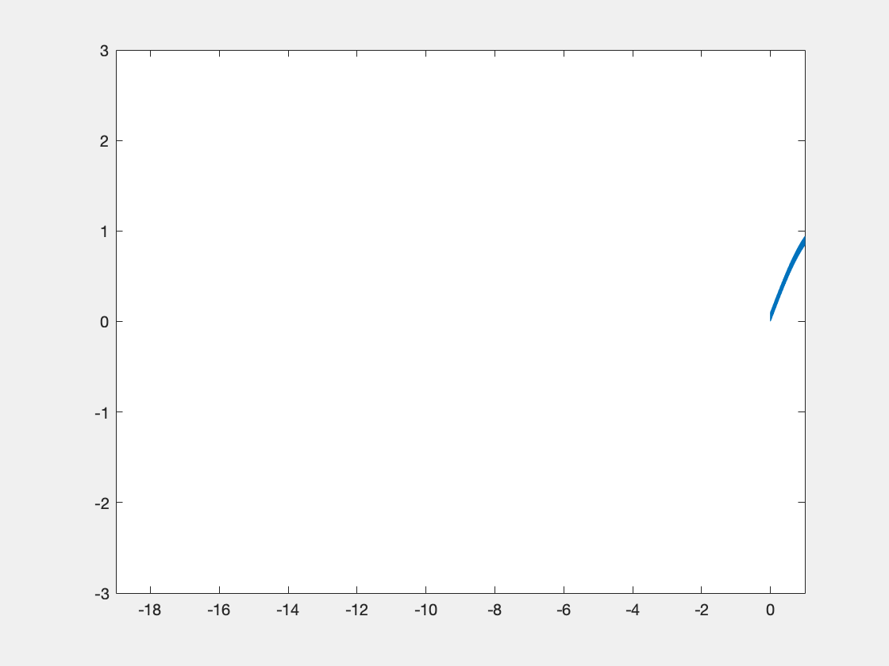

This post is currently being written.

# Plotting of Streaming Data in Matlab #

In a recent project I wanted to be able to plot data from a NI-DAQ as it was acquired. Additionally the data had to be saved to disk, and I had a few experimental control requirements as well, but those are stories for another time. For our animal work data are captured and plotted with a program called [Labchart by ADInstruments](https://www.adinstruments.com/products/labchart). This latest project however involved human subjects and thus my code needed to run off a USB-powered NI-DAQ, not off ADInstrument's wall powered device. National Instruments Labview programming language is designed for just this task but I've previously run into issues in managing large Labview projects. In retrospect I'm not sure that avoiding Labview was the best decision, but I managed to make something that works. This post discusses the code I wrote to make plotting of streaming data quick. I describe the basics of using the streaming code, expand upon its benefits, explain how it works behind the scenes, and discuss limitations and potential improvements. The code is a subset of my [plotBig library](https://github.com/JimHokanson/plotBig_Matlab). A previous article on the benefits of using the library without streaming is [available here.](../../2018/2018_01_PlotBig_Matlab)

It should also be noted that Matlab does provide a similar function called `animatedline` however it requires knowing how much data you are going to collect ahead of time and I found it to be too slow.

# Basic Usage #

Below is a basic example of using the streaming functionality of the plotBig library. It consists of two steps. First, the streaming data object is created (and plotted). Second, data is added to the object (as it is acquired).

```matlab
fs = 20000; %sampling rate
n_samples_init = fs*200; %how many samples to initially allocate 

%1) Initialization of the object
xy = big_plot.streaming_data(1/fs,n_samples_init);

%Needed so that the plot renders. Otherwise we are in "setup" mode.
plotBig(xy)

%2) Adding data
new_data = [1:fs 1:fs];
xy.addData(new_data);
set(gca,'xlim',[0 2])
```

This is similar to the usage of Matlab's animatedline() function.

```matlab
fs = 20000; %sampling rate
n_samples_init = fs*200; %how many samples to initially allocate 
%1) Initialization of the object
xy = animatedline('MaximumNumPoints',n_samples_init);

%2) Adding data
new_data = [1:fs 1:fs];
x = linspace(0,2,2*fs);
addpoints(xy,x,new_data)
set(gca,'xlim',[0 2])
```

Other than different names the usage is fairly similar. Some important usage differences are:

1. This implementation doesn't automatically render added data points until the object is plotted using plotBig(). See the above example.
2. This implementation doesn't automatically change the x axis limits as data points are added. The user must set it manually.

Note, this example is not typical, as generally data gets added as it is "acquired."

Here's a full example ...

```matlab
fs = 20000; %sampling rate
n_samples_init = fs*200; %how many samples to initially allocate 

%1) Initialization of the object
xy = big_plot.streaming_data(1/fs,n_samples_init);
%Needed so that the plot renders. Otherwise we are in "setup" mode.
plotBig(xy)
set(gca,'ylim',[0 1])

%2) "Adding" data
for i = 1:200
    new_data = linspace(0,1/i,fs);
	xy.addData(new_data);
	set(gca,'xlim',[i-20 i]);
	drawnow()
end
```

Note that we set the y axis limits because otherwise our scrolling (20 seconds used here) will trigger y-axis resizing.

# Benefits #

There are two main benefits to using this code instead of animatedline.

1. Expansion of underlying data arrays if more space is needed.
2. Faster plotting than animatedline.

Additionally, since data must be evenly sampled, no time vector is required, halving memory requirements compared to animatedline.

The main two benefits are expanded upon below.

## Data Expansion ##

Here's an example where we need to add data because the initial data allocation was insufficient.

```matlab
fs = 20000; %sampling rate
n_samples_init = fs*5; %Run for 200 seconds, but only initialize 5

xy = big_plot.streaming_data(1/fs,n_samples_init);
plotBig(xy)
set(gca,'ylim',[0 1])

%2) Adding data
for i = 1:200
    new_data = linspace(0,1/i,fs);
	xy.addData(new_data);
	set(gca,'xlim',[i-20 i]);
	drawnow()
end
```



One thing to note I've created these animated gifs using Chad Greene's `gif` function [available here](https://www.mathworks.com/matlabcentral/fileexchange/63239-gif) which is a wrapper around Matlab's `imwrite` function.

Internally array overflows are detected (right before they occur) and the arrays are resized accordingly.

This is the same code with animatedline. After 5 seconds of data only the last 5 seconds of data is kept for plotting.

```matlab
fs = 20000; %sampling rate
n_samples_init = fs*5; %Run for 200 seconds, but only initialize 5

xy = animatedline('MaximumNumPoints',n_samples_init);
%Note the default (below) keeps only 1 million data points then throws a warning
%xy = animatedline();
set(gca,'ylim',[0 1])

%2) Adding data
for i = 1:200
    new_data = linspace(0,1/i,fs);
    x = linspace(i,i+1,fs);
    addpoints(xy,x,new_data)
	set(gca,'xlim',[i-20 i]);
	drawnow()
end
```



## Speed ##

The main reason for implementing this code was to increase speed of plotting. animatedline handles adding data points to memory efficiently, but it is not clear that it actually has anyway of speeding up normal plotting. For example if we simply use animatedline to plot the following figure, it is the slowest out of four plot options tested.



In the above figure I'm plotting a sine wave sampled at 20 kHz for 20 minutes of data, a duration and sampling rate that might be reasonable for my work. 

Elapsed times are as follows:

- Matlab's plot(): 2.3 s
- Matlab's animatedline(): 14 s
- plotBig with streaming: 0.45 s
- plotBig without streaming: 0.45 s

Code available at: [speed_example_01.m]

Note, all results are from my macbook running Matlab 2019a.

Interestingly, if I specify the axis limits ahead of plotting, then the plotBig times drop to ~0.20 s (see limitations for more on this).

The main point of the above example is that animatedline isn't designed to be super fast at plotting, but rather to handle streaming data more efficiently as new data are added compared to other plotting strategies.

In the next example we add on data in 1 second increments, keeping visible one minute's worth of data. This more closely replicates the streaming use case for the streaming class and animatedline. After the 1 second of data has been added and the x-limits have been adjusted a render is forced (via drawnow()) to ensure that all frames are drawn (rather than only a subset of frames getting rendered due to the code being slow). I've reduced the total amount of data being plotted from 20 minutes to 2 minutes because plotting was getting to be too slow.

This is an example with animatedline():



This is an example with the plotBig library:



In addition to comparing Matlab's standard approach to my code, I also tried three other options. First, I tried plotting a line  with only 2 points for each window, rather than the 1.2 million I'm plotting in the above examples. This option provides an indication of how long it takes simply to plot anything. Second, I tried initializing a vector with NaNs, then replacing NaNs with relevant data as it is "collected." Finally, I tried only copying over the data that was within range. These latter options are naive ways of implementing streaming. Relevant code for these latter two is shown below.

```matlab
    %NaN option
    %---------------------------------
    start_I = end_I + 1;
    end_I = start_I + fs - 1;
    
    %x2 and y2 don't change size, preallocated to NaN
    y2(start_I:end_I) = y(start_I:end_I);
    x2(start_I:end_I) = linspace(i-1,i,fs);
    h2.XData = x2;
    h2.YData = y2;
    
    %Subset option
    %---------------------------------------
    t1 = i-n_secs_plot;
    t2 = i;  
    I1 = find(t >= t1,1);
    I2 = find(t <= t2,1,'last');
    
    %the data to the plot function may change size
    %but it only contains relevant data, unlike the
    %NaN option above
    h2.XData = t(I1:I2);
    h2.YData = y(I1:I2);
```

The following are the average execution times (5 runs) for each option:

- animatedline(): 11.9s
- plotBig streaming: 5.871s
- 2-point plots: 5.847s
- NaN plot: 27.4s
- Subset plot: 19.1

There are at least two takeaways from this result. First, plotBig doesn't take much longer to run than simply plotting 2 points for each view. Second, animatedline is pretty competitive, beating my one-off attempts at doing something simple.

Code for the above is available at: [speed_example_02.m]

The time difference between animatedline and plotBig depends on how points are being plotted. Plotting more data will make the difference in execution times larger. Interestingly, execution time for animatedline grows at a non-linear rate as more data are added to the object, even if the same amount of data is plotted in any given plot render. This is shown below. This is not true for plotBig, where execution time (as we saw in the previous example), is largely driven by the time necessary to render a simple plot.



My guess is that the non-linear increase in time with animatedline comes from it supporting a non-monotonic, non-evenly spaced time vector. More specifically, plotBig is able to determine relevant samples to be plotted from a simple calculation (based on start time and sampling rate), whereas I am assuming that animatedline needs to do a search over all the data points in its memory to determine which ones are valid for plotting. This makes animatedline more versatile than plotBig, at the cost of being slower. The above example also illustrates that the relative speedup between plotBig and animatedline depends on a variety of factors, including # of data points in memory (shown here), as well as # of data points plotted. This latter point is not tested in this post but comes from: 1) the point above that animatedline isn't designed to be fast at plotting, rather to not be super slow with streaming, and 2) details on how fast plotBig is at plotting relative to Matlab ([see previous blog post for more details]((../../2018/2018_01_PlotBig_Matlab)).

One other point from the above example, one solution to counteract this slow down with animatedline is to set a maximum on the # of data points that it stores, where the # of data points is sufficient to cover the window being plotted, but less than storing every point. This would almost certainly reduce the impact of having too many points in memory, but would cause problems if the window width were ever increased. In my use case I wanted the ability to plot a specified width (time duration) by default, as well as the ability to increase or decrease that width, and to scroll backwards to see previous data. Increasing the width and scrolling backwards would not be supported by animatedline if only a limited # of data points were retained in memory.

Code for the above is available at: [speed_example_03.m]

**Speed Summary:** Matlab's animatedline function is designed to efficiently plot data as new points are added. From what I can tell it is not designed to plot data fast. The streaming functionality of plotBig in contrast is designed to plot data fast AND to support plotting new data as it is added. The relative speedup between the two is dependent on how many points have been added to the plot objects, as well as how many points are plotted.

# Implementation Details #

Internally the streaming data object preallocates a buffer of a given size. When new data points are added, they are added to the internal buffer. If the added data would cause the buffer to overflow, the buffer is resized based on a specified growth rate (the default is to double the buffer size).

When plotting via the `plotBig` function, the streaming data class is detected and a data reduction call is made to the streaming class, rather than being handled by the default class that operates on normal arrays. 

As a reminder from the other [blog post](../../2018/2018_01_PlotBig_Matlab) on this library, the plotting speedup comes from only plotting a subset of data points that appears the same (to the viewer) as plotting all of the data points. More specifically I only plot min and max values at approximately one pair per pixel. In other words if we had 1 million data points per pixel, I would only plot 2 values for those 1 million data points, the min of those 1 million values and the max (see other blog post for more details).

The streaming class has three things that it does which is different from the default behavior. 

1. The size of the buffer is not necessarily the same as the size of the valid data. This needs to be kept in mind when doing the data reduction.
2. I decided to also compute a reduced data set, when data points are added, to speed up future data reduction. For example, from 1 million data points, I only hold on to 1000 data points, or more specifically 500 pairs of min/max values as a second smaller buffer. If we plot enough data (10 of millions of points or more), then the data reduction is computed on this smaller buffer, rather than on the larger original data. This was meant to help when streaming extreme amounts of data - data close to memory limits - although I haven't fully tested its utility relative to reducing the original array.
3. I wanted the ability to change the scaling of the data after it had been collected. In other words, I wanted the ability to calibrate the data. This technically could be done for the default `big_plot` class, but so far I've only implemented it in the streaming data. Since a linear calibration (what is implemented) doesn't change which indices are selected as max/min pairs, I currently perform the calibration after the data reduction. Note inverting the data in the calibration would only flip the max/min values, but they'd still be the same pair (min would become max, max would become min). Note, I also don't care which is plotted first, max or min, this switching of plot order for pairs of samples is not discernible when "zoomed" out and by the time you can tell, the library just plots all the relevant data in the zoomed in region.

Below is some sample code which is designed to demonstrate some of this functionality.

```
fs = 1e5; %sampling rate
n_samples_init = 1e6; %how many samples to initially allocate 
data_type = 'int16';

%1) Initialization of the object
xy = big_plot.streaming_data(1/fs,n_samples_init,'data_type',data_type);
m = 10/double(intmax('int16')); %10 V == intmax
b = 0;
xy.setCalibration(m,b);

close all
plotBig(xy)
set(gca,'ylim',[-3 3])

elapsed_times = zeros(1,100);

%2) "Adding" data
for i = 1:100
    if i == 50
        %a "recalibration example
        m = -2*m;
        xy.setCalibration(m,b);
    end
    
    x = (i-1):1/fs:(i-1/fs);
    r = 0.1*rand(1,length(x));
    if mod(i,3) == 0
    	%I add an artifact that should always be plotted
        r(1) = 0.5;
    end
    new_data = int16(3277*(sin(x)+r));
	xy.addData(new_data);
	set(gca,'xlim',[i-20 i]);
	drawnow()
end
```



If we display the `xy` object, we see the following info at the end:
```
xy =>
 		...
       n_add_events: 100
      n_grow_events: 4
              t_add: 0.2343
           t_reduce: 0.0667
     n_small_reduce: 92
   n_regular_reduce: 8
```

Definitions of these properties are as follows:

- **n_add_events:** # of times the addData() function was called
- **n_grow_events:** # of times the internal buffer was resized
- **t_add:** total time in seconds to process adding new data points, this includes buffer resizing and adding min/max pairs to the smaller buffer
- **t_reduce:** total time in seconds spent on reducing data for plotting, not including reductions associated with populating the smaller buffer
- **n_small_reduce:** # of times a reduce call was made that operated on the smaller buffer (min/max pairs)
- **n_regular_reduce:** # of times " "  " " on the original dataset

Note for reference the total plotting time for the above example was 5.4s on average. This means internal processing to add and reduce data took about 5% of the total time for plotting. This result matches with a previous result above that demonstrated only a small difference in time between stream plotting using this library and stream plotting of lines that consisted of only 2 data points using basic Matlab code. In other words, the slow part of this code is the rendering process used by Matlab (see improvements section below).

# Limitations & Potential Improvements #

At this point no further development is planned. The library works well enough. Here are just a few things that came to mind regarding limitations and potential improvements.

## Limitations ##

1. Currently the code does not have a memory limit and assumes you can fit all the data to plot in memory. Note in the above internals example we actually captured raw int16 values and calibrated them on the fly, which could save some memory relative to singles or doubles while still allowing scaled plotting of capture DAQ data. Unfortunately I seem to remember that Matlab's DAQ toolbox doesn't support returning raw data ....
2. The code requires evenly spaced samples. Since continuously sampled data tends to be evenly sampled in time, at least for my data, removing this limitation is not a priority for me.

## Potential Improvements ##

1. When replotting a window where there is partial overlap with a previous render it is conceivable that some time could be saved by only calculating the data reduction on the new data. For example if we have a 100 second window and we have previously plotted data from time 10 to 110, and now we want to plot from 20 to 120, we should only need to calculate the data reduction from 110 to 120. This is maybe not as critical given point #2 below.
2. It is pretty clear now that most of the speed restrictions come from how Matlab renders plots, not from a slow data reduction step. It is not clear exactly how this would occur. I was surprised to find out that plotting data out of the axes ranges does slow down plotting (see Yair's thread [here](https://www.mathworks.com/matlabcentral/answers/252979-increase-the-plotting-performance-in-the-matlab-level-drawmode-optimizing-rendering-down-sampling)). Some performance improvement may also come from manually controlling the tick marks and reducing the # of tick marks shown. Big picture I think the best way to improve plotting would likely be to write a custom OpenGL plotting library, but that's obviously a tremendous undertaking. A while back there was a product called Jacket by a company called AccelerEyes which was offering code that would render graphics but there was some dispute with the Mathworks about the product and it is no longer for sale.
3. Finally, perhaps the most meaningful improvement that could actually be accomplished would be to support only keeping a subset of the data in memory for plotting, and using the disk as necessary when scrolling to fetch data. Unfortunately this is non-trivial and I have lots of other things I would rather work on at this point!
