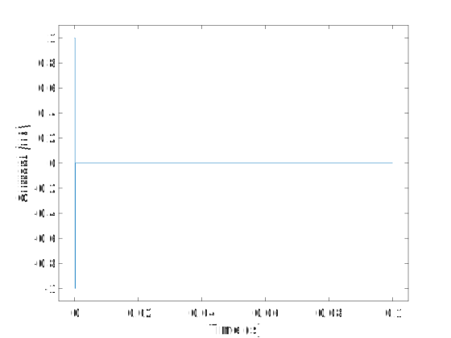
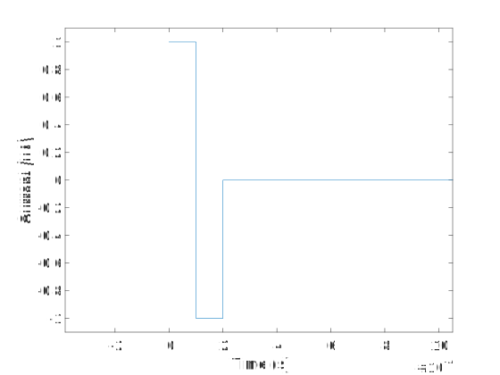
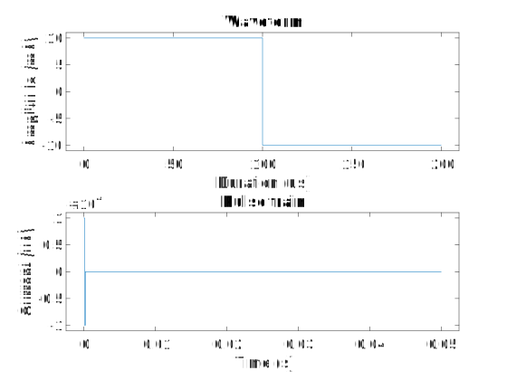
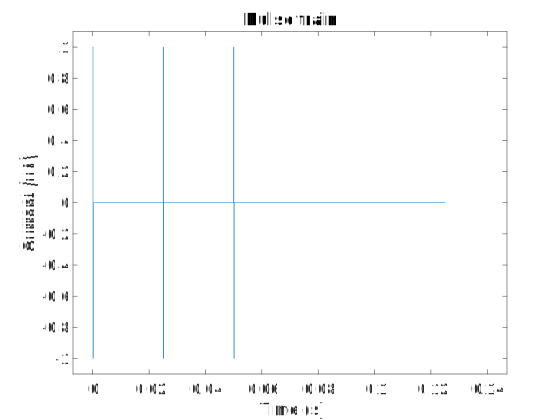

# Multi-Channel Systems Stimulator & Stimulus Design in Matlab

The following post discusses my transition to using a multi-channel systems (MCS) stimulator that is controlled by Matlab. It also discusses a useful stimulus design class that can be used by a variety of stimulators, not just MCS.

Code is available at:
https://github.com/JimHokanson/multichannel_systems_stg_matlab

# Motivation

In graduate school and during my postdoc I've spent a considerable amount of time studying electrical stimulation of the peripheral nervous system with the goal of understanding how to best provide therapies. A fundamental component of this work is using an electrical stimulation device (aka, a stimulator). 

The first stimulator I used in graduate school was a 16-channel stimulator from Tucker-Davis Technologies (the MS16 stimulus isolator). The stimulator ran off batteries that would occasionally run out of juice during experiments. Much of the experiments consisted of trying different stimulation parameters while collecting data. The data were then analyzed after the experiment. One problem with this approach however was that if we failed to find a response in our data, it was possible that the failure was due to the batteries dying, rather than our electrical stimulus not eliciting a response. Unfortunately we had no way of querying the stimulator (in code) regarding the battery status. The only sign of battery levels was from some LEDs on the front of the stimulator. I half jokingly suggested placing a webcam in front of the stimulator that before and after every trial would take a snapshot of the LEDs to ascertain the battery status. 

I'm skipping over some details here regarding alternative approaches to monitoring stimulators and the integrity of an experiment. The main point however is battery stimulators eventually die - with a non-neglible frequency during experiments - and that this can cause problems (obviously).

As a postdoc I started doing single-channel electrical stimulation using the AM Systems 2200 Analog Stimulus Isolator. This too was battery operated and this too, on occasion, would die in the middle of experiments! As a workaround I'd switch to a new stimulator and rerun the trial during which the stimulator failed (note I had a better readout of the stimulator function as this point allowing the quick switch).

Fortunately I have since left the world of battery operated stimulators for wall-powered units. A year or two ago (2017?) the lab purchased a MCS stimulator that was no longer battery powered! We had begun experiments that were considerably longer and needed a reliable stimulator. Unfortunately the default GUI (https://www.multichannelsystems.com/software/mc-stimulus-ii) was a bit awkward to use; so I found myself looking for a programmatic interface to the stimulator. Thus began the MCS stimulator library.

# Software Libraries

A brief aside on software libraries ...

In my work it is often necessary to write a bit of software to interface with devices. Additionally, when analyzing data, it is often necessary to first write software that can read data from a proprietary file format (that the device collecting the data uses). These tasks -  communicating with hardware and reading files - can often be encapsulated in software libraries, making it easier for others to write their software and to get on with their work.

As most researchers are concerned with their research, and not software design, I've found it common for researchers to write some one-off script that does the minimum necessary to accomplish their goal. It is perhaps even more common to resort to sub-optimal approaches since they do not possess the skills to write the software. For the case of the MCS stimulator library, using the GUI decreased my ability to effectively run experiments and was substantially more mistake prone. Importantly, I've found that with relatively little additional effort, it is possible to create a software library (see below) that accomplishes BOTH the goals of the desired task AND is useful to others.

A software library contains generic code that performs a well defined task. In the case of the MCS Stimulator library, the code helps the user to interact with the stimulator. By generic I mean the code doesn't contain anything specific to my particular experiments. 

Having generic code doesn't mean that the code can't have some functionality that is meant to help with executing personal work. For example, I might create a helper function that I found necessary for my work, and that I thought would be useful for others using MCS stimulators as well. However the helper function - and the rest of the code base - shouldn't force upon the user some personal preference. Doing this might lead to the user rewriting the internals of the code because it is specific to my setup and doesn't generalize to their setup. In cases where there are multiple options for how a function should operate, the options are exposed to the user so that they can change the behavior of the function externally, rather than internally.

Above I made the claim that creating a software library is not much additional effort compared to writing a one-off script. Indeed, I often find it to be less work to write the software library because it forces me to clearly separate my code from the library code, making it easier to add library functionality as needed or to fix bugs. The primary reason that writing a library is relatively little additional work is that I only implement the features of the library that I need, with placeholders for missing functionality. If this were professional software development missing features might matter, but I've found people appreciate having something rather than nothing.

# The MCS Stimulator Library

Code for the library can be found at:
https://github.com/JimHokanson/multichannel_systems_stg_matlab

## Getting Setup ##

I find the trickiest thing about writing software libraries like this one is figuring out how to get started. For this library, MCS provides a dll that we access via a .NET interface.

```matlab
	obj.dll = NET.addAssembly(fullfile(p,obj.DRIVER_VERSION,'McsUsbNet.dll'));
```

This only needs to be called once. Once this has been called it exposes a set of functions that can be called directly from Matlab. These functions are documented in a 'chm' file that is provided with the dll. For example, the following is a function that is now exposed because we've added the dll.

```matlab
	obj.h = Mcs.Usb.CMcsUsbListNet();
```

In my code I often use `h` to represent the handle to the underlying vendor implementation. `obj` is my class where I'll expose functions that the user can call, which will then call a method of `obj.h` (i.e of the underlying vendor's implementation).

The dll was originally obtained from https://www.multichannelsystems.com/software/mcsusbnetdll

With this knowledge, it is possible to write functions which make it easier to interact with the underlying dll. For MCS I think getting this information was relatively easy (maybe only took an hour). For other projects this has taken closer to 4 to 5 hours.

## Functionality

The MCS stimulator documentation seems to suggest that it supports "download" and "streaming" modes. I've only implemented the download mode, in which a specific stimulus pattern is sent to the stimulator and executed.

The first step in using the stimulator is to design a pattern to send to the stimulator. This is accomplished using the stimulus design pattern creating code, described below. Triggering and sync preferences are then specified, the patterns are uploaded to the stimulator, and stimulator is started. 

Here's a basic example from the readme page of the library.

```matlab
s = mcs.getStimulator();

%- This makes trigger 1 control channel 1, trigger 2 control channel 2, etc.
%- It also makes the pattern repeat forever
s.setupTrigger('linearize',true,'repeat_all',0);

%Discussed in the stimulus design section
%This will create a 40 Hz, 500 uA train of biphasic pulses
pt = 500*mcs.stg.pulse_train.fixed_rate(40);

%Stimulate on channel 1 with this pattern
%Curently pattern is automatically copied to the sync channel as well
s.sentDataToDevice(1,pt);

s.startStim;

%Needed to stop infinite stimulation
s.stopStim;
```

## Programming Interface - A 2nd Class Citizen

Some of the basic functions in the MCS DLL did not work. I've found this to be common when companies provide a programmatic interface to their devices or data, IN ADDITION TO a standard GUI. After sending an email to the company I found out some functions had not yet been implemented. Fortunately someone from the company sent an updated DLL to me. At the time of this writing I'm working with version 3.2.71 of the DLL even though the official website only has version 3.2.45 posted.

At one point the code worked for one of my stimulators and didn't work for another stimulator! The duration of the stimulus was being truncated on the broken stimulator. The company indicated that the DLL was a bit experimental and since the GUI worked for both stimulators there wasn't anything they were going to do. The problem went away after a firmware update (I think). I also changed the memory allocation behavior to be more like the GUI, which might have been the real fix of the problem. Note, even though I try my best to verify my work - and importantly, I use what I make - it is always best to verify that your code (with my library) is doing what you expect.

# Stimulus Design

In addition to simply communicating with the stimulator, I found it useful to write code that helped to design the stimulus patterns that get uploaded to the stimulator. 

## Initial Stimulus Design

Above I suggested that one approach to writing these libraries (my recommended approach) is to write the minimum amount of code necessary to accomplish my goals, and then to expand as necessary. As a starting point, I wanted to be able to generate a biphasic stimulus pulse at a constant rate (e.g. 10 Hz).

```matlab
rate = 10; %Hz
pt = mcs.stg.pulse_train.fixed_rate(rate);
plot(pt)
```

The above code results in the following plot. In general, where possible, I find great value in adding plotting functions to classes, as well as making the class display nicely in the command window (the latter would be a good topic for a post at some point ...). Note that by default only a single period is created (1/10 or 0.1 s). The stimulator can then repeat this pattern multiple times.



The default is to create a 1 uA, 100 us per phase biphasic pulse. Zooming in on the previous plot we can see the waveform (below).



This can all be modified fairly easily by passing options into the functions.

```matlab
amp = 10; %mA
duration = 100; %us
w = mcs.stg.waveform.biphasic(amp,duration,'amp_units','mA','duration_units','us');
rate = 20; %Hz
pt = mcs.stg.pulse_train.fixed_rate(rate,'waveform',w);

subplot(2,1,1)
plot(w)
set(gca,'FontSize',16,'FontName','Arial');
subplot(2,1,2)
plot(pt)
set(gca,'FontSize',16,'FontName','Arial');
```



In this example we first create a waveform and that waveform gets passed to our pulse train constructor. As the example shows I've added options that allow specifying the amplitude and duration units of the waveform. The waveform object also has its own plot function, resulting in the top subplot shown above. The bottom plot shows the pulse train, which includes a period with zero amplitude so that when the pattern is repeated the pulses occur at the desired rate.

One stimulus used in our lab consists of defining a set of pulses as a "train", and then repeating this train at a specified rate. Thus I expanded the stimulus design software to support the notion of trains and a train rate.

```matlab
pt = mcs.stg.pulse_train.fixed_rate(40,'n_pulses',3,'train_rate',8);
plot(pt)
set(gca,'FontSize',16,'FontName','Arial');
title('Pulse train')
```



As can be seen in the plot our train consists of 3 pulses at 40 Hz. This pattern is repeated at 8 Hz (hence the 0.125 s or 1/8 total duration).

## Internals - Amplitude/Duration Pairs

The MCS stimulator requires instructions as arrays of stimulation amplitudes along with duration pairs. This means a basic pattern such as a biphasic stimulus waveform repeated at 10 Hz requires 3 amplitude/duration pairs, 1 for the positive phase, 1 for the negative phase, and a zero amplitude phase to set the repetition rate.

This approach to stimulus specification has two important benefits over specifying the stimulus amplitude at every time point. First, it saves a considerable amount of memory. Most of the time this isn't critical ... until it is. Second, it can make manipulations to the stimulus slightly easier since we're working with a more abstract representation of the stimulus. For example, shortening or lengthening the duration of a stimulus involves math on a single number rather than removing or adding multiple elements to an array.

# Conclusions

The MCS Stimulator library allows programmatically interfacing with the stimulator in Matlab. Although not all functions of the underlying DLL have been exposed, I hope that others would still find it useful in their work. I've added stimulus design functionality to the library which makes it relatively straightforward to generate stimulus pulse trains. This functionality can be useful even without the use of the MCS stimulator. In retrospect it would have been good to make the stimulus design code its own package, but for now I'm leaving it where it is because I too have other work to do!
