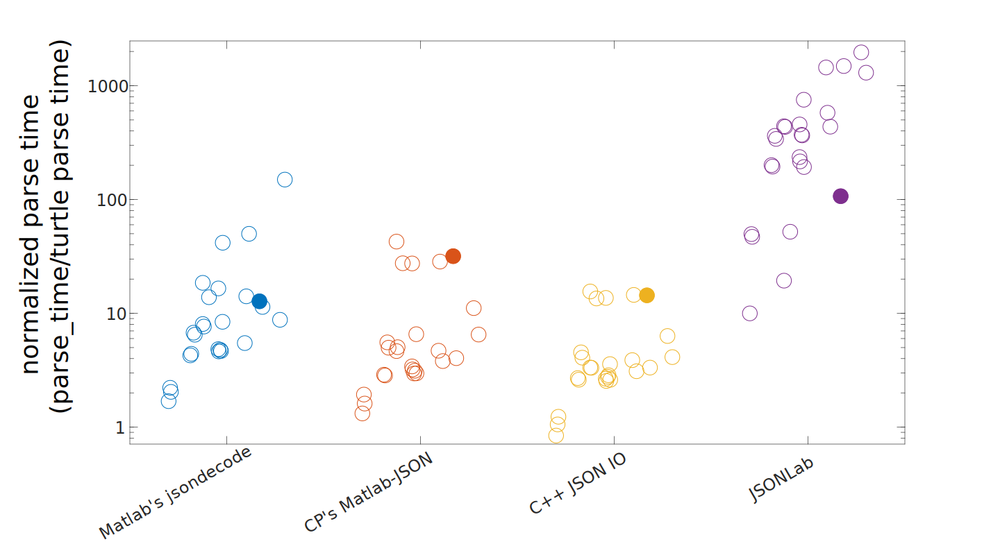
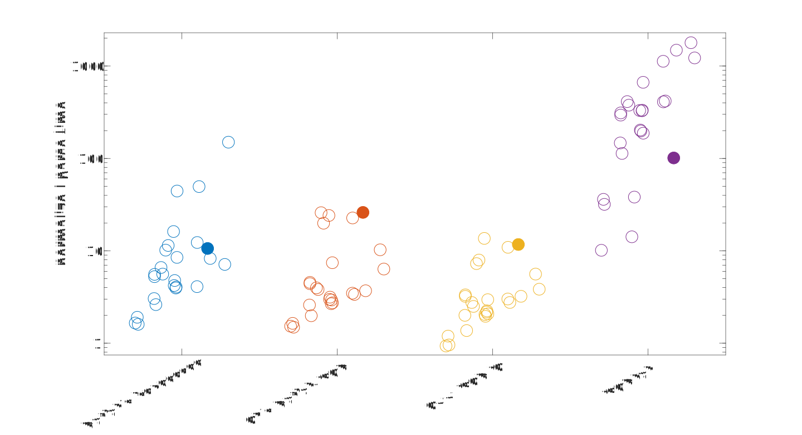
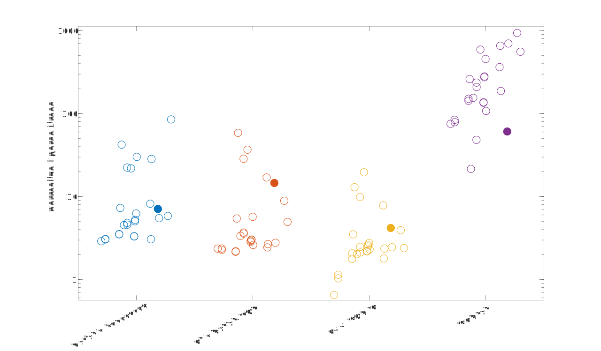

# Performance of my MATLAB JSON Parser: Turtle JSON #

**Finished: 2018-10-25**

**Edits: 2023-02-11**

In a previous article I documented [a JSON parser that I wrote in C for Matlab](../2018_01_Turtle_JSON_Intro).

The previous article focused on techniques I used to make the parser fast, but didn't include any performance information. For those writing performant C code, that post might be interesting, but I realized that many people probably wanted to know how just how fast (or slow!) the parser really is, and how well the parser performs relative to other Matlab JSON parsers. 

**If you're using MATLAB's built-in JSON parser, the answer is that you could see speed ups in the 10-100x range.**

This post contains one main test indicating how long it takes to read a JSON structure into Matlab objects. I've included a variety of JSON files that I've found over the web. These files encompass a variety of sizes and types (e.g. files with mostly strings, files with lots of objects, lots of numbers, etc.).

Additionally, at the end I'll briefly comment on a well known JSON benchmark and discuss how Turtle JSON compares to other non-Matlab JSON parsers.


## The Parsers ##

The benchmark currently includes 5 parsers:

1. [Turtle JSON!](https://github.com/JimHokanson/turtle_json)
2. Matlab's built in parsing - The Matlab parser changed quite a bit from ~2014 - 2016, but was officially released in 2016b in what I assume is a relatively stable version. Note, this may be wrong :/ . For this testing I used 2017a (my mac), and 2017b (Windows).  
3. [JSONLab](https://github.com/fangq/jsonlab) - This appears to be the main JSON parser that people use that is written in Matlab. This is the slowest parsing option but I thought it would be interesting to see how it compares. Also, as positives for this repo, this code supports handling binary JSON and writes Matlab variables to JSON in a way that clarifies the format of the data and data type. Properties can be ambiguous with JSON data, leading to variations in how the data are returned to the user.
4. [C. Panton's Matlab JSON (JSON-C wrapper)](https://github.com/christianpanton/matlab-json)
5. [O. Woodford's C++ JSON IO (nlohmann/json wrapper)](https://www.mathworks.com/matlabcentral/fileexchange/59166-c-json-io)

## The Files ##

The files were found online at various places. They can all [be found here.](https://drive.google.com/open?id=0B7to9gBdZEyGMExwTFA0ZWh1OTA)

Of note:

1. 1.json - This is a relatively well known test file from [https://github.com/kostya/benchmarks/tree/master/json](https://github.com/kostya/benchmarks/tree/master/json)
2. XJ30\_NaCl500mM4uL6h\_10m45x10s40s_Ea.json - This is a a file generated for analysis of worm (C. Elegans) movement and was the main motivator for writing this code. I will be referencing it again later on.

## The Main Test ##

All files were tested using run\_bench.m found at:
[https://github.com/JimHokanson/turtle_json_benchmark/](https://github.com/JimHokanson/turtle_json_benchmark/)

Files were read from disk and parsed into a Matlab structure. For those requiring an input string, rather than a file name, the file was first read into memory and then passed to the parsing function. For the files supporting a file name as input, the file name was passed directly to the parser. In both cases the timing process included the time to read the file (all from various SSDs).

No verification of the output was done. The parsers all produce slightly different outputs mainly due to the lack of direct translation between JSON and Matlab structures. This comes through in mainly three ways: 1) whether to collapse homogenous arrays or objects; 2) the shape of 1-d arrays (column vs row vectors) and 3) whether unicode is handled or not. The Turtle JSON parser exposes options for how the output should be returned, which can make it behave more like the other parsers (although there are some open issues on this front). From what I can tell the others do not have parsing options (other than 1 option in JSONLab). Thus for these other parsers you're stuck with what they give you and have to try and post-process accordingly.

All files were parsed one at a time by all parsers. This process was repeated 8 times and the smallest of either all 8 timing values or the last 7 timing values was the output variable. For parse times less than 10 ms, the parsing process was repeated 2000 times (within the rep) and the average loop time logged (leading to 1 of the 8 final values). Parsing times less than 100 ms (but above 10 ms) were parsed 200 times. This was done to try and get better estimates of the parse time for smaller files. Thus for a small file that took less than 5 ms to parse (for example), it would have been parsed 8*2000 times with 8 values logged, all corresponding to the average parse time (not total parse time for the 2000 tries).

It should come as no surprise that JSONLab, a pure Matlab implementation, is the slowest by far. For some files the parse time for this parser was hardcoded at 1 hour (3600 seconds) to reduce test time. My impression is that this is an underestimate but I haven't actually tested it! For reference the current test takes roughly 2-3 hours to run.

## The Results ##

Parse times have been computed in 3 different environments: 

|      Name         |         CPU          | cores |       Memory         |     OS     |  SIMD  |
|:-----------------:|:--------------------:|:-----:|:--------------------:|:----------:|:------:|
| Turtle            | i5-3570 @ 3.4GHz     |   2   |  Dual Chan DDR3 1333 |    Win 7   |   AVX  |  
| Paladin           | i7-4770 @ 3.4GHz     |   4   |  Dual Chan DDR3 1333 |  Win 10    |   AVX2 |
| Jim's Macbook     | m3-6Y30 @ 1.1GHz     |   2   |  Dual Chan DDR3 1866 |  Mac OS    |   AVX2 |

Each dot corresponds to the parse time of a single file normalized to the time it took Turtle JSON to parse the same file. A value of 1 indicates the same execution time. A value less than 1 indicates that the other parser runs faster. A value greater than 1 indicates that the other parser runs slower than Turtle JSON. For example, a value of 10 indicates that the other parser takes 10x as long to run as Turtle JSON.

The figures also display some variation on the x-axis. **The location on the x-axis is log-scaled by how long it took Turtle JSON to parse the file, with the fastest parse times on the left and the slowest parse times on the right.** Put another way, values on the left only took milliseconds to parse, and values to the right took seconds to parse. Again, in this instance parsing refers not only to an abstract representation of the JSON, but also conversion of the JSON into Matlab structures/arrays/values.

Here's the parse time results from my computer named Turtle. Turtle JSON was named after this computer and as my attempt at humor in honor of all the "fast" JSON parser names that exist out there such as "RapidJSON" and 



Nearly raw data (rounded to nearest 0.1 ms) are available at [Turtle_Comp_TJ_Bench.csv](Turtle_Comp_TJ_Bench.csv).

Three things should be noted from this figure:

First, in general Turtle JSON is consistently faster than the other parsers. There is only one exception where the C++ JSON IO parser is slightly faster.

Second, there is a noticeable trend whereby Turtle JSON is faster, relative to the other parsers, for files that take longer to parse. This can be seen by the trend of the scatter points moving from lower left to upper right. Again, "left" means a small parse time for Turtle JSON and "right" means a longer parse time for Turtle JSON. Back to the C++ JSON IO parser, this indicates that it is only faster for files that take very little time to parse (in this case, less than 1 ms to parse). This type of speed difference could be important if parsing many thousands of files at a time, although in this example the JSON file is extremely simple (an array with one short string of less than 10 characters). In other words, even for small files (e.g. 1 kB) Turtle JSON is fastest. Note, the internal memory structure of Turtle JSON was recently rewritten (September 2018) to minimize these differences so that the parser is still a good choice across all file sizes. At some point I may write up more on the two changes that were made to increase speed for small files (use of a C-structure and a preallocated Matlab structure).

Third, Turtle JSON is well designed for heavy number parsing. In particular, it is efficient at detecting numbers and then parsing them in parallel. This shows up in our highlighted file (dark circle) which was the impetus for designing the parser. In this example the parser is more than 10x faster than the other parsers. 

Here are the results for the other computers where the story is fairly similar:

[Paladin times - figure below:](Paladin_Comp_TJ_Bench.csv)



[Jim MacBook times - figure below:](Turtle_Comp_TJ_Bench.csv)



## 1.json speed ##

One JSON benchmark that includes a large variety of parsers can be found at:

https://github.com/kostya/benchmarks

In particular it tests the time required to sum all x,y,and z elements from an array of objects. The first bit of this file is as follows:

```
{
  "coordinates": [
    {
      "x": 0.5405492533441327,
      "y": 0.1606088575740785,
      "z": 0.28996148804190514,
      "name": "khfmzc 6328",
      "opts": {
        "1": [
          1,
          true
        ]
      }
    },
    {
      "x": 0.2032080968709824,
      "y": 0.46900080253088805,
      "z": 0.8568254531796844,
      "name": "buxtgk 4779",
      "opts": {
        "1": [
          1,
          true
        ]
      }
    },
    {
      "x": 0.48989088332548825,
      "y": 0.46347100945087105,
      "z": 0.48995472030171716,
      "name": "xwvlpe 6873",
      "opts": {
        "1": [
          1,
          true
        ]
      }
    },
```	

Note, this file is generated dynamically on the benchmarking site using a ruby script. In my case I've generated one example of this file for parsing. In total there are 1 million coordinates entries.

**Warning: the following is a bit hand wavy. Feel free to be a bit skeptical.**

The current top (best) values (October 2018) are as follows for reading and summing the numbers. For reference I've added on the time it takes me to execute these same tests on Turtle (my computer), averaging the time it takes to execute 10 runs.

| Language        | Time, s | Memory, MiB | Turtle, s|
| --------------- | ------- | ----------- |---------|
| D Gdc Fast      | 0.35    | 234.1       |         | 
| Rust Pull       | 0.49    | 207.7       |         |
| Rust Struct     | 0.50    | 226.2       |         |
| C++ Rapid SAX   | 0.72    | 1.0         | 1.04    |
| C++ Gason       | 0.83    | 582.2       |         |
| C++ Rapid       | 0.94    | 243.6       | 1.36    |
| Java            | 1.28    | 371.2       |         |
| Scala           | 1.44    | 457.2       |         |
| Rust Value      | 1.82    | 1675.8      |         |
| Turtle JSON     | *0.59   | ~350        | 0.85    | 
| Turtle JSON V2  | *0.35   |             | 0.5     |

*See text for details

Since Rapid JSON is header only, it is relatively easy to compile. I compiled the code using MS Visual C++ 2015 Professional with SSE4.2 enabled. Tests from the benchmark website were modified to run as mex files with printouts removed. The relevant cpp files can be found in this directory. I did not try the Rust options. I'd like to try the D GDC version but I don't think GDC targets Windows. These two results suggest that to translate my times to the table's times, I need to multiply my execution times by 0.69 (Again, a bit of hand waving is going on here).

To execute this task in C-mex (i.e. in C but with Matlab memory management) takes 0.85 seconds. This includes adding on some additional code to the parser to add the relevant numbers. This code can be found in `add_1_values_snippet.c` which I copied into the end of the main mex function for Turtle JSON. The code skips a few checks that would take precious microseconds (sarcasm - I'm being a bit lazy since the code is designed to be worked with in Matlab - I did not write C wrapper functions). The task of adding the 3 million numbers (1 million each for x,y,and z) is not timed below but took 6 ms. Using the aforementioned scaling factor, parsing this file in the benchmark should show up at around 0.59 seconds (roughly).

Internal execution timing is as follows (in ms, averaged):

```
                elapsed_read_time: 112.5511   %time to read the file
                c_parse_init_time: 0.0564
                     c_parse_time: 295.8875   %1
         parsed_data_logging_time: 0.0122
         total_elapsed_parse_time: 295.9566
              object_parsing_time: 93.4250    %2
                 object_init_time: 0.0225
               array_parsing_time: 29.8845    %3
              number_parsing_time: 22.2562    %4
    string_memory_allocation_time: 180.5333   %5
              string_parsing_time: 27.9706    %6
            total_elapsed_pp_time: 354.1021   
           total_elapsed_time_mex: 762.6190   %7
```

1. **Parse Time: 296 ms** It takes roughly 300 ms to do a first pass through the data. After recently learning about anonymous unions in structures I started to write a second version of the code that has only 1 main structure array in the main parser, rather than different arrays for numbers, arrays, objects, etc. This change reduced the execution time to 220 ms.  Unfortunately this would require rewriting the code that translates the tokenized data into Matlab, which I don't really want to spend my time on right now. (possible time savings: 75 ms)
2. **Object Parsing: 93 ms** When parsing objects every object gets assigned to an ID based on the field names. This later allows me to find homogenous arrays which is a huge time saver in memory allocation when translating to Matlab. This could presumably be made faster with OpenMP, but it is low priority for now.
3. **Array Parsing: 30 ms** Array parsing aims to find homogenous arrays of objects or numbers, which is important for how the data are returned to Matlab. A parser which did this analysis only on request could skip the analysis of all the "1" arrays which are not part of the benchmark. (possible time savings: maybe 15 ms )
4. **Number Parsing: 22 ms** This code was written to be fast at working with large amounts of number data. To do this I postpone number parsing until after the first pass and then parse all numbers at once using OpenMP. For my computer the execution time is reduced to roughly 25% of the time it takes to run without OpenMP.
5. **String Allocation: 181 ms** String allocation is killer for my code. Keys are allocated differently than strings, so this is the time it takes to allocate the 1 million "name" entries. In C we could just set the pointer to the first character and then modify the ending quote to be a null character to make it a null terminated string. (possible time savings: 180 ms)
6. **String Validation and Parsing: 28 ms** String parsing involves removing escaped characters and converting UTF-8 to UTF-16. This could also be passed through OpenMP and probably optimized slightly.
7. **Total Execution Time: 762 ms** This is the total execution time of the code. This time does not include time to call the mex function. More importantly, it does not include the time required to clear the managed memory. A loop to a simple mex file takes 4 ms, which means roughly 80 ms is spent clearing memory. I have no idea how long it takes to free memory (using `free`) but in some testing this seems to be on the order of 1 ms for all the data that I might have allocated if I were using `malloc()` instead of `mxMalloc`. (possible time savings: 80 ms)

Again, there's lot of hand waving going on but this suggests this code if it were written slightly differently, and notably without Matlab memory management, might save 350 ms in Turtle time which is 242 ms in translated time (maybe...)

This would put the estimated execution time at 0.35s which is the same as the D parser time. The D parser makes some assumptions about JSON validity which I'm avoiding (I think). Regardless, the point is not to make the claim that this code is the fastest since that would require some additional changes and better head to head comparisons. **Instead, the point is to indicate that this parser is on par with these other faster parsers.**

It is possible to make the parsing even faster, although that's a discussion for another post. 

## Conclusions ##

Turtle JSON is consistently the fastest parser out of the available options for Matlab. It provides additional customization options for returning data in the desired format for improved flexibility. The underlying C-mex parser is competitive with other non-Matlab parsers. Give it a try!
