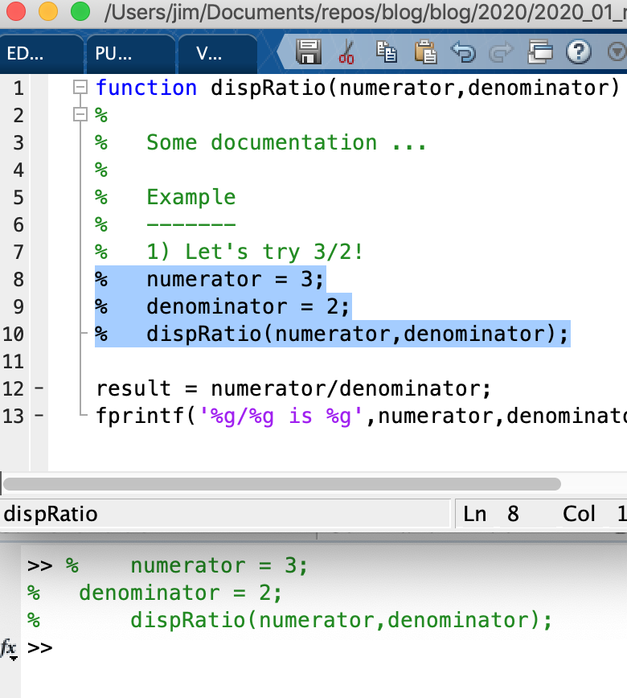
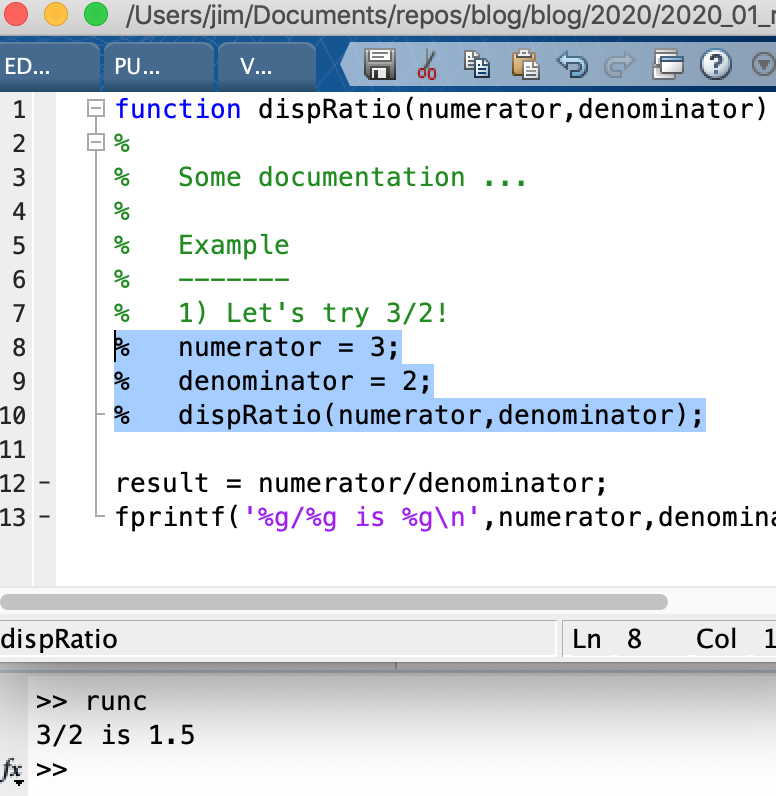
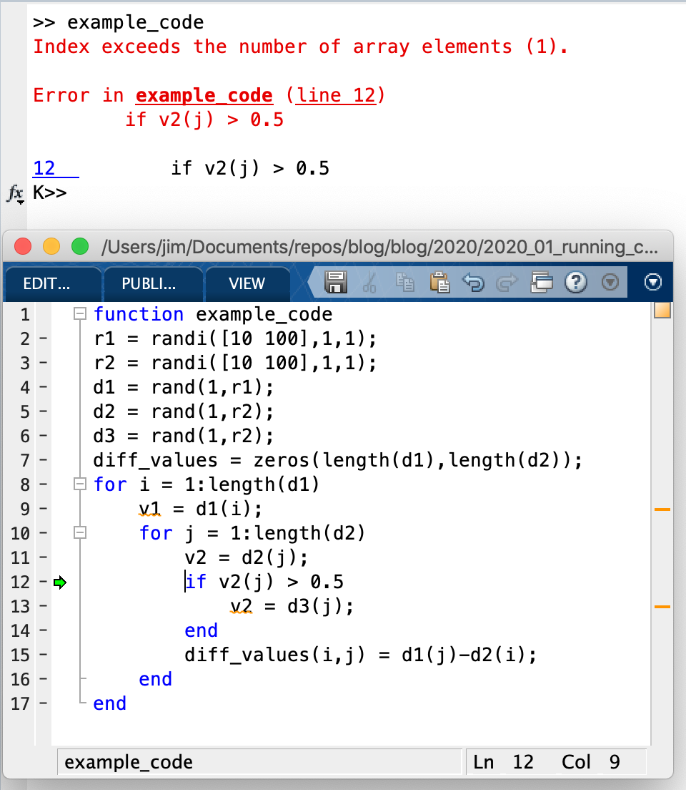
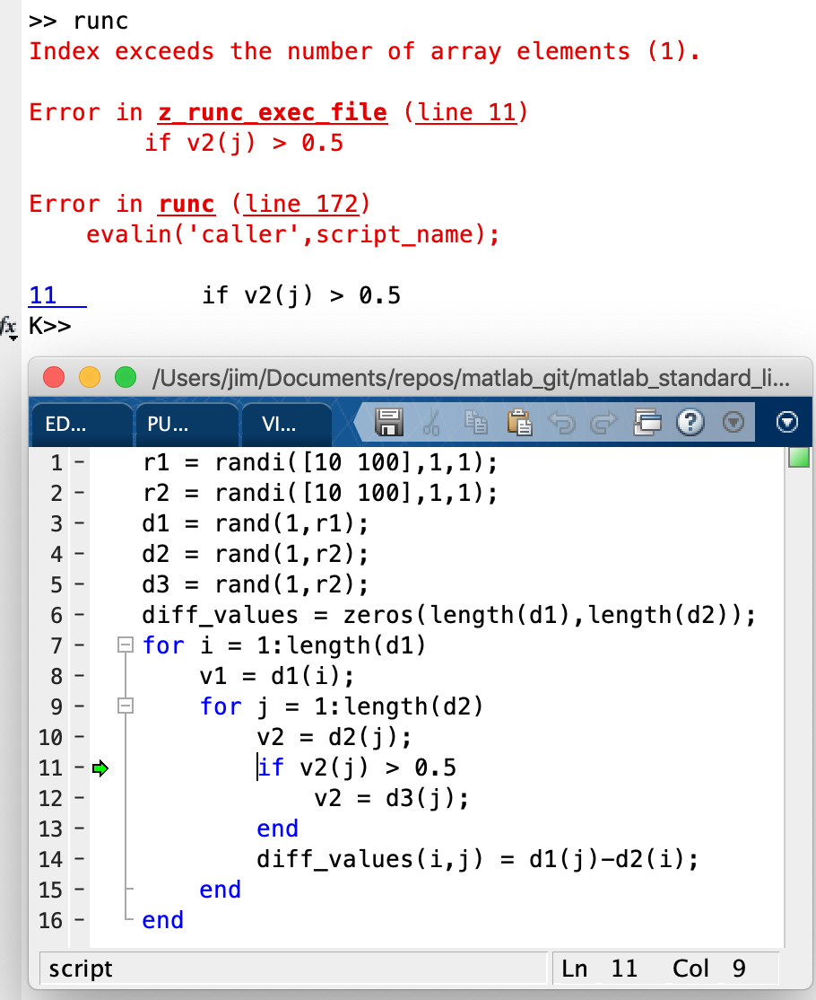

# Running clipboard code Matlab #

This post will discuss a function, `runc` that I use daily when writing Matlab code. The function helps with 1) running examples that are commented out and 2) with debugging pieces of code that I highlight and execute. 

The code is kept my ["Matlab Standard Library" repo](https://github.com/JimHokanson/matlab_standard_library). The library was started in June 2013 as a way of organizing reusable Matlab functions and classes that I write. This library is a topic for another post ... In the mean time it is just useful to know that `runc` is located in this library [link](https://github.com/JimHokanson/matlab_standard_library/blob/master/global_namespace_functions/runc.m)

I also made a standalone version available here:
https://github.com/JimHokanson/blog/tree/master/blog/2020/2020_01_running_clipboard_code_matlab


## Running example code ##

Initially `runc` was written to run example code that had been commented out. This isn't necessary for functions when using Matlab's `help` function since `help` removes all comments. However, when inspecting code in the editor the comments remain and evaluating highlighted code with comments won't run the copied code. For example:

<figure>

<figcaption>The example above has been highlighted and evaluated (right-click => evaluate selection). Not surprisingly the command window only displays the comments, it doesn't run the code.
</figcaption>
</figure>

Now, if instead of evaluating the selection we copy it to the clipboard, we can use `runc` at the command window to evaluate the commented code:

<figure>

<figcaption>The example above has been highlighted and evaluated (right-click => evaluate selection). Not surprisingly the command window only displays the comments, it doesn't run the code.
</figcaption>
</figure>

An alternative approach to running commented examples is to uncomment multiple lines of code, copy the resulting uncommented code, and then re-comment (or more typically to undo/ctrl-z the uncommenting). This approach works but I don't like making changes to the file, particularly if I forget to recomment the code and then I try and run the function and now it fails because it tries to execute the uncommented example (stack overflow!).

Another approach for examples is to use multi-line comments (by using `%{` and `%}` character groups) . For example:

```matlab
function dispRatio()
%
%	some documentation ...
%{
%Start of comment

%Example
%-------
%1) Let's try 3/2!
numerator = 3;
denominator = 2;
dispRatio(numerator,denominator);

%End of multiline comment
%}

result = numerator/denominator;
fprintf('%g/%g is %g\n',numerator,denominator,result)

end
```

In the above example, the example in the multi-line comment can simply be copied and pasted into the command window and run. However, Matlab doesn't support multi-line comments for documentation, so typing `help dispRatio` will not show the example! Thus multi-line comments are really only useful for internal examples.

So in summary: One function of `runc` is to allow evaluation of commented lines that have been copied to the clipboard.

## Better debugging ##

The internals of how `runc` works (not yet discussed) makes `runc` useful for debugging evaluated code. Matlab allows you to highlight lines and evaluate them. My approach to writing functions is to basically create a set of test inputs, then enter the debugger at the beginning of the function. I'll then write a few lines of my function, make sure that they work (via evaluation), then procede to write more lines of code.

Occasionally (often?) however I'll make a mistake. When evaluating lines Matlab will tell me that I've screwed up, but due to some strange quirk associated with evaluating lines versus normal code execution, it won't give me too many details other than the error message. Unfortunately, Matlab error messages are unnecessarily cryptic in my opinion (as are the errors for most languages).

At this point an example should help. Consider the following code:

```matlab
r1 = randi([10 100],1,1);
r2 = randi([10 100],1,1);
d1 = rand(1,r1);
d2 = rand(1,r2);
d3 = rand(1,r2);
diff_values = zeros(length(d1),length(d2));
for i = 1:length(d1)
    v1 = d1(i);
    for j = 1:length(d2)
        v2 = d2(j);
        if v2(j) > 0.5
            v2 = d3(j);
        end
        diff_values(i,j) = d1(j)-d2(i);
    end
end
```

What  this code does is not critical, and indeed it could be simplified significantly, but the point is that the above code has an error in it. Highlighting the code and evaluating it throws the following error:

```
Index exceeds the number of array elements (1).
```

If we ask Matlab for more details, we get the following:

```
>> lasterror

ans = 

  struct with fields:

       message: 'Index exceeds the number of array elements (1).'
    identifier: 'MATLAB:badsubscript'
         stack: [0×1 struct]
```

In the above you should notice that the stack trace is empty. Basically, Matlab won't tell us where the error occurred. 

In addition to not telling us where the error occurred, it doesn't stop execution at the error so that we can debug. This behavior is not enabled by default, but in my [startup script](https://www.mathworks.com/help/matlab/ref/startup.html) I place the command `dbstop if error`. This can slow code slightly (or used to, I haven't tried it in a while), but basically this command states that the Matlab interpreter should enter debug mode when an error in execution occurs. This allows you to evaluate variables in the context of the error, rather than trying to manually set a debug point to inspect the error. 

If instead our code were executed as a function or script, rather than by evaluating, we would stop at the line of our error:

<figure>

<figcaption>
The debugger has stopped at the line of the error (see green arrow) and is ready for debugging in the command window as indicated by 'K>>'. This occurs because we ran our code as its own function. If the code were only part of a function than a different approach would be needed to engage the debugger - as evaluating the selection would not trigger the debugger.
</figcaption>
</figure>

Importantly, the part you are evaluating might not be the entirety of a function or script, but rather a part of one. 

Thus our goal is to somehow get debugging at the point of an error when evaluating highlighted code. The solution is to use `runc`.

If we copy the highlighted lines, then type runc, we get the debugging we are looking for:

<figure>

<figcaption>
<b>Figure:</b> Like the above image, we are stopped in the debugger. If you look at the printed stack trace the error didn't come from the file we highlighted, but rather from a file called `z_runc_exec_file`. How this works is discussed in the next section. Importantly though, we get debugging from highlighting and "executing" the selected/copied code.
</figcaption>
</figure>

## Execution Details ##

`runc` works by grabbing the text that has been copied to the clipboard and writing it to a specific file `z_runc_exec_file` that is on the path. This file (script) is then executed by calling `evalin('caller',script_name);`. Since we are using a script (and not a function) and since we evaluate the script in the caller, all the variables in the caller (either the workspace currently being debugged or the base workspace) are available for running the code. In other words, this setup means we don't need to worry about passing in variables to the script or defining variables in the script, as long as they are defined in the caller. If code would work by highlighting and evaluating, then it will work when written to a script and evaluated in runc's caller.

The original `runc` code was meant for running commented code. When I wanted to expand the function to handle copied code that wasn't commented (for better debugging), I had to figure out how to handle commented code in one case and uncommented (or semi-commented) code in another case. The approach I settled on was to determine whether there were any non-empty lines without comments. If the code finds any uncommented lines, it leaves any comments in place. If all lines have comments, then all lines are uncommented.

This code would have comments removed because all lines are commented.
```matlab
% a = 1
% b = 2
% c = a + b
```

This code would keep comments because not all lines are commented.
```matlab
% This code adds a & b!
a = 1
%a = 2 %old value
b = 2
c = a + b
```

## "Installing" the code ##

Looking at the code it relies a bit on other functions in my "standard library". Installing using the standard library should be done as follows:
1) Placing the standard library base folder on your Matlab path. 
2) Calling `sl.initialize` on startup (this is currently a bit heavy for your average user ...)

Alternatively, I've removed the dependencies and placed the single 'runc' file in the folder that holds this article:
https://github.com/JimHokanson/blog/tree/master/blog/2020/2020_01_running_clipboard_code_matlab


        

