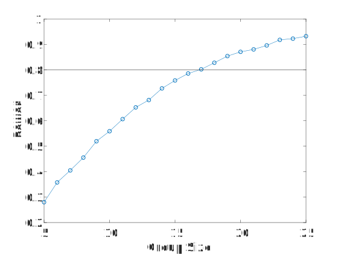

# The (Statistical) Power of Pairs #

In this post I describe how I stumbled upon a "hidden" parameter involved in doing a power analysis with paired data.

## Problem Setup ##

So the most useful thing out of this entire post might be the following; for straightforward power analyses, I use a program called [G*Power](http://www.psychologie.hhu.de/arbeitsgruppen/allgemeine-psychologie-und-arbeitspsychologie/gpower.html).

Let's use G\*Power to compute the number of samples/subjects we need with an effect size of 1 and standard error parameters ($\alpha=0.05$ and $ \text{power}=(1-\beta)=0.8$). Note, I like using the effect size when doing power analyses, since I think it is a nice way of specifying how strong an effect I expect to see. This is where some people get all worked up about power analyses, "power analyses are a bunch of baloney since you're making things up." It is true that when you don't have much data on which to base your power analysis there is a bit more freedom to choose your parameters. However, I think that the real point of power analysis is to tell you what sample sizes are reasonable for your study. If you fudge the numbers at the beginning, you're really lying to yourself about how big a task you're taking on which may cause problems later on. Anyway, onto the results.

If we start with an unpaired analysis, this is what we get in G\*Power:

<figure>

<figcaption>Results of power analysis for unpaired t-test - G*Power. 
</figcaption>
</figure>

If we split our samples evenly between the two groups, G*Power tells us that we need 34 samples, 17 from each group, to get our desired parameters. In some cases 34 may not be a lot but other times it can be quite a large number. We can reduce this number if we design our experiments such that we have paired sampling. For example with my work this means getting both measurements from the same animal. For example, we might ask how giving a drug compares to not giving a drug, where we first collect data without the drug in an animal (the baseline), and then we give the drug to the animal to see what happens. This is then repeated for multiple animals. Each animal has its own variability, its own starting point, but by looking at the changes within an animal, we remove some of this variability. The alternative is to not give the drug to one group of animals and to give the drug to another group of animals. This latter "unpaired" approach tends to require more samples/subjects/animals because we don't get to remove variability in the same way that we do when we calculate changes within sample (as will be shown in a figure below).

Anyway, if we switch to a paired analysis, then we get:

<figure>

<figcaption>Results of power analysis for paired t-test. 
</figcaption>
</figure>

Switching to paired testing gets us a large reduction in the sample size, from 34 to 10 samples! If you don't think about it for too long, it seems almost magical. But in retrospect it is a bit surprising that the parameters are "exactly the same" and there is such a large reduction in the sample number. But if you think about it a bit longer, or if you try to simulate this, then you might begin to wonder where exactly that reduction comes from. This wasn't obvious to me and is the topic of the remainder of this post.


## Simulations - Part 1 - Unpaired Testing ##

A project I was working on required something a bit more complicated than what G\*Power provided, so I decided to run numerical simulations to calculate the required sample size. Numerical simulations are useful when it is difficult to work out the analytical solutions. I personally like simulations because they tend to make more sense to me than an equation that is just handed down.

Before getting started on the complicated analysis, I wanted to practice by making sure I could replicate some simple examples. In this case, I was going to replicate the G\*Power results from above.

If you're comfortable running simulations for power analyses, feel free to skip down to the next section.

In this example we'll use an effect size $d$ of 1. There are lots of different effect sizes, but we'll be using "Cohen's d", which is:

$$d=\frac{\bar{x}_1 - \bar{x}_2}{s}$$

where $\bar{x}_1$ and $\bar{x}_1$ are sample means for two different groups and $s$ is the pooled standard deviation. More on the effect size can be found [here](https://en.wikipedia.org/wiki/Effect_size#Cohen's_d). An effect size of 1 means that the difference in means is equal to the pooled standard deviation. The pooled standard deviation combines the standard deviations from each group (equation not shown). If we assume the standard deviations of the groups to be equal, then the pooled standard deviation is simply the standard deviation of the groups.

Thus the numbers I've chosen are:
- $\bar{x}_1=0$
- $\bar{x}_2=1$
- $s = 1$

**The Intuition:** For power, the question is, if we sampled from our true distributions, in this case normal distributions with the above parameters, we wish to know how often we would expect to get a statistically significant result. If we sampled infinitely many samples, we would always get a significant result since the means are different. Similarly, if we use only a few samples, it is unlikely that we will have a significant result because of variability in the sampled means.

So basically we draw a specified number of samples and run our test. We repeat this process a lot (thousands of times), and keep track of the percentage of times we got a statistically significant test given the number of samples per group that we chose to use. That percentage of statistically significant results is our power.

Here's the code:

```matlab
alpha = 0.05;
mean1 = 0;
mean2 = 1;
std_dev = 1;
effect_size = abs(mean1-mean2)./std_dev;
fprintf('Effect Size: %g\n',effect_size);

n_sims = 10000;
n_max = 25; %The maximum group size we'll test
n_min = 5; %The minimum group size tested

%randn is slow to call in a loop, we'll grab a lot of samples
%all at once
r1 = mean1 + std_dev*randn(n_sims*sum(n_min:n_max),1);
r2 = mean2 + std_dev*randn(n_sims*sum(n_min:n_max),1);

I2 = 0;
pct_different = NaN(1,n_max);
for group_size = n_min:n_max
    fprintf('Running group size: %d\n',group_size);
    is_different = false(1,n_sims);
    for i = 1:n_sims
        I1 = I2 + 1;
        I2 = I2 + group_size;
        s1 = r1(I1:I2);
        s2 = r2(I1:I2);
        is_different(i) = ttest2(s1,s2,'alpha',alpha);
    end
    pct_different(group_size) = sum(is_different)/n_sims;
end
```


<figure>

<figcaption>Power as a function of group size for an unpaired test.
</figcaption>
</figure>

So if we look at where this plot crosses our target power of 0.80, we see this occurs at 17 samples per group (so n=34 total) with an achieved power of 0.807. Thus far everything is matching up with G\*Power.

## Simulations - Part 2 - "Paired Testing" ##

So now that the unpaired testing is matching, let's try paired testing.

So my first thought was, this should be easy ...

Let's take this:

```matlab
%ttest2() <= unpaired t-test
is_different(i) = ttest2(s1,s2,'alpha',alpha);
```

and switch the function call to this:

```matlab
%ttest() <= paired t-test
is_different(i) = ttest(s1,s2,'alpha',alpha);
```

Note, for `ttest()`, the two approaches below are equivalent:

```matlab
is_different(i) = ttest(s1,s2,'alpha',alpha);
%Comparing the differences of the paired values to 0
%Do we have a non-zero change?
is_different(i) = ttest(s1-s2,0,'alpha',alpha);
```

The second form of `ttest()` is necessary if you aren't starting with paired distributions, but instead if you simply want to know if a distribution is different from a constant. The first form is simply there for convenience.

Note, there is no second version for `ttest2()` since it doesn't make sense to compute differences between random samples that are not intrinsically paired.

<figure>

<figcaption>Power as a function of group size for both paired and unpaired tests. Note, as currently simulated we don't get a boost in power from simply switching to a paired test. This lack of an effect will be explored below.
</figcaption>
</figure>

Well, that didn't work! And in retrospect, there was really no reason that it should have.

## What's Missing? ##

A paired test can increase your power relative to an unpaired test if the values are positively correlated. For some reason this has always made sense to me with the following set of data. Consider the following distribution (left panel) where the effect size looks to be relatively small. However, if you look at the changes of individual samples, every sample is going up. These changes are summarized in the distribution on the right. The values at the top represent the unpaired p-value (left), the correlation (middle), and paired p-value (right). Obviously, in this case, given the high correlation value, the paired testing was quite helpful.

<figure>

<figcaption>Statistical testing using an unpaired (left) and paired (right) test with two groups that are highly correlated (middle).
</figcaption>
</figure>

Below is another example where the correlation has been reduced, and the resulting paired test is not as effective. 

<figure>

<figcaption>Statistical testing using an unpaired and paired test with less highly correlated values than the previous example ($\rho=0.31$).
</figcaption>
</figure>

## Two Different Effect Sizes ##

I had initially planned on providing code that demonstrated how to simulate results that took correlation into account. However, I ran into a lot of difficulty. So instead I went back to G\*Power and started looking around for inspiration. Eventually I had a hunch that the effect size in the paired case meant something different than the effect size in the unpaired case.

After a bit of googling I found this [page](http://jakewestfall.org/blog/index.php/2016/03/25/five-different-cohens-d-statistics-for-within-subject-designs/) describing 5 different versions of "Cohen's d" (the effect size we've been using here) for within-subject designs (which I took to mean paired testing). One of the options is described in that blog post as follows:

> A third way to compute a d-like effect size is to reduce each subject’s data to a single difference score—the mean difference between their responses in each condition—and then use the standard deviation of these difference scores as the denominator of d. Cohen actually discusses this statistic in his power analysis textbook (Cohen, 1988, p. 48), where he carefully distinguishes it from the classical Cohen’s d by calling it dz.

Basically $d_z$ is simply the mean of the distribution that results from calculating within sample differences (post-test value - pre-test value for each sample) divided by it's standard deviation. In Matlab, if we compare our second distribution, which has had both a mean and standard deviation of 1, to 0, we're essentially using an effect size, $d_z$, of 1. Also of note, when I go back and look at G\*Power it clearly indicates it is using $d_z$ instead of $d$ (obviously, no one besides me would ignore that little subscript!)

To see if we can replicate this behavior in Matlab, we change:

```matlab
%Unpaired test
is_different(i) = ttest2(s1,s2,'alpha',alpha);
```

to this:

```matlab
%Paired test
%s2 has a d_z = 1 relative to the constant 0
%s2 has a d = 1 relative to s1
is_different(i) = ttest(s2,0,'alpha',alpha);
``` 

Note, this isn't doing anything with correlation yet. We're not subtracting the two groups, we're simply seeing if we use a $d_z = 1$ in our simulations if we see the same boost in power that we are getting in G\*Power. As a reminder, "*is_different*" is tracking whether random samplings of our distributions result in a positive statistical test (rejection of the null hypothesis) when we know there should be a positive statistical test because we've specified the true distributions. How often this happens - which ideally would be all the time - is our statistical power.

The figure below shows our increase in power from using an effect size that is based on the original distributions ($d=1$) versus one that is based on the distribution resulting from the differences ($d_z = 1$).

<figure>

<figcaption>Power analysis with two different effect sizes, both of which are equal to 1. $d_z$ describes a distribution relative to a constant and $d$ describes the relationship between two separate distributions. Note that for equal effect sizes the power is different for a given group size (discussed below).
</figcaption>
</figure>

## Translating Effect Sizes Via Correlation ##

The observation that I was using different effect sizes doesn't explain how we go from an effect size that's based on our original groups to one that is based on the distribution of differences. It turns out there is a formula you can use. An article ([DOI:10.1037/1082-989X.7.1.105](https://doi.org/10.1037/1082-989X.7.1.105)) by Morris and DeShon (2002) suggests you can translate between $d$ and $d_z$ by using the equation (#12 in the paper):

$$ d_z = \frac{d}{\sqrt{2*(1-\rho)}} $$

Note the authors use different notation where $d_z$ is referred to as $d_{RM}$ for Repeated Measures and $d$ becomes $d_{IG}$ for Independent Groups.

It is a bit surprising that no derivation is given of this equation or an equation that links standard deviations (equation 7).

Note, as the correlation increases the denominator of the equation gets larger, increasing the resulting effect size, $d_z$, for the paired case. A correlation value of 0.5 results in equal effect sizes. Big picture, the more correlated the pre and post-test values within sample are, the more subtracting them will reduce variance and thus increase the effect size.

## Equal effect sizes, different t-statistics ##

One thing to be careful of is that equal effect sizes does not mean equal test statistics. Indeed, at the beginning of this post I specified equal effect sizes (values of 1), but got very different sample sizes (34 vs. 10) for my desired power. This can also be seen in the previous figure where we show power as a function of group size for the two effect sizes. Thus, it is important to remember that for different types of effect sizes, equal values does not mean equal statistical results (i.e. equal t-statistics).

This equal-but-different might throw off your intuition. The figure below shows an example of an issue I saw recently in my own work:

<figure>

<figcaption> Distributions of two groups with means at 0.8 and -0.2. Unit standard deviations for each means the effect size, $d$, between the two groups is 1. The effect size, $d_z$ of the first distribution relative to a constant, 0, is 0.8. Even though the first effect size is larger than the second effect size, our power is higher in the second case. This leads to on average lower p-values (p=0.043) in the second case, as compared to the first (p=0.064). Averages are from 10000 simulations with n=14 per group.
</figcaption>
</figure>

In the above figure, we have two distributions. If we compare the blue distribution to the red or to the line (a constant), we might expect that it is more likely we'll get a low p-value when comparing to the red distribution (p1) than the line. However, even though the effect size is larger in the red case, on average the p-value is lower when comparing to the line (p2). This example highlights that you can't directly compare different effect sizes, when the type of the effect size is different.

I ran into this exact example recently when comparing normalized data. A group was being compared to controls (value = 1) and to another group, that had a mean less than 1. However, statistically, it was more likely that the original group was different than 1 than it was that it was different than the second group, even though the second group had a mean less than 1.

The t-statistic for the unpaired test is as follows:

$$ t = \frac{\bar{X}_1 - \bar{X}_2}{s_p \sqrt\frac{2}{n}} = d*\frac{\sqrt{n}}{\sqrt{2}} $$

and for the paired test is:

$$ t = \frac{\bar{x} - \mu_0}{s/\sqrt{n}} = d_z*\sqrt{n} $$

These equations say that if $d_z = d$, then the statistic from the paired test will be $\sqrt{2}$ or ~40 larger than the unpaired test. Note, there is not a linear mapping between the t-statistic and a p-value and/or power, and I think you actually tend to get a larger boost than 40% for a p-value or power. Of course, paired tests are something you either have or you don't, and in general you shouldn't be choosing your type of test after you've collected your data. What's important to note here is that your intuitions about differences may be off if you're comparing one statistical test that has two distributions, and another statistical test which has only one distribution that's being compared to a constant. 

## Simulating Correlations ##

So at the beginning of this post my intention was simply to simulate correlations and show the improvement in power as a function of the underlying correlation. Then I ran into some problems with the simulations that I don't think are super important to discuss but that were proving to be a real road block. After taking some time away from the problem the approach was much more obvious. Perhaps the lesson to learn there is that if you run into a road block sometimes it helps to take a step back and to perhaps try a different approach or work on something related but slightly tangential.

The following is based on [this question](https://math.stackexchange.com/questions/446093/generate-correlated-normal-random-variables)

The setup for creating correlated normal distributions is as follows:

1. Create standard normal ($\mu=0, \sigma=1$) distributions $X_1 $ and $X_2$
2. Create $X_3$ where $X_3 = \rho X_1 + \sqrt{1-\rho^2}\,X_2$
3. Compute $Y_1$ and $Y_2$ where $Y_1 = \mu_1  + \sigma_1 X_1$ and $Y_2 = \mu_2 + \sigma_2 X_3$

$Y_1$ and $Y_2$ will now have correlation $\rho$.

Above we had determined that simply switching from a unpaired to a paired t-test in Matlab doesn't do anything because we hadn't changed the correlation. Below we set $\rho$ to 0.5, which is the point at which the effect size $d_z$ is equivalent to our original effect size, d. This means that if our correlation code is correct, running a paired test with $\rho=0.5$ on a data set where $d=1$ will result in the same statistical outcome as if we were comparing to a constant using $d_z=1$. It turns out that this is exactly what we see.

<figure>

<figcaption>In this figure we verify that we're able to correctly simulate correlations in data. We're using $\rho$ = 0.5 which should result in $d_z$ being equal to $d$. Unlike my initial efforts where I simply swapped functions and the resulting power curves for paired and unpaired testing were essentially the same, here a correlation in the data has been successfully added so that the correlated data matches what we would expect if we had instead analytically converted to $d_z$.
</figcaption>
</figure>

This means that if we weren't aware of the equation to convert $d$ to $d_z$, we could simply simulate our correlation and compute the resulting power.

## Is the Equation Correct? ##

Being reasonably certain that our simulations of correlation are correct, we can use these simulations to check the analytical solution that translates $d$ to $d_z$. To do this we'll calculate $d_z$ on our data while varying the correlation between our two groups which themselves will have a fixed effect size of $d=1$ (although you could presumably use a different value and get similar results).

If we rearrange variables that equate $d_z$ and $d$ we get:

$$ \rho = 0.5\frac{d^2}{d_z^2} + 1 $$

Plotting $\rho$ versus the right hand side of the equation yields the following data:

<figure>

<figcaption>Plot of $\rho$ versus a ratio of the effect sizes, which should yield an identity line. Deviations from this identity line are observed for low correlation values and small group sizes. Each point is the average result of 10000 simulations.
</figcaption>
</figure>

Note, our simulations deviate from what should be a 1 to 1 relationship at low correlations and for low group sizes. The right panel shows this in more detail. This suggests that the equivalency equation above may only be true as $n\to\infty$. Note, assuming I'm interpreting the graphs correctly, for a given value of $d$ and $\rho$ the analytical formula may be underestimating the resulting $d_z$.

## Brief Summary of Points ##

- There are multiple kinds of effect sizes. Arguably one of the best well known is Cohen's d, which is specific to the difference in two, unpaired, normal? distributions. A second effect size, $d_z$ is for the single distribution that results from calculating within subject differences.
- For equal effect sizes $d$ and $d_z$, $d_z$ will result in a larger t-statistic and thus lower p-values and higher power for a given sample size.
- $d_z$ can be computed from $d$ based on the correlation between the two distributions that are used to calculate $d$. The equation relating the two effect sizes may only be asymptotically correct with slight errors for low sample sizes at low correlations.
- A relatively straightforward set of equations can be used to introduce a specific correlation between two sets of data.


## Conclusions ##

When doing a power analysis to plan for the size of an experiment where paired sampling/repeated measures will occur, one can think of the effect size in terms of either the unpaired or paired data. In the former case, this is the effect size of the two group distributions (e.g. pre-test and post-test). In the latter case, this is the resulting single distribution calculated from within-subject differences.

If the expected results are thought of in terms of the original two distributions, then the expected power needs to take into account the expected correlation that will occur between samples in the two groups. I've seen a bit of thinking about this online, largely in the form that correlations can be relatively high, but it still seems like it would be tough to estimate the correlation parameter in a reasonable way. Fortunately I would argue that we tend to think of the results in terms of the paired distribution. For example, if I give a drug, I might think of the average improvement that I will observe relative to the patient's own baseline. However, even this can be difficult and likely benefits from at least some prior experience, even if not with the exact same question that's being asked with the new study.

Note, summary data are often published without showing the distribution of differences when paired statistical testing is used. This makes it difficult to know how much variability was reduced by using paired-differences. Technically if a p-value is reported you could back out the correlation based on what we've discussed above. Here's a plot style that I've started using for paired testing which shows not only the two original distributions, but the distributions of differences as well. One could additionally add lines between points although at times I've found this can make the plot a bit too cluttered.

<figure>

<figcaption>Plot format that I've used to indicate both the original distributions, and the distribution formed by taking within-subject differences.
</figcaption>
</figure>

## What's Next ##

I'm currently working on a project where I am going to try at least two different classification approaches for predicting treatment outcomes. The fundamental question that I've been thinking about for a while now is, how do you know if one classification model is better than another? This seemingly simple question has proven quite difficult to answer, which I find surprising since this is a question that should come up all the time in predictive modeling. 

There are a couple of approaches that currently exist but I think they each have their own limitations. Although my focus is more so on model development using existing techniques, I'm also hoping to get the opportunity to work on statistical issues with model evaluation. You might be wondering what this has to do with paired testing. Well, one approach for model comparison that one of my mentors had suggested involved evaluating the change in performance with subject (i.e. paired testing) between the two models being compared. That approach may have had a limitation, it may have required what is known as a calibrated model. Anyway, hopefully in a year or two I'll have a followup blog post and paper that expands upon this topic.
