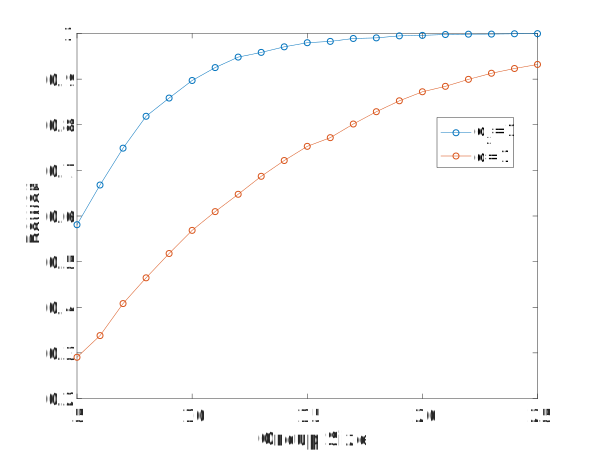

# The (Statistical) Power of Pairs #

In this post I describe how I stumbled upon a "hidden" parameter involved in doing a power analysis with paired data. 

## Problem Setup ##

So, the most useful thing out of this entire post might be the following .... For straightforward power analyses, I use a program called [G*Power](http://www.psychologie.hhu.de/arbeitsgruppen/allgemeine-psychologie-und-arbeitspsychologie/gpower.html).

Let's compute the # of samples we need with an effect size of 1 and standard error parameters (&alpha;=0.05 and power=(1-&beta;)=0.8). Note, I like using the effect size when doing power analyses, since I think it is a nice straightforward way of specifying how strong an effect I expect to see. This is where some people get all worked up about power analyses, "power analyses are a bunch of baloney since you're making things up." It is true that when you don't have much data on which to base your power analysis, there is a bit more freedom to choose your parameters. However, I think that the real point of power analysis is to tell you what sample sizes are reasonable for your study, so if you fudge the numbers at the beginning, you're really lying to yourself. Anyway, onto the results.

If we start with an unpaired analysis, this is what we get:

<figure>

<figcaption>Results of power analysis for unpaired t-test. 
</figcaption>
</figure>

If we split our samples evenly, G*Power tells us that we need 34 samples, 17 from each group, to get our desired parameters. In some cases 34 may not be a lot, but for me 34 is often a lot. We can reduce this number if we design our experiments such that we have paired samples. For example with my work this means getting both measurements from the same animal. 

If we switch to a paired analysis, then we get:

<figure>

<figcaption>Results of power analysis for paired t-test. 
</figcaption>
</figure>

Switching to a paired test gets us a large reduction in the sample size, from 34 to 10 samples! If you don't think about it for too long, it seems almost magical. But in retrospect it is a bit surprising that the parameters are "exactly the same" and there is such a large reduction in the sample number. But if you think about it a bit longer, or if you try to simulate this, then you might begin to wonder where exactly that reduction comes from.


## Simulations - Part 1 - Unpaired Testing ##

So a project I was working on required something a bit more complicated than what G*Power provided, so I decided to run numerical simulations to calculate the required sample size. Numerical simulations are useful when it is difficult to work out the analytical solutions. I personally like simulations because they tend to be more intuitively obvious to me.

Before getting started on the complicated analysis, I wanted to practice by making sure I could replicate some simple examples. In this case, I was going to replicate the G*Power results from above.

If you're comfortable running simulations for power analyses, feel free to skip down to the next section.

In this example we'll use an effect size of 1. More on the effect size can be found [here](https://en.wikipedia.org/wiki/Effect_size#Cohen's_d). An effect size of 1 means that the difference in means is equal to the pooled standard deviation. If we assume the standard deviations of the groups to be equal, then the pooled standard deviation is simply the standard deviation of the groups.

Thus the numbers I've chosen are:
- mean1 = 0
- mean2 = 1
- standard_deviation = 1

**The Intuition:** For power, the question is, if we sampled from our expected data, in this case normal distributions, how often would we get a significant result. If we sampled infinitely many samples, we would always get a significant result. Similarly, if we use only a few samples, it is unlikely that we will have a significant result.

So basically we draw some samples and run our test. We repeat this process a lot (thousands of times), and keep track of the percentage of times we got a statistically significant test. That percentage is our power.

Here's the code:

```matlab
alpha = 0.05;
mean1 = 0;
mean2 = 1;
std_dev = 1;
effect_size = abs(mean1-mean2)./std_dev;
fprintf('Effect Size: %g\n',effect_size);

n_sims = 10000;
n_max = 25; %The maximum group size we'll test
n_min = 5; %The minimum group size tested

%randn is slow to call in a loop, we'll grab a lot of samples
%all at once
r1 = mean1 + std_dev*randn(n_sims*sum(n_min:n_max),1);
r2 = mean2 + std_dev*randn(n_sims*sum(n_min:n_max),1);

I2 = 0;
pct_different = NaN(1,n_max);
for group_size = n_min:n_max
    fprintf('Running group size: %d\n',group_size);
    is_different = false(1,n_sims);
    for i = 1:n_sims
        I1 = I2 + 1;
        I2 = I2 + group_size;
        s1 = r1(I1:I2);
        s2 = r2(I1:I2);
        is_different(i) = ttest2(s1,s2,'alpha',alpha);
    end
    pct_different(group_size) = sum(is_different)/n_sims;
end
```

<p align="center">

</p>

So if we look at where this plot crosses our target power of 0.80, we see this occurs at 17 samples with an achieved power of 0.807. So everything is matching up with G*Power.

## Simulations - Part 2 - "Paired Testing"##

So now that the unpaired testing is matching up, let's try paired testing.

So my first thought was, this should be easy ...

Let's take this:

```matlab
is_different(i) = ttest2(s1,s2,'alpha',alpha);
```

to this:

```matlab
is_different(i) = ttest(s1,s2,'alpha',alpha);
```

<p align="center">

</p>

Well, that didn't work!

And in retrospect, there was really no reason that it should have.

## What's Missing ##

A paired test can increase your power relative to an unpaired test if the values are correlated. For some reason this has always made sense to me with the following set of data. Consider the following distribution (left panel) where the effect size looks to be relatively small.

<p align="center">

</p>

However, if you look at the changes of individual samples, every sample is going up. These changes are summarized in the distribution on the right. The values at the top represent the unpaired p-value (left), the correlation (middle), and paired p-value (right). Obviously, in this case, given the high correlation value, the paired testing was quite helpful.

Below is another example where the correlation has been reduced, and the resulting paired test is not as effective. 

<p align="center">

</p>

## Two Different Effect Sizes ##

I had initially planned on providing code that demonstrated how to simulate results that took correlation into account. However, I ran into a lot of difficulty which I'll discuss below. So instead I went back to G\*Power and started poking around more closely. Eventually I had a hunch that they must be calculating sample size based on a **single** distribution of the differences, rather than on the two original distributions. Most likely this was a normal distribution, because well, why not.  In other words, our statistical test was now going to be whether the distribution created by calculating differences within each pair was different than 0 (where being equal to 0 means there is no difference in values between the two groups). 

Thus the question became, how do we calculate an effect size when we're comparing a single distribution to a fixed value. After a bit of googling I found this [page](http://jakewestfall.org/blog/index.php/2016/03/25/five-different-cohens-d-statistics-for-within-subject-designs/) detailing 5 different versions "Cohen's d" (the effect size we've been using here) for within-subject designs (which I took to mean paired testing). One of the options that blog says:

> A third way to compute a d-like effect size is to reduce each subject’s data to a single difference score—the mean difference between their responses in each condition—and then use the standard deviation of these difference scores as the denominator of d. Cohen actually discusses this statistic in his power analysis textbook (Cohen, 1988, p. 48), where he carefully distinguishes it from the classical Cohen’s d by calling it dz.

Basically d<sub>z</sub> is simply the mean of the difference distribution divided by it's standard deviation. In Matlab, if we compare our second distribution, which has had both a mean and standard deviation of 1, to 0, we're essentially using an effect size (d<sub>z</sub>) of 1. Also of note, when I go back and look at G\*Power it clearly indicates it is using d<sub>z</sub> instead of d (obviously, no one besides me would ignore that little subscript!)

In Matlab our test goes from:

```matlab
is_different(i) = ttest2(s1,s2,'alpha',alpha);
```

to this:

```matlab
%Comparing to 0, i.e. is there a change 
is_different(i) = ttest(s2,0,'alpha',alpha);
``` 

As a reminder, is_different is tracking whether random samplings of our distributions result in a positive test outcome when we know there should be a positive outcome because we've specified the true distributions. How often this happens is our statistical power.

The figure below shows our increase in power from using an effect size that is based on the original distributions (d=1) versus one that is based on the distribution resulting from the differences (d<sub>z</sub>).

<p align="center">

</p>


When switching from unpaired to paired, the effect size switches from d to dz, something I hadn't noticed before and which I'll come back to in a second. 


While steps 1 to 3 target at comparing independent groups, especially in intervention research, the results are usually based on intra-individual changes in test scores. Morris & DeShon (2008, p.111) suggest a procedure to estimate the effect size for single-group pretest-posttest designs by taking the correlation between the pre- and post-test into account:

σD=σ·2·1-ρ
In case, the correlation is .5, the resulting effect size equals 1. Comparison of groups with equal size (Cohen's d and Glass Δ). Higher values lead to an increase in the effect size. Morris & DeShon (2008) suggest to use the standard deviation of the pre-test, as this value is not influenced by the intervention. The following calculator both reports the according effect size and as well reports the effect size based on the pooled standard deviation:


- simulation
- where's the pairing
- correlations