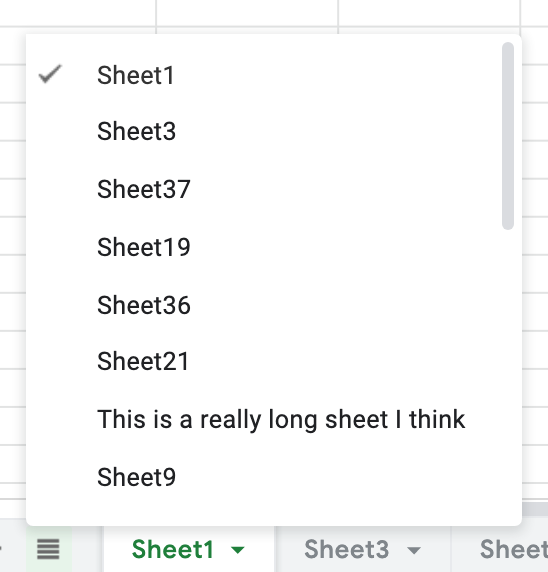
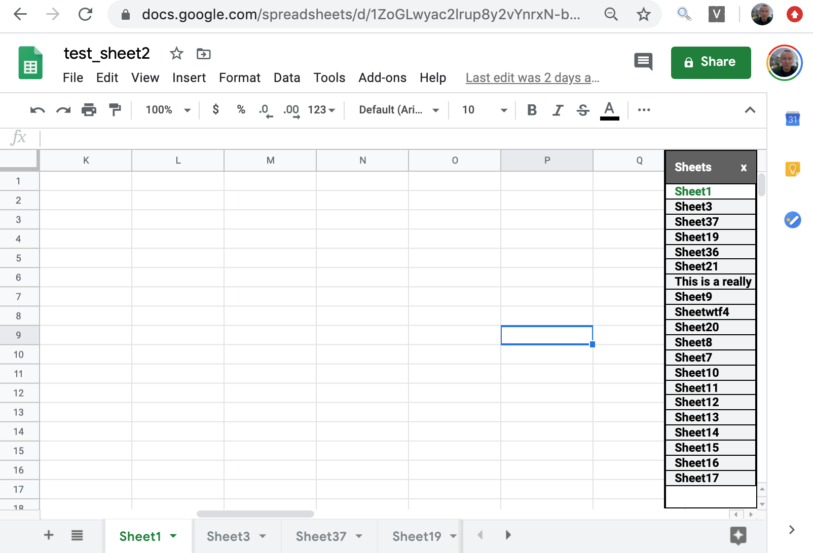
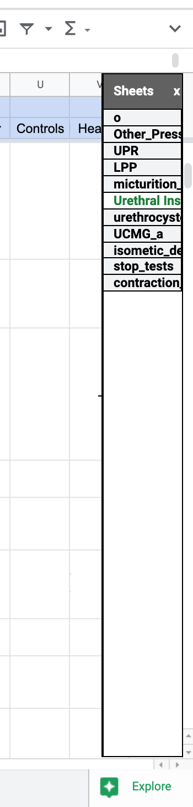
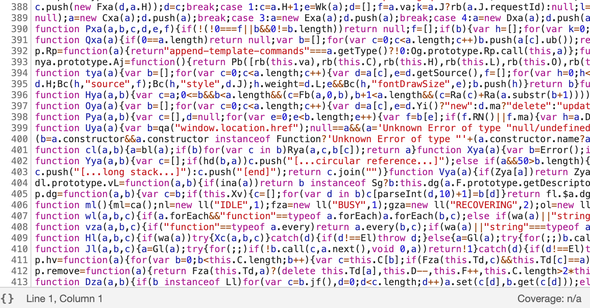
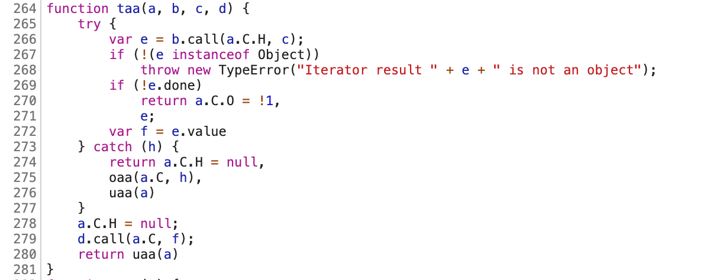
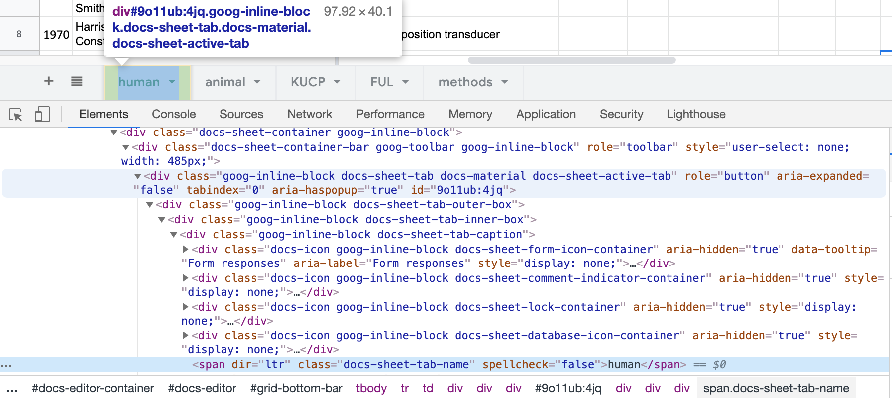

## Vertical Sheet Tabs in Google Sheets ##

This post describes my work creating a vertical list of sheets that can be used to navigate between sheets in a Google Spreadsheet document.

The resulting code for this project is hosted at:

[https://github.com/JimHokanson/vertical_gsheets_selector](https://github.com/JimHokanson/vertical_gsheets_selector)

## Motivation ##

I had started writing a blog post on how I organize information on papers that I read while doing scientific research. This process involves using Google Spreadsheets (for reasons I intend on discussing in that post). Google Spreadsheets is an online (and offline) spreadsheet editor like Microsoft Excel.

At some point during writing that post I decided I was fed up with sheet navigation and wondered if there were any existing workarounds to fix the problem. Specifically, in Google Sheets, like in Excel (and web browsers, and elsewhere), navigation between sheets is done using a horizontal list. For those with limited screen real estate and lots of sheets it can be awkward to switch between sheets.

<figure>

<figcaption>Horizontal sheet navigation bar example.
</figcaption>
</figure>  

Above is an example of the standard method of navigating between spreadsheets. Clicking on a sheet name switches to that sheet. Some sheet names are not visible and thus can not be clicked on with the mouse. To click on those sheets you can use the arrows (right side of the image) to navigate to the tab of interest and then click on the sheet. Alternatively, an "all sheets" button is provided on the lower left. Clicking on this button brings up a list of all sheets. Clicking on an item in this list navigates to that sheet. An example of this list is shown below.

<figure>

<figcaption>Example of navigation list that pops-up when clicking on the "all sheets" button (horizontal lines next to the "+" symbol).
</figcaption>
</figure>

Notice, this list may still require scrolling even though there is room for vertical expansion of the list (to avoid scrolling). Additionally, this list is normally hidden which may not be desirable.

What I wanted was an optionally visible list (permanent, but hide-able) that would display all available sheets and allow navigating between sheets by clicking on a sheet name.

## The Result - In Brief ##

The screenshot below shows the result of my work towards this goal.

<figure>

<figcaption>Example of the resulting vertical list of sheets.
</figcaption>
</figure>

Clicking on any sheet name navigates to that sheet. Other implemented features include:

1. resizable (via dragging on left part of window)
2. resizes on window resizing
3. resizes if menu visibility is toggled (still a little buggy occasionally ..., not sure why)
4. resizes if the companion bar is toggled (companion bar is the bar on the right with links to Calendar, Tasks, and Tasks)
5. listens for left/right moves, selection, add sheet, and remove sheet actions

Here's an example from one my actual spreadsheets that shows that the vertical sheet navigation sidebar has adjusted with the companion bar and menus being hidden.

<figure>

<figcaption>Example of the list moving to account for the menu and side bar hiding.
</figcaption>
</figure>

In the rest of the post I discuss approaches that I considered taking to solve this problem and the approach that I ended up using. I also discuss some of the technical aspects of implementing this code, current limitations, and possible future directions.

## Possible Approaches ##

There are at least two different advertised ways of programmatically interfacing with Google Sheets.

The first approach is to use the [Sheets API](https://developers.google.com/sheets/api/reference/rest). This was the interface I was aware of before starting this project. This interface involves communication with sheets via a REST (web based) API. If I wanted to periodically backup all of my sheets using a Python program, this is the interface that I would use. If I wanted to create a website that did something fancy with Sheets data, I would use this API. 

The other approach is the [Apps-Script API](https://developers.google.com/apps-script). From what I can tell this approach is for developing *Add-Ons* for apps such as Google Sheets, Gmail, or Maps. My impression is that this is often used by school districts to provide additional functionality on top of Google's web apps. These add-ons are either internal for [GSuite](https://gsuite.google.com/) customers or they can be shared publicly on the [GSuite marketplace](https://gsuite.google.com/marketplace).

If the goal is to add on a vertical sheet navigator to Google Sheets, **within Google Sheets**, the Sheets API is not appropriate. At first glance this would seem to only leave the Apps-Script API. However, I was less than enthusiastic about publishing something to the GSuite Marketplace. Really what I wanted was some code that I could easily use on my machines without publishing. It is not easy to share code between sheets without publishing; doing so basically involves copying the code from one file and pasting into another for every new spreadsheet. From what I could tell there was no good way of linking all spreadsheets to one script (again, without publishing). 

Additionally, and perhaps more importantly than publishing, calls to the API must go through Google's servers, rather than being processed locally. This means that the API needs an internet connection in order to work. Google Sheets itself works offline, syncing changes when an internet connection is available. Google Sheets is primarily a web app, but I highly value its offline functionality and wanted my code to have the same offline functionality.

So I needed a 3rd approach to interacting with Google Sheets ...

## A Chrome Extension ##

In addition to providing approaches that are specifically designed for interacting with Google Sheets, Google also provides a generic mechanism for interacting with websites within Google Chrome - Google Chrome extensions. Unlike the GSuite Marketplace, it is relatively straightforward to download extension code on your computer and to get it to run on all of your spreadsheets. It can also work offline as well, if designed that way. 

## Implementation ##

Using the extension approach, there is no documented way of interacting with a sheet. I can't for example tell the sheet that when a new sheet is added, I want my code to be called.

Now technically this may not be true, but it is quite difficult. The code that runs a sheet is available for anyone to view, manipulate, and probe. However the code is obfuscated so making sense of the code is difficult (although not necessarily impossible). As someone with minimal javascript background I quickly gave up on trying to interface with the existing code base. 

Using Chrome Developer Tools one can inspect the code running on the web page. Below is a snapshot of a file called "2938944681-waffle\_js\_prod\_core.js" For reference, I have no idea what it does, other than it being something that is used by Google Sheets. The code has been [minified](https://en.wikipedia.org/wiki/Minification_(programming)) for sending it more quickly over a network (as well I suspect for quicker parsing/loading). Minification involves removing unecessary characters like white space and comments that aren't necessary for running code.

<figure>

<figcaption>Code presumably used for working with my sheet as sent over the network. Note the lack of whitespace as the code has been minified.
</figcaption>
</figure>

Developer tools can automatically insert white-spaces to "pretty-print" the code. A screenshot of the same file after this has been done is shown below. This view shows us another important aspect of the code, it has been [obfuscated](https://en.wikipedia.org/wiki/Obfuscation_(software)). In other words, no one at Google is writing a function called `taa` that works with inputs `a`, `b`, `c`, and `d`. Note, the code isn't complete gibberish, and with some effort you could probably figure out what the function does. However, the purpose of the function is not as obvious as it might be with good variable names.

<figure>

<figcaption>Function showing that the code has been obfuscated to discourage use by others. 
</figcaption>
</figure>

So ... we can't easily hook into the existing javascript code for our extension. However, we know that when we click on a particular button, a new sheet is added. Thus we can listen for that button to be clicked. When it is clicked, the focus changes to the new sheet. In other words, the site opens up the new page and visual changes are made which indicate that the new sheet is selected. These visual changes also correspond to changes in the html code which we can query with our own javascript.

So in other words, if we want our navigation sidebar to show that a new sheet has been added, and to add it in the correct position with the correct new name, we can do the following:

1. Log the currently active sheet for reference (on startup).
2. Add a listener that tells the browser that if the button is clicked our code needs to run
3. When clicked, wait until our active sheet is no longer active. This indicates that Google's code has processed the new sheet.
4. Once no longer active, get the new active sheet name and position.
5. Update our sidebar accordingly.

Determining what an active sheet means involves looking at the html code using developer tools. A screen shot of the relevant element is shown below. Google's developer tools allows you to click on an element and it will navigate to where in the document the element is located. When doing this on the selected sheet tab we can see that the tab has a class name of "docs-sheet-active-tab". If you look a bit further down you can see the name of that tab is "human". Note also that the tab has a class name of "docs-sheet-tab". If we query the document for all of those tabs we can get a list of all the sheet names.

<figure>

<figcaption>A portion of the html document (representing my spreadsheet) containing the markup for the active sheet tab. This type of inspection allowed me to write code that would look for the active sheet as well as to get the sheet names.
</figcaption>
</figure>

This indirect approach, logging initial state then listening for an event and waiting for the state to change was used throughout the project. Looking at the underlying html was critical for understanding how to referene various parts of the web page.

## Mid-Blog Rewrite ##

Writing these blog posts, similar to writing a paper, provides an opportunity to asess and reflect on what's been done. Often times code documentation improvements are made. Sometimes bugs are fixed. 

When testing the functionality that monitored when a new sheet was added I noticed my code was no longe working, even though it had worked before. Worse, during additional testing it would occasionally work. This type of bug generally indicates a [race condition](https://en.wikipedia.org/wiki/Race_condition), wherein whether code works or not depends on how fast different parts of code, running in parallel, finish relative to one another. If one part runs fast enough, your code works. If it runs slower than another part, your code doesn't work. 

I asked about this observation on [Stack Overflow](https://stackoverflow.com/questions/62617290/why-is-my-html-element-javascript-variable-not-matching-what-i-see-in-the-dom). In addition to getting an answer to my question (which was indeed a race condition), others provided input on how to improve my code. In particular, rather than looking for a user to click, I could just ask the browser to tell me when the horizontal tab display changed (and why). This is apparently known as a [Mutation Observer](https://developer.mozilla.org/en-US/docs/Web/API/MutationObserver) and was helpful in improving code reliability and features. This ended up making it much easier to detect not only when a new sheet was added, but also when one had been deleted, or moved.

What really gets me about this experience is that it was a relatively obvious solution but that I was completely unaware of it. I think this probably happens a lot whether someone is trying to accomplish a task within a programming language, or choosing a programming language/framework that is best to accomplish a new project where the general approach isn't obvious, or even outside of software (e.g. techniques for performing surgery or tips on fixing a toilet - needed to do that one recently). The killer thing in these situations is that just a couple of minutes of good advice from someone knowledgable in the area can make a huge difference or save tons of time for the less knowledgable party. In the context of hobby programming, I often find myself wondering if there are good ways of facilting "hand-on apprenticeships" where you can go for quick advice on how to approach a project or how you might improve some small bit of code. 

Anyway, onto limitations.  

## Limitations ##

First, the only communication that the vertical sheets selector has with the "app" is to switch pages. It is not a replacement for the horizontal sheet selector. You can't rename or move a sheet. If there were exposed methods that could be called to make these changes I would consider implementing them. But since there aren't, this is not something I plan on spending effort on.

Currently not all of the changes in the horizontal sheets are mapped to the vertical sheet. For example, the horizontal sheet allows you to give a sheet a color. This is something I could implement on the vertical sheet (i.e., mirroring the color of the horizontal sheet), but I'm not at this time. For me this is an important aspect of designing free software in my free time - feature completeness is not something I strive for. Instead, I write software to suit my needs and share it with others in case they find it useful.

At times the visual placement can get a bit off if menus are hidden or if a download banner appears/disappears. At some point I may try and improve this behavior but it is low priority for me.

Finally, the window literally just floats over the sheet. I don't integrate the vertical sheets into any of the other display elements (and adjust their appearance accordingly). In rare circumstances this may lead to the columns on the far right being hidden. Unfortunately this is something that I don't think I could change without a lot of effort.

## Concluding Thoughts and Future Directions ##

With the code in place I find myself reaching for it relatively frequently to help navigate sheets. I also find myself less inclined to try and minimize the number of sheets in a document for fear of needing to scroll since the vertical setup can typically handle many more sheets before scrolling becomes an issue.

As this was my first javascript project and the approach for accomplishing what I wanted to do was unclear, the code is a bit of a mess. At some point I'd like to clean it up although I have a lot of other projects that are higher priority for me (with potentially much larger impact).

I'm also warming up to the idea of publishing the code as an official chrome extension so that it is easier for others to use the code. However, I am a bit nervous about having to jump through hoops and I'm also somewhat nervous about getting on Google's bad side. I've read a lot of horror stories about people getting kicked off Google's apps with little to no warning. Since I use Google Sheets pretty frequently this would be quite unfortunate. At this point I'd like to stay off the Google radar.

Finally, as I use the vertical sheets interface I find myself wishing that it could link to other related documents. One approach for doing this would be to create a sheet which contains names and links to other documents that should be displayed in the vertical sheets selector. Unfortunately, to implement this would require being able to read the sheets, something my code can't do. Instead, I would need to go back to using a Google Apps script. Again, this is something I'd be interested in pursuing some time in the future, but with my limited time there are other much higher priorties.

