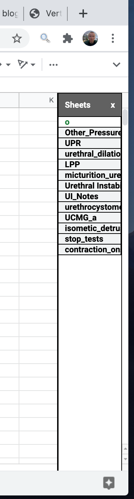

## Vertical Sheet Tabs in Google Sheets ##

This post describes my work creating a vertical list of sheets that can be used to navigate between sheets in a Google Spreadsheet document.

The resulting code for this project is hosted at:

[https://github.com/JimHokanson/vertical_gsheets_selector](https://github.com/JimHokanson/vertical_gsheets_selector)

## Motivation ##

I had started writing a blog post on how I organize information on papers that I read while doing scientific research. This process involves using Google Spreadsheets (for reasons I intend on discussing in that post). Google Spreadsheets is an online (and offline) spreadsheet editor like Microsoft Excel.

At some point during writing that post I decided I was fed up with sheet navigation and wondered if there were any existing workarounds to fix the problem. Specifically, in Google Sheets, like in Excel (and web browsers, and elsewhere), navigation between sheets is done using a horizontal list. For those with limited screen real estate and lots of sheets it can be awkward to switch between sheets.

<figure>

<figcaption>Horizontal sheet navigation bar example.
</figcaption>
</figure>  

Above is an example of the standard method of navigating between spreadsheets. Clicking on a sheet name switches to that sheet. Some sheet names are not visible and thus can not be clicked on with the mouse. To click on those sheets you can use the arrows (right side of the image) to navigate to the tab of interest and then click on the sheet. Alternatively, an "all sheets" button is provided on the lower left. Clicking on this button brings up a list of all sheets. Clicking on an item in this list navigates to that sheet. An example of this list is shown below.

<figure>

<figcaption>Example of navigation list that pops-up when clicking on the "all sheets" button (horizontal lines next to the "+" symbol).
</figcaption>
</figure>

Notice, this list may still require scrolling even though there is room for vertical expansion of the list (to avoid scrolling). Additionally, this list is normally hidden which may not be desirable.

What I wanted was an optionally visible list (permanent, but hide-able) that would display all available sheets and allow navigating between sheets by clicking on a sheet name.

## The Result - In Brief ##

The screenshot below shows the result of my work towards this goal.

<figure>

<figcaption>Example of the resulting vertical list of sheets.
</figcaption>
</figure>

Clicking on any sheet name navigates to that sheet. Other implemented features include:

1. resizable
2. resizes on window resizing
3. resizes if menu visibility is toggled (still a little buggy occasionally ..., not sure why)
4. resizes if the companion bar is toggled (companion bar is the bar on the right with links to Calendar, Tasks, and Tasks)
5. listens for left/right moves, selection, and add sheet in bottom bar

Here's an example from one my actual spreadsheets that shows that the vertical sheet navigation sidebar has adjusted with the companion bar and menus being hidden.

<figure>

<figcaption>Example of the list moving to account for the menu and side bar hiding.
</figcaption>
</figure>

In the rest of the post I discuss approaches that I considered taking to solve this problem and the approach that I ended up using. I also discuss some of the technical aspects of implementing this code, current limitations, and possible future directions.

## Possible Approaches ##

There are at least two different advertised ways of programmatically interfacing with Google Sheets.

https://developers.google.com/sheets/api/reference/rest
https://developers.google.com/apps-script

- selected approach
- limitations
- concluding thoughts and future directions

