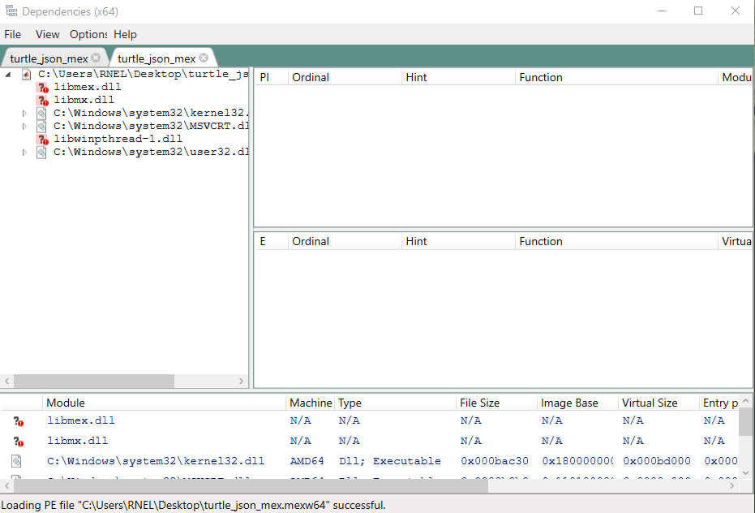

# Three Little Windows Programs #

I've been helping a group to get my awesome ;) JSON parser program working for MATLAB on their computers. Unfortunately compiling the program is a little bit more difficult than `mex myprogram.c`. 

As part of this process I used a couple of programs that I wish someone would have told me about years ago. In this post I briefly highlight three programs that I use semi-regularly on Windows, two of which are related to compiling (not necessarily just for MATLAB), and one that my eyes appreciate.

Those programs are:
1. [Dependencies](https://github.com/lucasg/Dependencies)
2. [Windows Path Editor](https://rix0rrr.github.io/WindowsPathEditor/)
3. [PangoBright](https://www.pangobright.com/)

# Dependencies #

Available at: [https://github.com/lucasg/Dependencies](https://github.com/lucasg/Dependencies)

This program helps you to determine what other programs on your computer your program needs to run. This has been immensely helpful for mex files (basically dll files for MATLAB), since it can easily show you files that are needed to run that are not available.

For example here's a screenshot of loading a mex file clearly showing that a thread library, "libwinpthread-1.dll", was missing.

When I had properly linked the thread library into my library (statically linked), that dependency disappeared. Thus my file was ready to distribute to other people without needing to make sure that I also sent them the thread dll. Note, the libmex and libmx files are part of MATLAB and will be properly detected when MATLAB is running (so the fact that they are missing is OK).

One of the reasons I wanted to write this quick post is that for the longest time I had used a program called "Dependency Walker". Here's a screenshot taken from [https://stackoverflow.com/questions/33604738/dependency-walker-with-kernel32-dll-on-windows-10](https://stackoverflow.com/questions/33604738/dependency-walker-with-kernel32-dll-on-windows-10)

One annoying feature is that warns you about a lot of "missing" libraries that are actually just a part of Windows. I used to hate using Dependency Walker because it was clearly abandoned, but I knew of no alternative. I don't remember how I came across Dependencies, a replacement for Dependency Walker, but boy was I excited! At the same time, I felt like that person that still uses Internet Explorer because how else are you going to get on the "internet"?!? That's a shoutout to my dad.... Why hadn't anyone told me earlier?

# Windows Path Editor #

Available at: [https://rix0rrr.github.io/WindowsPathEditor/](https://rix0rrr.github.io/WindowsPathEditor/)

When you run a program, Windows needs to know where to look for code that will help your program run. Most of the time things just work but occasionally you need to explicitly tell Windows where to look for code files by editing "the path." There are actually at least two paths, and these paths consist of a list of folders that Windows should search, separated by a semicolon. For example, my path starts like this:

`'C:\Program Files (x86)\Common Files\Oracle\Java\javapath;C:\tools\ruby23\bin;C:\ProgramData\Oracle\Java\javapath;`

Back in the day editing the Windows path, either to add a folder or remove a folder, was a horrible experience. Here's a picture from [https://superuser.com/questions/297947/is-there-a-convenient-way-to-edit-path-in-windows-7/297950](https://superuser.com/questions/297947/is-there-a-convenient-way-to-edit-path-in-windows-7/297950)

A few years ago Windows 10 finally updated their path editor, but it still isn't great. There are a couple of options but I really like Windows Path Editor. Here's a screenshot from that same SuperUser page linked above.

The program tells you which folders no longer exist (not shown in the above screen shot). It also makes it easy to search for programs/libraries (using "type to search (which)" box at the top). The only thing I would remove or encourage you not to use is the "automatic" button.

# PangoBright #

I saved the best for last. If you feel like your monitors are constantly showering you with an unnecessary number of lumens (?, candela?) this program can easily reduce the screen brightness. When you run it hides itself in the lower right on the task bar.

Every time I use the program my eyes thank me. I have only two gripes. One, I think sometimes it quits randomly. Also, when taking screenshots the brightness of the image is hard to interpret because your screenshot is dark (because of the program running) and then it is darkened again by the running program. Thus when I take screenshots I usually set the brightness back at 100% temporarily.

Now, you may be wondering, Jim, why don't you just adjust the brightness of your monitors. For any montior ninjas out there, this may be a valid option. If you're like me where touching any button besides the power button on the monitor gets you nervous, you may want to give this small program a try.

A final note, all 3 of these programs just run locally without installation. I've thus created an "apps" folder on my desktop where these programs live.

# Conclusion #

Hopefully you find at least one of these programs useful. If you have another small Windows app that you use all the time I'd be interested in hearing about it -- send me an email. 

