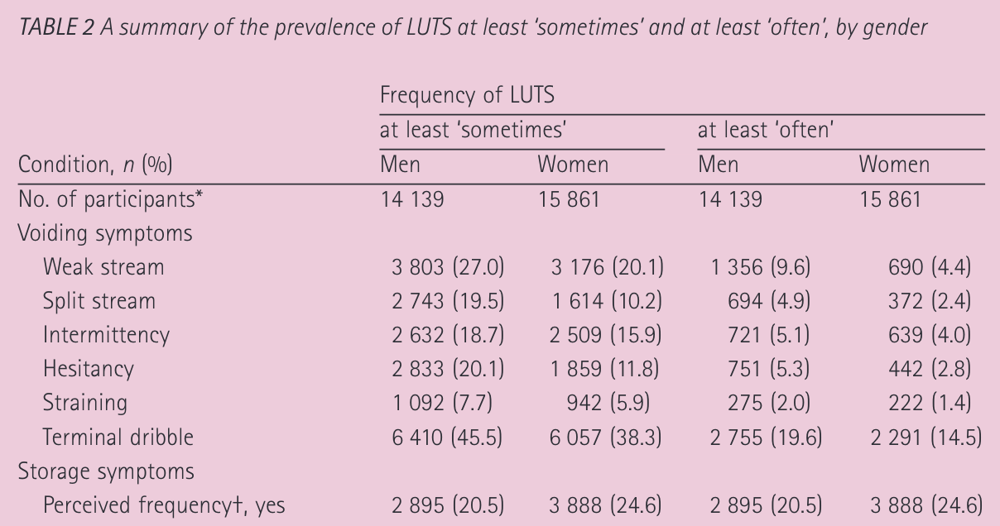
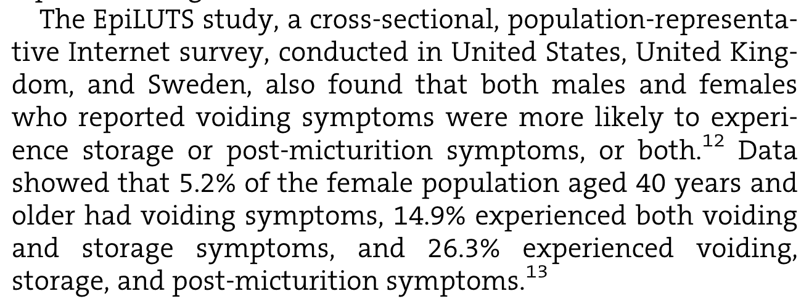
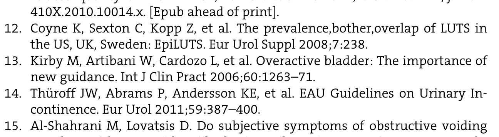
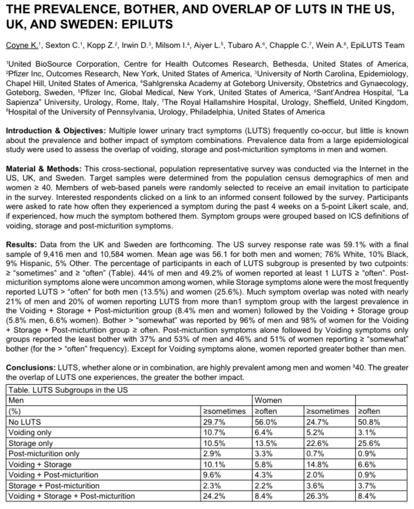
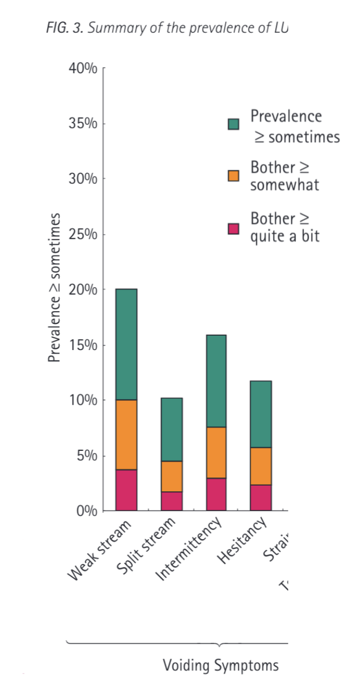

# Thinking Critically About Papers #

June 24, 2022

The following is a bit of a rabbit hole I went down, tracking down references, that I think may be informative for students. Feel free to work through this first on your own and then work through this with them. Although the material covers voiding dysfunction, that topic is not relevant to the problems encountered and anyone should be able to answer the questions. This was discussed during our journal club and I felt like it led to a pretty good discussion with my students.

# Introduction #

I'm working on a paper with other co-authors and came across the following paragraph one of my co-authors wrote. The first challenge I went through with my students was showing them the paragraph in question, and then seeing if they could identify which statment prompted me to investigate the reference(s) further. Here's the paragraph:

"Voiding symptoms are a departure from normal sensation or function, experienced by the woman during or following the act of micturition (PMID: 19941278). Per survey of the general population, 14.9% of women aged 40 and older have coexisting voiding and storage symptoms, and an additional 5.2% have isolated voiding symptoms (PMID: 19281467, PMID: 22419262). Coexistent storage and voiding symptoms are more common in women than isolated voiding symptoms and the clinical entities of underactive or “coexisting overactive-underactive bladder” are increasingly recognized (PMID: 32032454)."

The references in question are the ones with the statistics. I wanted to verify those numbers. They also seem like they come from the same material, so it was unclear why two references were present. I also wanted to know a bit more about how the numbers were characterizing different symptoms. Who is the general population? On what basis was having a symptom assessed? These details aren't necessarily going to make it into the final version of the paper but I like having a handle on what I'm citing.

I often give more scrutiny to references with statistical claims. I also frequently investigate surprising references -- "Dr. SuchAndSuch demonstrated that the earth is flat (Ref 1)!" Additionally, I have a bit of a pet-peeve when it comes to things that are cited as being extremely well-known or demonstrated in multiple studies, and yet only one reference is provided -- "It has been conclusively shown by multiple labs that kids like candy (Ref 2)." If 'Ref 2' is a review, that's OK. However it is not uncommon to have it be a single study, which in mind my is not great evidence that this is well-characterized/known.

Side rant .... Dear clinical journals that limit the number of references you can include on a paper, please remove this limit. Let reviewers decide if the number of references is excessive rather than encouraging plagiarism and poor attribution by limiting the number of references. And writers, please provide citations to back up your claims. Not citing is not cool. Thanks!

# EpiLUTS #

The first reference in question is the well known EpiLUTS study (PMID: 19281467). Don't worry if you are not familiar with it, it is not critical to the questions below. I will be referring to LUTS, which is an acronym for Lower Urinary Tract Symptoms.

Table 2 is where the action is at. I've posted a portion of this table here:

I'll come back to this table later in more detail. For now the important part is to highlight the data. The one comprehension question worth asking here is "why is this reference not sufficient for our paper?" The answer of course is that voiding symptoms are broken out by type, rather than being summarized in aggregate. More on this distinction later.

# Review of Voiding Dysfunction #

The second reference is a review of voiding dysfunction in neurologically normal women, henceforth referred to as the "review" (PMID: 22419262). Neurologically normal means there has been no overt neurological issue or trauma like stroke, spinal cord injury, or multiple sclerosis, even though there may be some non-obvious neural issues at play.

This is where things get interesting. This review cites a source claiming to provide aggregate (not per symptom) statistics. Here's the first part

and here's the reference section:

At this point there is one immediately obvious issue. The cited statistics most likely do not come from reference #13. Instead, from my discussion above of the first EpiLUTS paper, it should be pretty clear that the reference of interest is #12. Looking back at the first image from this paper, the need for two references probably should have thrown some red flags. There is one additional problem with that paragraph that we'll highlight later.

# EpiLUTS Abstract #

Here is the cited abstract from the review:

The first and perhaps most straight-forward question for this document is to ask what this type of document is. The answer of course is that it is an abstract, not a full journal article. As an abstract these results are intermediate and not necessarily as well prepared as the final article will be.

There are at least three issues with this abstract. The most noticeable is the formatting of the table. Presumably the "women" title should be over to the right one column (i.e., currently it is one too far to the left, covering values of "often" for men). The second issue is subtle and arguably not an issue. The title of the abstract implies, at a quick glance, that the results are aggregated from three different countries, the US, UK, and Sweden. However, the methods make clear that only data from the US are available. I would have liked to have seen a better title for the abstract, perhaps as simple as "US results of prevalence, bother, and symptom overlap from the EpiLUTS study." The third issue is with respect to the data, and honestly I screwed this up initially in my analysis of this abstract. The problem comes in when looking at the frequency of ">= sometimes" and ">= often". At first glance, it seems like ">= sometimes" should also incorporate ">= often", so that the values in the former should always be higher than values in the latter. However, this is not what the table shows and is in fact correct, due to the interactions between the rows. However after A LOT of thinking about this I think there is actually no way to represent this data nicely like they are trying to show it. As an example, consider someone that often has voiding symptoms and sometimes has storage symptoms, where do they go in this table? My guess is that they are counted twice, once in the often column for voiding (no LUTS in the "often" column), and once in the voiding + storage for the "sometimes" column. I find this to be very unintuitive and generally misleading. However, this sort of multi-counting checks out as each column sums to 100%. Thus someone could "often" have no LUTS but "sometimes" have all the LUTS types; it makes sense but it definitely takes a while to appreciate.

# Final Thoughts on EpiLuts Data #

So thus far the review paper incorrectly referenced an abstract, and the abstract was itself, quite rough. There are a few additional points to comment on.

First, I wondered are these cited data points from the "sometimes" or "often" column. Take a second to find the data. What do you see? Yes, one of the values has been copied incorrectly. It is not much of an error, 14.8% in the abstract vs 14.9% in the review, but still.

Next, I had my team review the actual EpiLuts study to get estimates of prevalence for any voiding symptom. This was meant as an exercise to understand summary statistics. There are two questions here. First, what is the highest possible percentage of women that have voiding symptoms? Second, what is the lowest possible percentage? We don't have those numbers, but it is useful to think of how the population is being summarized. The answer to the first question is the sum of each individual symptom, wherein we assume that each subject only has 1 symptom. This would lead to the highest possible total count. Of course this is highly unlikely and if we exceed 100% we know it to definitely not be true (absent rounding issues). Note, the text itself may offer some clarification that this did not occur which I am ignoring here. The answer to the second question then is the highest single value, wherein we assume that people that have any other other symptoms also have the most common symptom.

Two final thoughts. First, I think it would be beneficial to have students look at Figure 3 in the EpiLUTS study. A portion of it is below, with the legend moved into the field of view.

This figure highlights two things. First, that prevalence is not the same as bother. This is pretty obvious but is important to highlight. Second, the y-label is confusing. Not sure why they labeled it like they did.

The final issue is that we still don't have the numbers from EpiLuts on people with any voiding symptoms. If the data were publicly available we'd be able to analyze it to extract that number. It turns out the EpiLuts study was funded by Pfizer. If it had been funded by the NIH, there would be a reasonable expectation that the data would be either publicly available, or available on request, although there is a lot that could be said about this "availability" (perhaps a topic for another time).

# Bonus #

Numbers, numbers, numbers!

