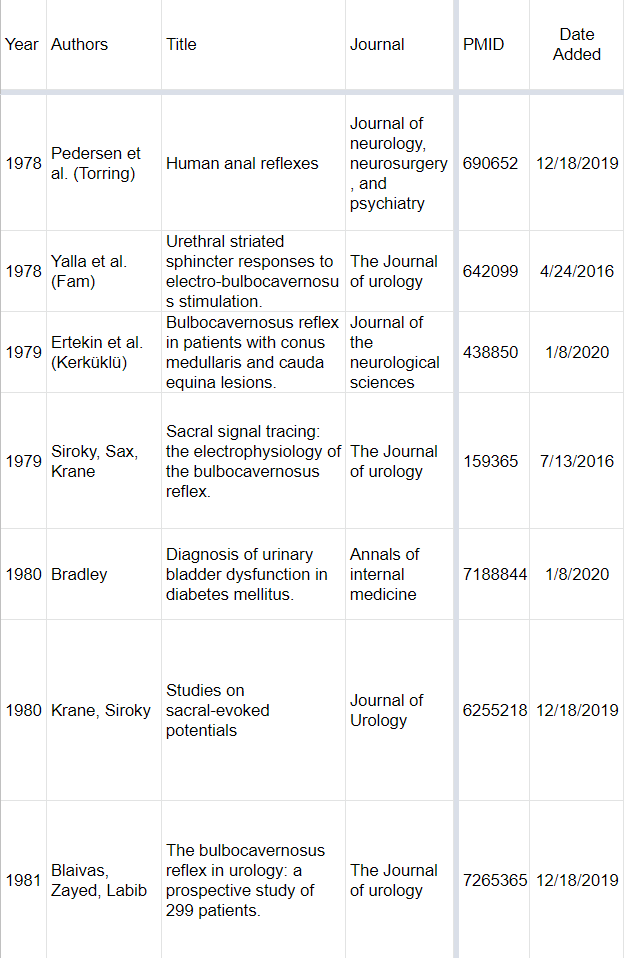
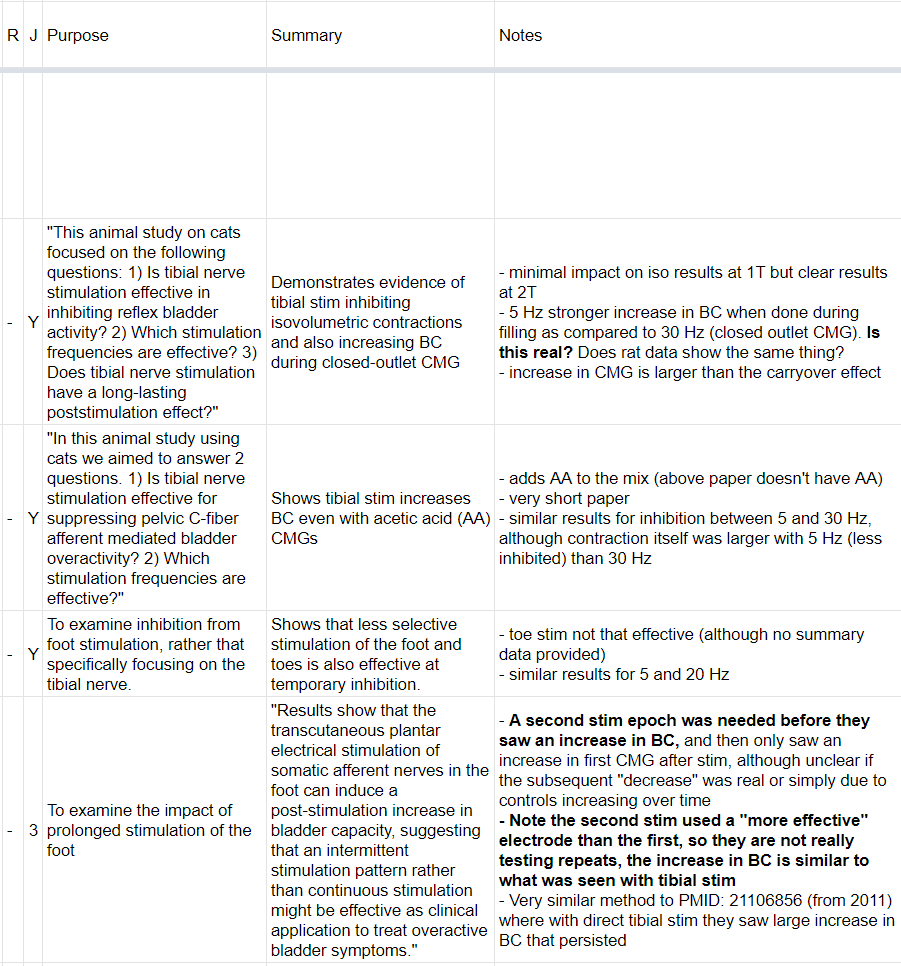
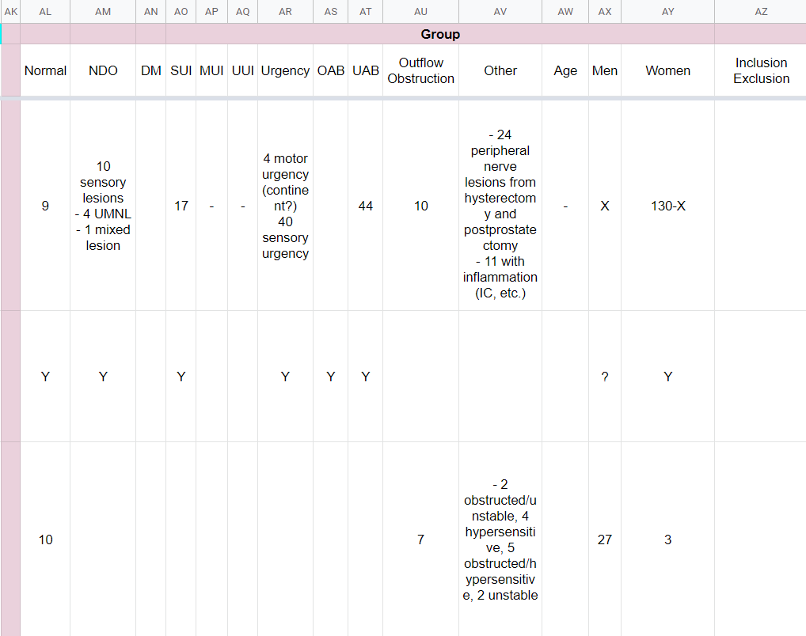
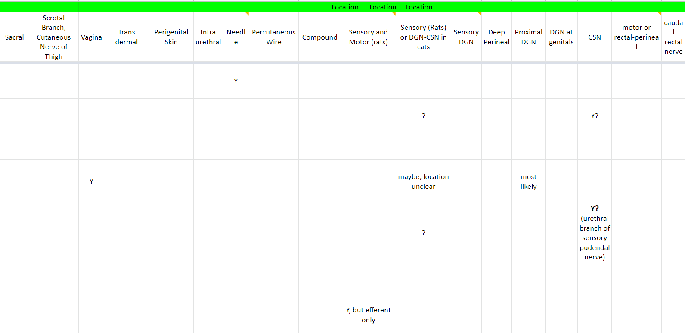
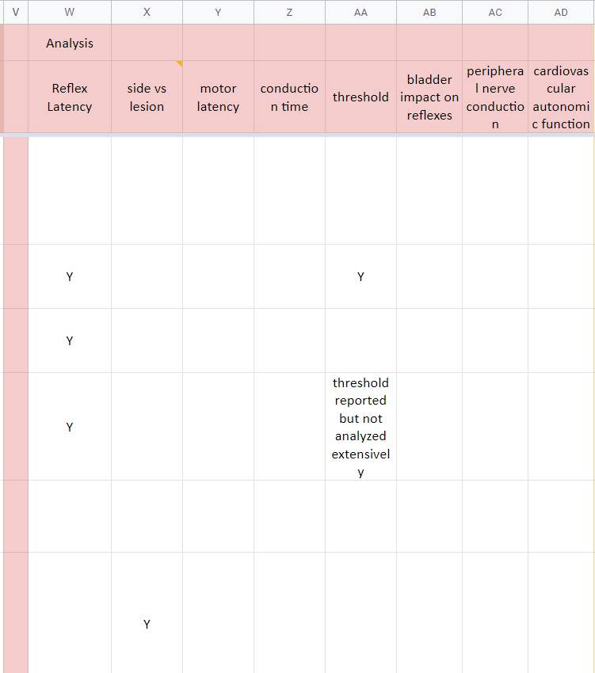

# Organizing Papers/Knowledge Using Google Sheets #

**Oct. 22, 2022**

In this post I'll describe how I organize papers/knowledge for keeping track of scientific papers that I read. As I described in more detail in a [previous post](../../2020/2020_08_what_do_we_know/), there are a ton of papers on "science" and the rate of accrual of papers seems to be ever increasing. I also described how I think most people in most fields do a poor job of both 1) staying up to date on new papers as well as 2) fully understanding what has already been published. This is not necessarily due to personal failures. When nearly everyone is awful at something, it suggests the system itself might need to be changed. However this post is not about what changes we may want to make (see linked post above), this post is about how I try and stay on top of the scientific literature. I am by no means perfect, and I will highlight some ideas I have on further improvements at the end, but my system has been honed over the past ~10 years and I think it is worth sharing.

# The Main Idea #

When I first started reading papers, I found that I felt like I was learning so much. But when I was done I would try and remember what I had read and had a hard time remembering details. This was despite making notes alongside each paper and highlighting relevant sections, something made easier by the rise of alternative bibliography managers around the time I started graduate school (Mendeley, Zotero, Papers) that were more than just "reference management" tools.

So as a postdoc I started the practice of keeping "lists" of papers that I read. I write these lists on Google Sheets for synchronization and easier searching. Importantly, these lists are my way of tracking what I read, including very specific and often important details of the papers. Below I describe exactly how I do this but the main idea is that at the end of reading I have added a document to my lists, including details meant to help me retain the paper's information, as well as to understand its place relative to others papers.

# High level Overview #

## Document Naming ##

The first step in starting a list is to create a document (Google Sheet). I find choosing a suitable name to be quite difficult and will occasionally change my naming approach. This highlights one of the first important things about my overall strategy; there are few rules and I change my approach as I go. This is NOT a perfect system. In general I try to group topics in a single document and create more specific documents if need be. For example, when I first started I created, a "drugs" sheet. In reality this was not just a sheet about drugs as therapeutics, this also was about receptors and transmitters. At some point I updated the title of the document to reflect this ("drugs_chemical_receptors"). Eventually many drug/receptor/transmitter topics became hard to organize on a single sheet and I started to create additional documents that were more specific. For example, some of the sheets in this category are:

- Drugs__Acetic_Acid
- Drugs__Adenosine
- Drugs__Adrenergic
- Drugs__AlphaAgonists_And_Antagonists
- Drugs__alpha_chloralose
- Drugs__anesthesia
- Drugs__ATP_P2X

and that's just the A's

You'll also notice some small inconsistencies with the sheets, such as adrenergic and alpha agonists/antagonists, where the latter is a subset of the former. Same for anesthesia and alpha chloralose, as well as adenosine and ATP/P2X. These are OK with my system. I'll discuss how I handle this when I discuss handling multiple sheets and documents.

## Paper Identification ##

Within a document I usually start with a "main" sheet or a "human" and "animal" sheet. Humans and animals studies are often done very differently and I find it helpful to separate these in most of my "generic" sheets (more on what generic means later when I discuss non-generic sheets). For most entries, I identify a paper with the following 6 columns:

- year
- authors
- title
- journal
- PMID or DOI
- date added

Within these entries I sort by year, then by last name of the first author. Any sorting levels after that are not specified, i.e., there is no guarantee of the order of two or more papers by Doe et al. 2002 on a sheet. For authors I have the following rules:

- 1 author: list their last name -> last1
- 2 authors: last1 and last2
- 3 authors: last1, last2, last3
- 4+ authors: last1 et al. (last name of last author) - often it is helpful to be able to see who is the last author

Here is a screenshot of all this in action:

## Values for Y/N Columns ##

Values for many of the following columns can take on one of the following values:

- **&lt;blank&gt;** : This indicates that the cell has not had information entered into it.
- **"Y"** : Used to indicate yes.
- **"-"** : This is used to indicate no. It is visible but not visually overpowering which makes it easier to see the yes entries. For many sheets this is most prevalent answer.
- **&lt;additional detail&gt;** : Many entries could be interpreted as yes or no, but often it is helpful to add additional detail. For example, when documenting whether a paper is a review or not, valid entries include "Y" but also "systematic", "meta-analysis", etc.

## First 5 Info Columns ##

After identifying the paper, the next 5 columns are typically the following:

- **review** : I often abbreviate this as "R" to save space.
- **Jim** : I often abbreviate this as "J" to save space. This indicates that I have the paper. This can be useful if I share a document with someone else, where they can also add a column to track that they have the paper. Ideally once I have read the paper I change this to a score from 1 (worse) to 5 (best).
- **Purpose** : The objective for the study.
- **Summary** : The main take-home message for the study.
- **Notes** : All other notes that don't go into a specific column. Occasionally I will bold notes of high importance.

Here is an example screenshot:

## Other Aspects of Within Sheet Organization ##

Additional columns are much more variable, although I tend to have the following "topic areas". These include:

- **who** - For people this will often include "men","women" along with types of patients which for me includes "UUI","SUI","neuro" to represent people with urgency urinary incontinence, stress urinary incontinence, and neurogenic patients. In addition to Y/N I will try and include counts (when available). For animals I often have things like "F_rat", "M_rat", "F_mouse", and "M_mouse" where F and M stand for female and male.
- **experiment methods** - These columns focus on how the experiment was executed. This is very specific to the sheet. For example, for electrical stimulation I document how the stimulation amplitude, rate, and pulse width, as well as location of stimulation (if not clear by the sheet topic). Sometimes this can get complex as one parameter may have been used in one test and another parameter in another test. I do my best to document this in the cell. Other times I will make this multiple columns where each column indicates the presence or absence of some aspect of the test.
- **analysis** - What data were analyzed. This can often be inferred from the experiment methods but of course there are multiple ways of analyzing collected data. For electrical stimulation, this may include understanding how the response varies with rate or with amplitude ("vs_rate" or "vs_amp")

Again, it is important to note that these columns tend to be flexible. Often I will add columns as I am reading papers and realize there is something I want to track. I also like to break out these sorts of sections by color to help with my organization (see screenshots below).

Here are some example screenshots:

**Important Note**: My sheets are far from perfect, and many have blank entries or don't follow the format above. Here is an old sheet in a bit of a different format. At some point if I am doing more work with this topic I may rearrange things a bit, and that's OK!

# Usage #

- data entry with colors
- do a search and add relevant papers
- read papers past to future
- add columns as necessary
- break off sheets/reorganize as necessary
- don't always use when not reviewing a topic
- reviewing a paper

# Multiple Sheets #

- subsets - tracking a particular feature rather than generic
- see also/links - helpful for 
- vertical sheets app

# Future Directions What's Missing #

- easier to add entries
- images as thumbnails or with markup
- coverage (where is my document)
- could work better as a dedicated program - if column is true, then add another sheet with other things that are tracked.

