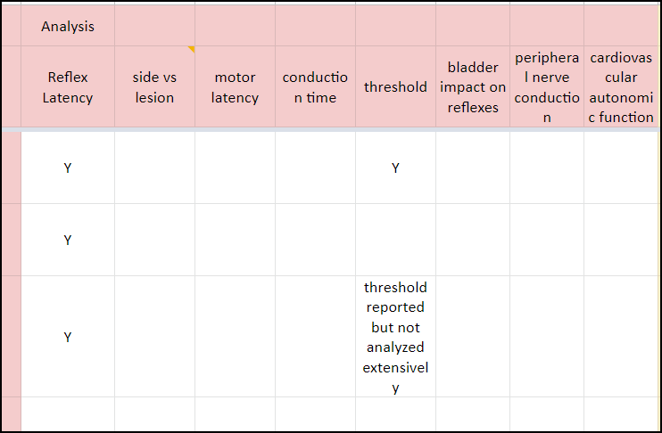

**Published January 18, 2023**

# Organizing Papers/Knowledge Using Google Sheets #

In this post I'll describe how I organize papers/knowledge for keeping track of the scientific papers I read. As I described in more detail in a [previous post](../../2020/2020_08_what_do_we_know/), there are a ton of papers on "science" and the rate of accrual of papers seems to be ever increasing. I also described how I think most people in most fields do a poor job of both: 1) staying up to date on new papers as well as 2) fully understanding what has already been published. This is not necessarily due to personal failures. When nearly everyone is awful at something, it suggests the system itself might need to be changed. However this post is not about what changes we may want to make (see linked post above), this post is about how I try and stay on top of the scientific literature. I am by no means perfect, and I will highlight some ideas I have on further improvements at the end, but my system has been honed over the past ~10 years and I think it is worth sharing.

# The Main Idea #

When I first started reading papers, I found that I felt like I was learning so much. But when I was done reading a set of papers, I would try and remember what I had read, and I had a hard time remembering details. This was despite making notes alongside each paper, and highlighting relevant sections, something made easier by the rise of alternative bibliography managers around the time I started graduate school (Mendeley, Zotero, Papers) that were more than just "reference management" tools.

So as a postdoc I started the practice of keeping "lists" of papers that I had or planned to read. I write these lists on Google Sheets for synchronization and easier searching. Importantly, these lists are my way of tracking what I read, including very specific and often important details of the papers. Below I describe exactly how I do this, but the main idea is that at the end of reading a paper I have added an entry into one of my lists, including details meant to help me retain the paper's information, as well as to understand its place relative to others papers.

# High level Overview #

## Document Naming ##

The first step in starting a list is to create a document (a Google Sheet). I find choosing a suitable name to be quite difficult and will occasionally change my naming approach. This highlights an important aspect of my overall strategy; there are few rules and I change my approach as I go. This is NOT a perfect system. In general I try to group topics in a single document and create more specific documents if need be. For example, when I first started I created, a "drugs" sheet. In reality this was not just a sheet about drugs as therapeutics, this also was also about receptors and transmitters. At some point I updated the title of the document to reflect this ("drugs_chemical_receptors"). Eventually many drug/receptor/transmitter topics became hard to organize on a single sheet and I started to create additional documents that were more specific. For example, some of the documents currently in this category are:

- Drugs__Acetic_Acid
- Drugs__Adenosine
- Drugs__Adrenergic
- Drugs__AlphaAgonists_And_Antagonists
- Drugs__alpha_chloralose
- Drugs__anesthesia
- Drugs__ATP_P2X

and that's just the A's

You'll also notice some small inconsistencies with the sheets, such as adrenergic and alpha agonists/antagonists, where the latter is a subset of the former. Same for anesthesia and alpha chloralose, as well as adenosine and ATP/P2X. These are OK with my system. I'll discuss how I handle this when I discuss handling multiple sheets and documents.

## Paper Identification ##

Within a document I usually start with a "main" sheet or a "human" and "animal" sheet. Humans and animals studies are often done very differently. I find it helpful to separate these in most of my documents. For most entries, I identify a paper with the following 6 columns:

- year
- authors
- title
- journal
- PMID (Pubmed ID) or DOI (Digital Object Identifier)
- date added

Within these entries I sort rows by year, then by last name of the first author. Any sorting levels after that are not specified. So, for example, there is no guarantee of the order of two or more papers by Doe et al. 2002 on a sheet. For authors I have the following rules:

- 1 author: list their last name -> last1
- 2 authors: last1 and last2
- 3 authors: last1, last2, last3
- 4+ authors: last1 et al. (last name of last author) - often it is helpful to be able to see who is the last author

Here is a screenshot of all this in action:

**Figure 1**: First 6 columns of most of my documents. Notice the various ways of doing author name formatting. Often times the "PMID" column will be "PMID or DOI" and will occasionally have ISBN numbers in there as well for chapters. 

## Values for Y/N Columns ##

Values for many of the subsequent columns can take on one of the following values:

- **&lt;blank&gt;** : This indicates that the cell has not had information entered into it.
- **"Y"** : Used to indicate yes.
- **"-"** : This is used to indicate no. It is visible but not visually overpowering which makes it easier to see the yes entries. For many sheets this is the most prevalent answer.
- **&lt;additional detail&gt;** : Many entries could be interpreted as yes or no, but often it is helpful to add additional details. For example, when documenting whether a paper is a review or not, valid entries include "Y" but also "systematic", "meta-analysis", etc.

## Next 5 Columns ##

After identifying the paper, the next 5 columns are typically the following:

- **review** : I often abbreviate this as "R" to save space.
- **Jim** : I often abbreviate this as "J" to save space. This indicates that I have the paper. This can be useful if I share a document with someone else, where they can also add a column to track that they have the paper. Ideally once I have read the paper I change this to a score from 1 (worse) to 5 (best). I sometimes also add this as a tag in my Zotero library (e.g., score_4)
- **Purpose** : The objective for the study.
- **Summary** : The main take-home message for the study.
- **Notes** : All other notes that don't go into a specific column. Occasionally I will bold notes of high importance.

Here is an example screenshot:

**Figure 2**: These 5 columns tend to immediately follow the first 6 columns. Notice that in some cases I copy directly from the document, which I try to indicate with the use of quotes. None of the papers in this example are reviews; I use the "-" character to indicate "no", which in general tends to make it easier to understand things.

## Other Aspects of Within Sheet Organization ##

Additional columns are much more variable, although I tend to have the following "topic areas". These include:

- **who** - For people this will often include "men","women" along with types of patients. For me these "types" include "UUI", "SUI", and "neuro" to represent people with urgency urinary incontinence, stress urinary incontinence, and neurogenic patients respectively. In addition to Y/N I will try and include counts (when available). For animals I often have things like "F_rat", "M_rat", "F_mouse", and "M_mouse" where F and M stand for female and male.
- **experiment methods** - These columns focus on how the experiments were executed. This is very specific to the sheet. For example, for electrical stimulation I document the stimulation amplitude, rate, and pulse width, as well as location of stimulation (if not clear by the sheet topic). Sometimes this can get complex as one parameter may have been used in one test and another parameter in another test. I do my best to document this in the cell. Other times I will make this multiple columns where each column indicates the presence or absence of a test (e.g., isovolumetric testing, single fill cystometry, continuous cystometry, etc.).
- **analysis** - What data were analyzed. This can often be inferred from the experiment methods but of course there are multiple ways of analyzing collected data. For electrical stimulation, this may include understanding how the response varies with rate or with amplitude ("vs_rate" or "vs_amp")

Again, it is important to note that these columns tend to be flexible. Often I will add columns as I am reading papers and realize there is something I want to track. I also like to break out these sorts of sections by color to help with my organization (see screenshots below).

**Figure 3**: An example of documenting the subjects involved in a study. Where possible I try and use more detail, in this case numbers, rather than just "Y" or "N"

**Figure 4**: Another grouping example, this one documenting stimulation location for "pudendal" nerve stimulation. Ideally I would be more proactive with my use of the "-" character to indicate that the various locations were not stimulated. If you look closely you'll also notice notes/comments (yellow tabs) in some of the columns. These can be useful to remind me what I intended to document when I created the column.

**Figure 5**: Another grouping example, again where "-" should probably be used more. Note, I try not to use "-" unless I have explicitly confirmed the absence of something. A blank space by comparison means the value hasn't been explicitly logged one way or the other. 

**Important Note**: My sheets are far from perfect, and many have blank entries or don't follow the format above. Here is an old sheet in a bit of a different format. At some point if I am doing more work with this topic I may rearrange things a bit, and that's OK!

**Figure 6**: One of my older sheets with a different format.

# Adding Entries #

I tend not to be very good about reading individual papers consistently. To "stay current" on papers I get email notifications from Google Scholar about new papers. I also occasionally remember to skim through journals for new articles. In both cases however I rarely read more than the abstract and will often simply download papers of interest to read at a later date.

Instead, most of my deep reading of papers tends to come from:
- reviewing a paper or grant
- being inspired by a question from ongoing research
- writing a paper
- spontaneously wondering about some topic and doing a deep dive (I do this alot ...)

The process of working with sheets can be broken down into two distinct processes, adding entries and entering additional data. I tend to do these two tasks seprately.

When I'm reviewing a paper or reading a really interesting paper, I'll often first go through the references and find ones related to the topic of interest. These are then added to the relevant sheet.

**Figure 7**: An example of papers that I have logged as being relevant to the topic at hand, but where I have not entered in all of the baseline information.

Note, I initially colored the entire row green to indicate a missing paper. This caused problems when I started adding colored columns to denote different sections, as undoing the row color would impact the dividers. I then switched to simply highlighting the first 3 columns. However, it is pretty easy to see which rows are incomplete and I've largely stopped highlighting these rows.

Adding the title can be a bit of work, particularly if trying to copy from PDFs. Occasionally if I'm in a hurry I will simply enter into the title something like the citing paper's author and year so that at a later point in time I can go back and find the specific paper being referenced.

Some entries are also tough to find. In those cases the "journal" entry may contain:

- name of the relevant conference and abstract page info
- name of book and page numbers for a particular chapter
- I may also enter "requested", with a date, if I couldn't find the entry and made a request to my libary for the document
- etc.

Other approaches to adding papers include searching Pubmed or Google Scholar for topics, or occasionally I will simply search my personal library of papers (i.e., search my Zotero library). 

Depending on how I'm feeling, I will then go ahead and add the full entries. As of right now, adding information for a full entry (adding the journal, PMID, date added, as well as ensuring authors and title are correct) indicates that I have that particular paper in my library. As a reminder, I do have a column that indicates if I have the paper, which would theoretically allow me to track papers in my library even if someone else that I shared the document with adds the full entry.

I find this whole process to be relatively mindless and something I can, and often do, while watching TV. Remember, in this case the goal is not to read papers, it is simply to create a "reading list" of papers and to ensure that I have the papers in my library. This makes it easier for me to focus when I'm reading papers.

# Adding Detailed Paper Information #

This step, unfortunately, is generally not possible while multi-tasking.

Rather than reading papers randomly, I often read by topic, reading papers from one of my sheets. I find it most useful to start at the beginning or at some earlier point of my choosing (i.e., I might start reading papers from 2000 or 2010, depending on the topic, as some older papers can be quite a slog). I find this approach useful because it recreates, to some extent, how the papers came into existence. If instead I were to read in reverse chronological order, I would have less of a knowledge base to draw upon. Reading in chronological order I am better able to understand what was done, as well as see ideas and concepts develop over time with subsequent publications.

Note, if I am trying to quickly get caught up on a topic sometimes it can be helpful to read a recent review paper. There are always exceptions to the rule!

As I'm reading I will inevitably find papers I've missed. Again, depending on my mood, I may first go back and read thosee older papers, or I may simply add a partial entry in my list. I will rarely however add a full entry to my list (check if the paper is in my library, download it if not, add all of the first 6 columns to my list). Adding the partial entry is meant to be quick and not distract too much from the process of reading.

# Multiple Sheets #

Thus far we have largely focused on single sheets in a document, or potentially having two sheets, one for animals and one for humans, as the type of information logged is often very different between the two.

As I'm documenting a topic, I will occasionally hit upon a subset of the topic that I want to track in more detail. For example, for sacral neurmodulation, I may be interested in understanding factors that are associated with treatment success, or surgical best practices, or improvements to the way the therapy is delivered (e.g., tined lead, MRI compatibility, curved stylet, etc.). These topics are then added as additional sheets in the document. Ideally in these instances the new sheet has more than 1 column of new information, as otherwise it could simply be a column in the original sheet.

Another instance where I have multiple sheets is for a generic topic that has many specific sub-topics. We've already encountered this with drugs, where originally I had one document with multiple sheets about different drugs. Other notable examples of this include testing, where the sheets in a document are different tests related to the same overall type of testing (e.g., urethral motor testing), and anatomy, where sheets will focus on different anatomical components (e.g., urethra, bladder, puendal nerve, pelvic nerve, etc.). Note for anatomy I organize my documents by species, rather than by anatomical topic.
 
All of these examples use roughly the same format as outlined above. However, as is hopefully clear by now, I sometimes deviate from this setup. For example, in drugs it is common for me to have a sheet with very specific drug names and descriptions of what they do. Another example is a table that documents the type of motor or sensory responses observed from stimulation at different spinal levels. Technically this could be documented in a more traditional format, but sometimes I prefer a more compact format.

One challenge with my approach is that it can be hard to find particular entries. Occasionally I will open up a document looking for a particular topic, e.g., urethral instability, and it won't be in that document. Once I find the correct document, I go back to the original document and create ... a link! I was pretty excited about this particular "invention." One of the first sheets in many of my documents is a "links" page that describes sheets related to the current document, with links to the relevant sheets (in other documents). Some of these link sheets also serve as tables of contents, describing the intentions of the other sheets in the document.

Finally, some documents have LOTS of sheets. Unfortunately Google Sheets does not support vertical tabs. I wrote a javascript add-on that will bring up a vertical list of sheets. Clicking on a sheet name will navigate to that sheet. More info on this is in a [previous blog post](../../2020/2020_04_Vertical_Tabs_Google_Sheets/). Here's what that add-on looks like for my sacral neuromodululation document:

**Figure 8**: Screenshot of my vertical sheets add-on. Clicking on a sheet navigates to that sheet. See referenced blog post on how to setup.

# Issues and Future Directions #

This system is far from perfect, but I've found it helps pretty well with paper recall. The following are a few final thoughts on what could be improved further.

**Better Entry Adding:**
Adding entries, particularly for systematic searches, takes work. I've created a script that takes a Pubmed ID and send the first 6 columns to the clipboard for pasting into a document. I'm also working on creating scripts that will take a set of documents, whether from a Pubmed search or from a Zotero search and add them to a particular sheet. This is low priority for me and the code is not yet public.

Currently it is possible to have a paper in multiple locations, which can lead to some duplication. I try not to worry about this but it does bug me a bit. I could imagine that a program specifically designed for this type of work might support different views or filters, where each view only showed particular papers, and in the process of filtering also added additional columns specific to that filter. For example, if one was looking at predictive models for sacral neuromodulation (the filter), additional columns could describe the modeling approaches used, what outcome was targeted specifically with the models, etc.

**Attaching figures with markup to cells**
For a while I've wanted to support pop-up images in cells. This would make it easy to include an image that summarizes a finding, rather than having to rely on text. Google Sheets does support embedding drawings into cells, but my impression is that the drawings have to be made first. In general the approach is rather clunky. As a bonus, I'd like the image to be a part of an image library that would also support markup (for understanding the figure), as well as adding metadata for searching. 

**Figure 9**: Hypothetical figure markup program that ideally would be easily attached to cells in a document. The app would support easy logging of metadata that could be searched (e.g., bring up all real urodyanmics traces with EMG recordings).

**Related documents and MESH support**

The entries on a page form a collection from which it should be possible to identify related documents that are not currently part of the set. Many of the content recommendation systems I've seen are prompted by single words or by single papers. My gut feeling is that a set of papers would be a better way of identifying related material.

Three potential ways of implementing this relatedness metric are:
- MESH terms
- citation mapping
- NLP analysis of content

MESH or [Medical Subject Headings](https://en.wikipedia.org/wiki/Medical_Subject_Headings), overseen by the National Library of Medicine (NLM), are a set of very specific words that are used to describe papers as well as clinical trials. My impression is that MESH terms are entered manually for every paper in Pubmed, although AI based approaches may be used to assist (or even do the job completely now). The following is an example of the MESH terms for "Somatic innervation of the human bulbocavernosus muscle" (PMID: 10363763)

**Figure 10**: MESH terms for a particular Pubmed ID. The terms can be found at the bottom of an entry's webpage, and are also available via Pubmed's web APIs (Entrez tools). 

I'm skipping over some of the intricacies of MESH, but the general idea is that by finding popular MESH terms in a set of papers it may be possible to find similar papers.

The second approach would be to use citation mapping. More specifically it should be possible to find papers commonly cited by a set of documents (common older papers), as well as new documents that cite a subset of the documents in the collection. Unfortunately doing this requires access to good citation data. I've long wished that a public database of citations was available, but I'm not aware of any. [Clarviate](https://en.wikipedia.org/wiki/Clarivate), the company that calculates impact factors, offers citation databases (Web of Science), but only to those that pay. My guess is that it would be against their terms of service to build a service, that is available to the public, that makes it easy to get citation graphs/maps for multiple papers quickly. Note I could be wrong here ....

Finally, another approach could involve some sort of natural language processing or NLP. In words words, use AI to process papers and "magically" infer relatedness. Compared to MESH and citations, I am a bit skeptical of this approach, but with recent advances in AI, who knows.

**Vendor lock-in/out**

One thing that gets me nervous about my approach is the potential for vendor lock-in, or perhaps more likely, lock-out (getting kicked out of my Google account). There are stories floating around on the web that Google will occasionally ban people for potentially silly reasons, or automated (read: AI) reasons that are not accurate, and that some people lose access to their accounts forever.

On my TODO list is to build in support for mass exporting of these files to my local computer. I've started working with the `gspread` Google Sheets Python library, and it shouldn't take that long to traverse a directory and export all sheets to local Excel documents. Note, although Excel is proprietary, the Excel document format is actually an open standard that any program could theoretically read. Additionally, the real win in this case is that the files are backed up locally, rather than the switching of formats. 

# Concluding Thoughts #

My system is far from perfect but I think it works pretty well. If I could ever figure out how to get funding for better knowledge integration, whether in urology specifically or through the design of better software, I would. Lately there seems to be a proliferation of programs in this space although none that I have found that are worth using. 

I'd love to make my documents publicly available, although some of the comments are specific to my interpretation of the material, and some of my comments are a bit direct! Also, in some ways I view my work in this area as being potentially advantageous for future projects. I love sharing but I also need to pay my bills. Much of this material could be wrapped into review articles, but review articles are critically undervalued, and often incomplete. As my career progresses I'm strongly considering trying to work with specific journals to create "living" review articles that receive Pubmed IDs (a sign of being official), but that are versioned in such a way that they can be updated (with significant material reuse), to handle new information and omissions. See this [previous post](../../2020/2020_08_what_do_we_know/). To be clear though, this is low priority. In my opinion, our current scientific system rewards novelty and innovation at the expense of knowledge integration/consolidation, translation, and reliability. Going forward I hope to be an agent of change but (as people like to remind me) change takes time.
