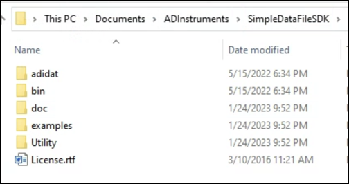

This post was motivated by a paper that was recently published with screenshots of the data captured. Screenshots! If only they used my software.

# Intro #

As a graduate student working in neuroscience I had become accustomed to working with proprietary data formats. Our lab seemed to specialize in working with lots of different companies. These companies often had no solution for working with data in MATLAB, or wrote really bad interfaces that made data analysis painfully slow. Thus I, along with a few others in my lab, often found ourselves reading the binary specification of the file formats and writing custom parsers to read files into MATLAB for analysis.

As I started my postdoc I was hoping to avoid doing anything related to parsing files. Unfortunately, life had other plans.

# LabChart #

Most of my work as a graduate student focused on multi-channel, or at the time what we called high channel count (~30 - 150), signals. In 2023 high channel count might mean thousands of signals (electrode channels); boy how things change! Transitioning to my postdoc we were only going to be recording from a handful of signals, generally 3 - 4 signals, maybe 10 at most. Rather than the more esoteric neuroscience software we had largely been using, we transitioned to a rather neat bit of software called [LabChart](https://www.adinstruments.com/products/labchart) by [ADInstruments](https://www.adinstruments.com/).

The main aspects of a LabChart file include signals and comments. Signals have a particular sampling rate, a name, and associated units. Comments are associated with a particular time and have an ID associated with them. Different periods of recording, know as blocks or records, can be created with different signals active during each period. This structure of signals, or as I refer to them, time-series signals, along with associated comments is a relatively simple and common pattern present in many data acquisition devices. I'll note this is different than my graduate school work which tended to focus on the occurence of events (neural action potentials) that occurred at specific non-regular times, or what I refer to as point-processes. I've written software to make it easier to work with time-series signals (links below).

# The Issue #

After I had collected some data with LabChart, I began looking for ways to export the data so that I could read it in MATLAB. Fortunately, there was an export to ".mat" button, which is the file format (or technically file extension, there are multiple .mat file formats) used by MATLAB. Great!

Unfortunately, the export functionality didn't work. My brain is a little fuzzy here, but I believe you could only export small sections of data; larger selections, in my case more than a minute or two (presumably sampling rate dependent), generated a corrupt .mat file. Many others may have been content to work with this limitation, but I was not.

As an aside, many of these issues I initially posted on an ADInstruments message board. At some point, like many companies, ADInstruments decided they would rather not have a forum that airs all of their dirty laundry and took the site down. I think that's unfortunate. The majority of the comments were constructive and were helpful to others encountering similar issues. I believe this to be an unfortunate trend. Fortunately there are some companies that still allow offering feedback and asking for help. One such notable example is [Zotero](https://forums.zotero.org/).

# The Solution #

I believe in this instance someone on the forum pointed me to the ADInstruments SDK. A SDK or "Software Development Kit" is code or a development environment that you can download that allows you to work with a product. It is similar to an API or "Application Programming Interface", however APIs tend not to involve downloading anything, rather they tend to specify how you should communicate with a remote interface, with the calls you should make to a website to get specific information.

Generally one of the most difficult steps when implementing code is to figure out how to even get started. In this case, installation of the main LabChart program includes an "extras" folder which includes 4 installers, two for the C SDK, and two for the COM SDK, with 32 and 64 bit versions for both. 


Installing one of these installers creates a new set of files in your Windows' "Documents" folder. I'll note at this time all of this is Windows only (something I discuss more later on).



This directory contains everything needed to create programs that can read LabChart files, including relevant header files, dynamic library files, and even SDK documentation. 

As I am pretty terrible at C++ I decided to try the C SDK, rather than the COM SDK. 

The main interface relies on a C [mex](https://www.mathworks.com/help/matlab/call-mex-file-functions.html) file that I wrote, which makes calls to the ADInstruments library, and then passes the result to the user in MATLAB. The path to the mex file in my repo is:

&lt;repo\_root&gt;/+adi/private/sdk_mex.cpp

The code itself is fairly simple, and is probably a good starting point for those just learning how to do this work. That being said, there may be better ways of doing this (discussed below). Here's a snippet of the code. The basic idea is we pass in a numeric function option, and based on that value we call different functions of the SDK library interface (ADInstruments functions). For mex, the number of inputs to the function call can be variable. Based on the function call we interpret the inputs to the mex call differently. For example, if requesting the number of ticks (number of samples of fastest channel) in a record, the 3rd input after the function option and the file handle is the record we wish to know about (starting and stopping recordings creates new blocks).


Most of the calls are fairly straightforward, with the exception of object pointers. For example, when working with a file, the first step is to open the file. This returns a file pointer. All subsequent calls working with the file need this pointer. On 64 bit systems we basically need to store a 64 bit number. This value is passed to MATLAB and passed back to the C code on subsequent function calls. So far this is relatively straightforward. Back in the day when you wanted to support either 32 bit or 64 bit numbers you had to do a bit more work to allow for either pointer size. The "tricky" part is that when you are done with a file the final step should be to close the file. In some cases if this is not done (not sure about this case), the main library knows that the file is open and in use and refuses to let other programs (and possibly calls from the same program) work with the file (note, this may be wrong, I am not an expert here). Additionally, closing a file allows any internal resources to be cleared so that repeated used of the library doesn't build up a large chunk of unused memory from non-closed files. 

Many many years ago reliably closing unused pointers was a bit more difficult in MATLAB. However, since the introduction of object-oriented programming in MATLAB in [2008](https://www.mathworks.com/company/newsletters/articles/inside-matlab-objects-in-r2008a.html), you can create an object, more specifically a "handle" object that when no longer used, or when explicitly cleared/deleted, MATLAB will automatically call the object's delete() method if one is present. In the delete method then you can simply call the C code to close the file handle. Below is the relevant code:


# Concluding Thoughts and Outstanding Issues #

That's basically all there is too it. I am skipping over some of the mex details, but hopefully this gives a suficient high level overview of the work involved.

As noted above, the SDK only provides access to library files on Windows. I've asked ADInstruments about providing support for Mac and Linux and they have indicated that it won't happen. My impression is that this was a quick project implemented a long time ago; if someone finds the SDK useful, great, if not, oh well.

The fact that it is Windows only does not in any way limit this solution to MATLAB. A few years ago I was approached by someone in my postdoc lab asking if there was a Python implementation of my code. There was not, but after a day's worth of work, [there was](https://github.com/JimHokanson/adinstruments_sdk_python). The Python version is fairly basic but it works. For Python the wrapper approach was much easier, and used something called CFFI or [C Foreign Function Interface](https://cffi.readthedocs.io/en/latest/) which uses C-header files to generate code that allows Python to call the functions directly. If this were MATLAB, this would mean I could call the ADInstruments functions directly from MATLAB, without first calling the mex file. 

MATLAB actually has something similar [loadlibrary](https://www.mathworks.com/help/matlab/matlab_external/calling-functions-in-shared-libraries.html). I used it a long time ago with some luck, but seem to remember it being finicky. That was 15+ years ago and it is possible that the system has improved since then and that my mex code is no longer needed. That being said, if a system is working, don't mess with it! As a reminder, all of this is an aside from actually conducting science! My hope is that my effort means many tens if not hundreds or thousands of people are slightly more productive at there work. This code has been downloaded from the [MATLAB file exchange](https://www.mathworks.com/matlabcentral/fileexchange/50520-adinstruments-labchart-sdk) 1800+ times since the writing of this code, and who nows how many times from GitHub which is where ADInstruments themselves [recommends people go](https://www.adinstruments.com/support/knowledge-base/can-i-read-raw-data-recorded-labchart-data-files-another-companys-software). Honestly, this job is mostly thankless but I get a bit of a kick out of ADInstruments pointing people my way. Here's a screenshot in case that page ever goes dark, although I also just asked the [Wayback Machine](https://archive.org/web/) to archive it.


In 2019 MATLAB introduced an [analog to loadlibrary() for C++](https://blogs.mathworks.com/developer/2019/07/11/cpp-interface/). I haven't used it yet but it may be useful for working with the COM interface. My memory is a bit foggy here but I think even though the C SDK advertises working with comments, it doesn't actually work. Either that or you can't move comments, only create new ones. Either way, my impression is that the COM SDK would allow moving comments. We have a pipeline that involves extracting specific types of comments to define different aspects of a trial. For example, [the pump interface that I wrote](https://github.com/JimHokanson/harvard_apparatus_pump_matlab), that I'll eventually blog about, is wrapped by a program that also adds comments into the LabChart file when the pump starts and stops, and includes the pump rate and total volume pumped. These comments are then automatically extracted, using this code, into a "meta data" table that describes important characteristics of our trials. That way when loading our data into MATLAB it is trivial to load the signal of interest during the time we were pumping (all of this I'd like to blog about at some point as well). Anyway, some events are manual such as when the trial officially ended. If this event is missing (weren't added manually during the experiment), we go into the LabChart file and manually add the event at the correct time. Note, to be specific, in this case I am talking about adding a "comment" that has the string "trial ended." Anyway, this process is a bit annoying, particularly as navigation across the LabChart file is a bit slow. With the COM interface it should be possible to do all the comment moving, adding, or editing, all within MATLAB.

In discussion with ADInstruments reps, they were aware that the performance of scrolling (to review data, not to collect it) within LabChart was not exactly great. A few years later they introduced [LabChart Lightning](https://www.adinstruments.com/products/labchart/lightning). I have not personally used LabChart Lightning, although I am assuming the scrolling performance when reviewing data is better. This upgrading by replacing is interesting to me; I'm not sure if there is a name for it (maybe planned obsolescence?). I recently found out that THE major supplier of urology diagnostic testing equipment (specifically urodynamics), a company called Laborie, created a new system, that in my impression is not backwards compatible with the old system. My impression is that this has two benefits ... for the company. First, it is an opportunity to shed old baggage, starting fresh rather than needing to know the particulars of the old system. Second, presumably it is an opportunity to convince people that they need to upgrade rather than simply keep or fix their current system. Unfortunately this often means more work developing software to work with the new file types.

I actually rarely work directly with my ADInstruments code. Instead, I have code that wraps my code and provides additional functionality. Much of this is specific to my work, and thus does not belong in my ADInstruments repository. However some of it is a bit generic and should probably be moved into the ADInstruments repository. Two "features" in particular come to mind. First, by default when an object is displayed in MATLAB, which in this case might be a file, record, or channel, the properties are displayed. I find this to be super helpful for understanding objects and is something I have actually replicated in Python (another potential blog post). However, the methods are not displayed, and require extra work by the code developer to display information on the available methods. As most people that work with MATLAB are not familiar with object-oriented programming, I think automatically displaying help on the classes methods would be helpful.

TODO: screenshot

Second, it makes sense to create some very basic plotting functions where you specify the channels of interest and a time range and it plots the resulting data. This is presumably a very common operation that would be nice to include as part of the code. In fact, it was this lack of easy plotting that initially prompted this post. More specifically, it is relatively common for people to post ... screenshots of captured data. Screenshots! Sorry, I'm a bit of a figure snob. By default LabChart has a bluish-greenish gridding to the charts, which makes it pretty clear when someone has taken a screenshot of data captured in LabChart. Now technically you can turn this gridding off before taking a screenshot, but ideally someone could simply download this software and run a line or two that would generate a nice plot that was customizable and could be exported as vector graphics for further potentail touchup (color changing, aspect ratio changing, overlaying of multiple signals, etc.).  

The following is the screenshot that motivated this posting. There is more to this figure but I'm trying to only show a part of it since I'm claiming fair use here in reproducing it. The image is from [this paper](https://onlinelibrary.wiley.com/doi/abs/10.1002/nau.25127), see reference below. Notice that the blurriness is a result of the screenshot.


Ideally one day this could simply be generated using the following call in MATLAB (or Python):

```
file_path = 'my_file_path';
file = adi.readFile(file_path)
record = 3;
time_range = [100 200]
channels = {'Pves'}
h = file.plot(record,time_range,channels)
```

Perhaps one day an enterprising student in my lab will write that code ;) ....

**Figure reference:**
Son, H. S., Moon, S. Y., Kwon, J. & Kim, J. H. Effect of β3‐adrenoceptor agonist on the micromotion of bilateral major pelvic ganglion‐excised rat bladder. Neurourology and Urodynamics nau.25127 (2023) doi:10.1002/nau.25127.

# Other Links #

Labchart Server
MATLAB standard library
Plotting - blog posts and code


