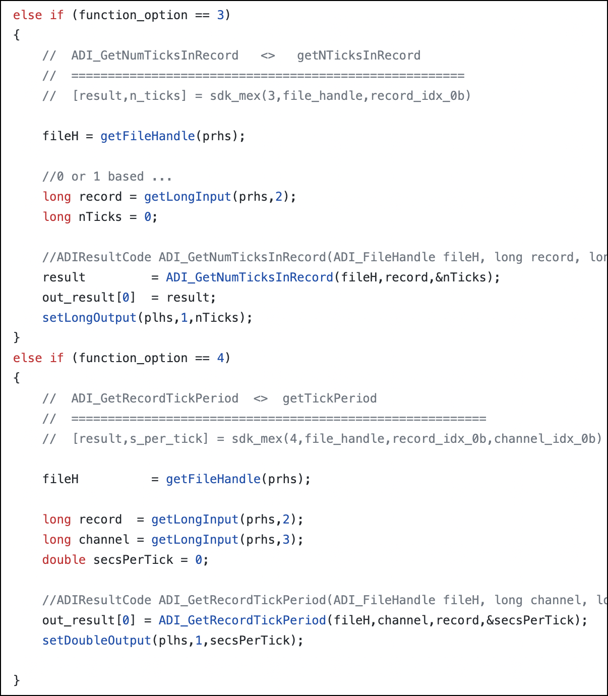

This post was motivated by a paper that was recently published with screenshots of the data captured. Screenshots! If only they used my software.

# Intro #

As a graduate student working in neuroscience I had become accustomed to working with proprietary data formats. Our lab seemed to specialize in working with lots of different companies. These companies often had no solution for working with data in MATLAB, or wrote really bad interfaces that made data analysis painfully slow. Thus I, along with a few others in my lab, often found ourselves reading the binary specification of the file formats and writing custom parsers to read files into MATLAB for analysis.

As I started my postdoc I was hoping to avoid doing anything related to parsing files. Unfortunately, life had other plans.

# LabChart #

Most of my work as a graduate student focused on multi-channel, or at the time what we called high channel count (~30 - 150), signals. Now high channel count might mean thousands of signals (electrode channels). Transitioning to my postdoc we were only going to be recording from a handful of signals, generally 3 - 4 signals, maybe 10 at most. Rather than the more esoteric neuroscience software we had largely been using, we transitioned to a rather neat bit of software called [LabChart](https://www.adinstruments.com/products/labchart) by [ADInstruments](https://www.adinstruments.com/).

The main aspects of a LabChart file include signals and comments. Signals have a particular sampling rate, a name, and associated units. Comments are associated with a particular time and have an ID associated with them. Different periods of recording, know as blocks or records, can be created with different signals active during each period. This structure of signals, or as I refer to them, time-series signals, along with associated comments is a relatively simple and common pattern present in many data acquisition devices. I'll note this is different than my graduate school work which tended to focus on the occurence of events (neural action potentials) that occurred at specific non-regular times, or what I refer to as point-processes. I've written software to make it easier to work with time-series signals (links below).

# The Issue #

After I had collected some data with LabChart, I began looking for ways to export the data so that I could read it in MATLAB. Fortunately, there was an export to ".mat" button, which is the file format (or technically file extension, there are multiple .mat file formats) used by MATLAB. Great!

Unfortunately, the export functionality didn't work. My brain is a little fuzzy here, but I believe you could only export small sections of data, with larger selections, in my case more than a minute or two (presumably sampling rate dependent), generating a corrupt .mat file. Many others may have been content to work with this limitation, but I was not.

As an aside, many of these issues were initially posted on an ADInstruments message board. At some point, like many companies, ADInstruments decided they would rather not have a forum that airs all of their dirty laundry and took the site down. I think that's unfortunate. The majority of the comments were constructive and genuinely offered help. I believe this to be an unfortunate trend. Fortunately there are some companies that still allow offering feedback and asking for help. One such notable example is [Zotero](https://forums.zotero.org/).

# The Solution #

I believe in this instance someone on the forum pointed me to the ADInstruments SDK. Generally one of the most difficult steps when implementing code is to figure out the general approach. In this case, installation of LabChart includes an "extras" folder which includes 4 installers, two for the C SDK, and two for the COM SDK, with 32 and 64 bit versions for both. 

Installing one of these installers creates a new set of files in your "Documents" folder. I'll note at this time all of this is Windows only (something I discuss more later on).

This directory contains everything needed to create programs that can read LabChart files, including relevant header files, dynamic library files, and even SDK documentation. 

As I am pretty terrible at C++ I decided to try the C SDK, rather than the COM SDK. 

The main interface relies on a C [mex] file that I wrote, which makes calls to the ADInstruments library, and then passes the result to the user in MATLAB. The path to the mex file is:

&lt;repo\_root&gt;/+adi/private/sdk_mex.cpp

The code itself is fairly simple, and is probably a good starting point for those just learning how to do this work. That being said, there may be better ways of doing this (discussed below). Here's a snippet of the code. The basic idea is we pass in a numeric function option, and based on that value we call different functions. For mex, the number of inputs to the function call can be variable. Based on the function call we interpret the inputs to the mex call differently. For example, if requesting the number of ticks (samples of fastest channel) in a record, the 3rd input after the function option and the file handle is the record we wish to know about.

- file handle

# Outstanding Issues #

- methods display
- adding comments
- LabChart Lightning
- plotting

- screenshots aren't even necessary