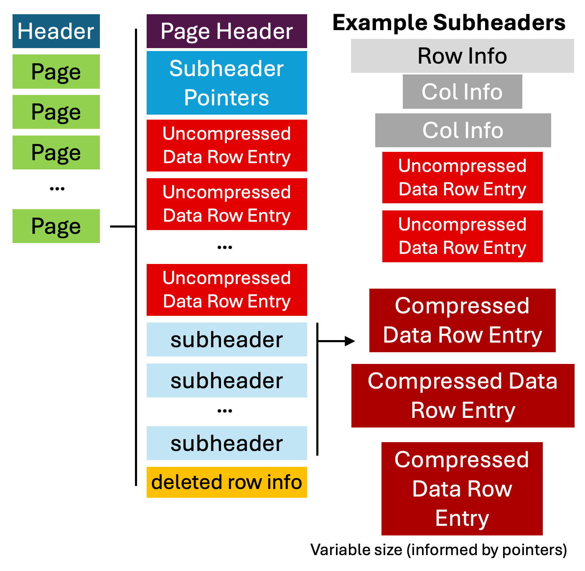

# Writing a SAS Data Parser in MATLAB #

In the following blog post I will describe my thoughts related to writing MATLAB code that can load SAS binary data files, i.e., those with the ".sas7bdat" extension.

Part of this is self-documentation of my endeavors. However I also found the whole experience quite interesting as unlike many other file formats I work with, the SAS format is quite popular and is "supported" by some quite popular packages (Pandas for Python, Haven for R). It was interesting to see the chaotic mess that is supporting a non-documented file format. Thoughts on partaking in this "experience" are shared below, along with some details on the parser itself.

# Introduction #

I'm currently working on a project that involves something called a data coordinating center or DCC. The DCC is a group of people that help aggregate data from multiple testing sites and, at least in our case, provides statistical assistance on projects. 

As part of a project I'm working on I asked to see some of the files the DCC was working with. Being (good?, true?) statisticians they sent me some data as SAS binary data files in the .sas7bdat format. They asked me whether I would prefer it if they exported the data as CSV files instead. Trying to get the data quickly, and figuring I could get any code to work ;) I declined their offer to export the files. One relatively quick "data use agreement" later I was logging onto a SharePoint server to download my data.

I was hoping that the [Mathworks File Exchange](https://www.mathworks.com/matlabcentral/fileexchange/) would have a solution for loading these files into MATLAB. Unfortunately that was not the case. The only thing I could find was [this code](https://www.mathworks.com/matlabcentral/fileexchange/15835-import-data-from-sas) which uses ActiveX to load the SAS file into Excel, saves the resulting Excel file, and then uses standard MATLAB functionality to load the Excel file; not ideal. (Update) Actually it appears that code doesn't really work, and instead the author recommends installing MySQL as a bridge for MATLAB, [eeeek](https://www.mathworks.com/matlabcentral/fileexchange/13069-the-twain-shall-meet-facilitating-data-exchange-between-sas-and-matlab) (although props to the author for the workaround). A similar search of GitHub, which I often search in addition to the File Exchange, failed to find any results.

Recently MATLAB has been strengthening its ability to interface with Python. I figured perhaps I would try loading my file in Python. If that worked I would then write a wrapper to load the file in MATLAB, by calling Python. Note that unlike the Excel approach above MATLAB has a way of sharing memory (transferring memory?) between Python, as opposed to writing and reading a file from disk. 

A quick Google search suggested that Pandas, the "default" table loader in Python, supported reading SAS files. I pointed Pandas at my file (maybe 1 GB in size?) and ... waited. After maybe 30 seconds I quit the process. After looking at the Pandas SAS code that looked functional but not exactly designed for performance, I decided that maybe I wanted to spend some of my free time [shaving yet another Yak](https://seths.blog/2005/03/dont_shave_that/), or in this case, writing yet another MATLAB parser. 

Keep in mind, the CSV exporting from the DCC was still an option, but how hard could this be ....

# The Unlikely(?) Hero #

At this point I Googled "sas7bdat file format", hoping (praying) that the file format was documented. To my disappointment it quickly became clear that SAS had not released any documentation on the file format. Fortunately after a bit more searching I found a R "Vignette" by one Matthew S. Shotwell, PhD, documenting the format.

It is impossible to describe adequately the excitement, surprise, and awe reading through his document. I've reverse engineered a decent number of file formats and with the exception of one a [long time ago](https://github.com/NeuralDataFormats/matlab_xltek_epworks_parser) (possibly my first) , I've refrained from posting details online. Yet here was this document with extremely useful details for creating a parser just shared online like it was no big deal.

Here's the opening text. 

<blockquote>
The SAS7BDAT file is a binary database storage file. At the time of this writing, no description of the SAS7BDAT file format was publicly available. Hence, users who wish to read and manipulate these files were required to obtain a license for the SAS software, or third party software with support for SAS7BDAT files. The purpose of this document is to promote interoperability between SAS and other popular statistical software packages,
especially R (http://www.r-project.org/).

The information below was deduced by examining the contents of many SAS7BDAT databases downloaded freely from internet resources (see data/sas7bdat.sources.RData). No guarantee is made regarding its accuracy. No SAS software, nor any other software requiring the purchase of a license was used.
</blockquote>

Beautiful!!!!

I emailed Matt to see if his code had any new updates that he hadn't shared yet, as the majority of [his code](https://github.com/BioStatMatt/sas7bdat) was posted 10+ years ago. He responded fairly quickly indicating that he did not, and that efforts to improve the parser had largely moved elsewhere. I'll be describing some of these efforts below, but it is important to make clear that most, if not all, of the other parsers are based on, and presumably benefited tremendously from, Matt's work. Thank you Matt!!!

# Scattered Ecosystem #

As I indicated above, this is the first project I've ever worked on where people were publicly posting their efforts to reverse engineer a well known file format.

What was surprising, and also frustrating, was that despite the numerous SAS parsers that now exist, most of which were based on Matt's work, none seemed to have invested effort in creating and updating a centralized repository documenting the file format. For me this meant reading through the code for multiple parsers, rather than being able to go to one central location for all the necessary information.

Another issue I found frustrating was simply software discovery. In 2024 it remains challenging to find "the right" software. For example, Pandas is NOT the right way to load SAS files in Python. Instead, you would be better off in many cases (but maybe not all?), using [pyreadstat](https://github.com/Roche/pyreadstat) or perhaps [sas7bdat](https://github.com/jonashaag/sas7bdat); I don't know! The pyreadstat code is distributed by [Roche](https://www.roche.com/), a major multinational company in the healthcare space. It is wild to me to see a company posting code that involves reverse engineering a proprietary file format from another major company.

For what it is worth I think the most "correct" parser is called [Parso](https://github.com/epam/parso). Unfortunately the code is written in Java, and many languages (Python, MATLAB, R, etc.) have a pretty significant performance penalty when calling, or in particular sharing data with, Java based code. I'll note I may be missing better parsers since again, software discovery is still quite difficult.

# Differences in functionality #

The following is my attempt to briefly document major differences in functionality. It is important to note that these SAS files are basically data tables, i.e., a big spreadsheet with column names and rows of values.

A lot of differences in functionality between programs involve parsing quality. In particular there are many differences in terms of support for:

- binary compressed data
- different date, time, and datetime formats
- different string encodings
- hiding entries (rows) that have been "deleted" but are still in the file

Most of these issues arise because they were not covered in Matt's documentation and no one bothered to pass that information back to him when they figured it out. The middle two are a bit more complicated because of the large variety of options available. As an example, one column I loaded had the datetime format of "MINGUO" which is a Taiwanese datetime format. I hadn't added support for that format yet. It took only a few minutes to add support but without a comprehensive list often you add new entries as they come up in new files. Other than perhaps the Parso SAS parser I haven't seen any systematic effort to generate different test files that support all of the possible column formats. Even Parso may be incomplete; it is tough to tell as they don't exactly discuss how they made their parser and what the test files are doing.

The second big issue, besides parser accuracy, is the interface. Big issues here include support, or lack there of, for:

- accessing column labels (descriptions)
- filtering for specific values (e.g., all rows where name=="Jim")
- reading only certain rows (e.g., rows 100 to 200)
- including or excluding specific columns

Most parsers appeared to be pretty bad in this area. That being said, I'm sure many of the people writing the parsers felt like they were doing a good job just loading the file and figured at least now the user could do most of these things in post processing. I know I would generally feel that way. Unfortunately now I had GB sized files so all of a sudden I found myself a bit more interested in supporting being able to load only a part of the file. 

# Performance #

## Intro ##

Earlier I mentioned that part of the impetus for creating a MATLAB parser was the extremely slow performance of the Pandas parser. I previously created a JSON parser where I tried really hard to get [good performance](https://jimhokanson.com/blog/2018/2018_08_Turtle_JSON_speed/). Here my goal was simply to get decent performance. This turned out to be pretty easy (or so I thought, see below).

**The following was written before I had completely implemented my parser. I'm keeping it for now but I'll specify an additional issue that can be a HUGE time sink**

## Old Thoughts ##

From what I can tell there are three areas where performance can be improved. First, in many cases the binary data are stored raw and loading the data can be really fast. However in some cases the data are stored in a compressed format. The decompression code has a lot of branching and logic that does not work well for interpreted code. I've borrowed readstat's c-code for one of the two decompression algorithms. The other one is a little bit less computationally intensive and I haven't translated it yet.

Second, and the most important (I think), is that unlike other parsers, I parse multiple rows at a time. To facilitate row lookups the data are stored by row rather than by column. Thus reading a single row involves reading one contiguous set of bytes. Most parsers I've seen will convert each row's data into interpreted data and then store the result in an output buffer. This process is repeated for all rows. The interpretation bit has a bit of overhead, and the cost is incurred once per row. In contrast, I take the row data and concatenate it together. When ready to return the final interpreted data to the user I then grab the relevant data per column and convert it. This approach takes a bit more memory but reduces the overhead on the conversion.

Third has to do with memory layout. **This issue is a bit technical and can be skipped as it is largely a note to self and is almost certainly a bit painful to read** This issue arises because we are storing the row data and then converting it later. When reading and writing data it is best to store data continuously in memory. For a matrix in MATLAB this means reading and writing data in columns, rather than rows, as MATLAB stores data in [column-major order](https://en.wikipedia.org/wiki/Row-_and_column-major_order). 

When extracting a row's bytes, it is quickest to store those bytes in memory as a single column. Unfortunately with this approach, when we go to parse a column of data, an individual column's data are stored across columns of our matrix (whereas ideally they would all be in one column of the matrix). 

Alternatively we could store the bytes of a row across columns, which incurs two penalties. The first is in storing the column. The second is in converting the raw bytes to data, as consecutive bytes for a single value are actually stored across columns (see below). 

I had hoped to find some optimal layout but it is not clear to me that one exists. 

**Storing a row's bytes as a column. This is the approach I am currently using**
```
%DEFINITIONS:
%a,b,c - column names
%1,2,3 - row #
% repeats a1,a1,a1 -> bytes that together form the final value after type-casting
% e.g. for a full double, you would typically expect 8 bytes

%Matrix:
a1 a2 a3
a1 a2 a3
a1 a2 a3
b1 b2 b3
b1 b2 b3
c1 c2 c3
```

**Storing a data-row across columns**
```
%Note, storage may be slow
%Grabbing bytes for converting a column (a,b,c) may be faster

%Matrix
a1 a1 a1 b1 b1 c1
a2 a2 a2 b2 b2 c2
a3 a3 a3 b3 b3 c3
```

## New thoughts - Strings! ##

During testing of the one of the files below, my MATLAB code was running quite slowly. Fortunately the code had run fast before, which indicated to me that a recent change had significantly slowed down the code. The change involved taking the raw bytes and converting them to strings.

"Back in the day" we used to represent all strings using one byte per character. However, this became problematic as we wanted to be able to represent all different sorts of languages without having to rely on a secondary piece of information specifying the particular character set we were working with. Internally MATLAB stores strings using UTF-16, which is often (but not always) 2 bytes per character. We thus need to run a conversion function that converts from how the bytes are stored in the file to UTF-16.

More on character encoding can be found here: [https://en.wikipedia.org/wiki/Character_encoding](https://en.wikipedia.org/wiki/Character_encoding)

MATLAB has a function called *native2unicode()* which takes in raw bytes and converts them to UTF-16. You need to specify the encoding used in the file, which in this case is stored as a property of the binary SAS file. Alternatively, you can simply ignore the encoding, and convert the bytes to strings. However, this has the potential of returning incorrect characters. This latter approach was what I was using as a temporary hack. It also led to decent, albeit potentially incorrect, performance.

MATLAB's *native2unicode()* function only accepts a 1-d vector of characters. This makes some sense as for some encodings a variable number of bytes becomes a character. This means that for any given set of bytes, for some encodings, you don't know the final length of the string, as the first character may be only byte and the next character may require 3 bytes. This means that to convert a matrix of bytes, where each row (or column) represents data for a different string (i.e., a new row/entry in our table), you need to loop through the entries and convert them, one at a time, from raw bytes to a string.
 
Thus, the old code looked something like this (with no encoding support and thus likely incorrect characters in the output):
```
column_data = string(char(column_bytes));
```

The new, more correct, and slower code looked something like this:
```
column_data = cell(n_rows,1);
for i = 1:n_rows
column_data{i} = native2unicode(column_bytes(i,:),encoding_format);
end
column_data = string(column_data);

%I might have initialized and set strings rather than working 
%with a cell array and converting to a string later

```

It turns out this looping behavior made parsing my test file go from roughly 10s to roughly 50s.

So, how do we "fix" this and get faster speed AND correct behavior. Unfortunately, for variable length encodings (e.g., UTF-8) this would be a lot of effort. Fortunately, many of the files I'm working with are not variable length, and thus for a given input byte there is only one valid output byte. Note this is not the case for variable length encoding where we need to worry about the preceding bytes to determine the meaning of the current "input" byte.

Thus as a workaround we will first check if we are using a simple 1-to-1 mapping (based on the encoding). If we are, we can then use a lookup table. For simplicity we create the lookup table on the fly. Here's the code:

```
if encoding_format == "format_of_interest"

	%Creation of the lookup table "char_map"
	%This is pretty quick since we are only processing 255 entries
	bytes = uint8(1:255);

    temp = native2unicode(bytes,encoding);
    char_map = uint16(temp);

	%Execution of the lookup table
	%Convert each input byte to a fix output byte
    fixed_bytes = char_map(column_data_bytes);

	%A bit extra to convert the resulting matrix to strings
    values = string(char(fixed_bytes'));
else
    %use the slow approach abovew ith native2unicode
end    
```

Using this approach the parsing time is back down around 10s (for my test file) AND is always correct for all files (although it may be slower than necessary for formats that I haven't done the mapping for -- which is fixable but just takes some effort). Note to this has only been implemented for 1-byte character maps.

This whole process is good, but can we get faster than 10s for our large file? Ideally we would be loading a 1 GB file in under 1 second.

In looking into this I re-discovered a pain point in trying to parse files quickly, that is **string allocation.** Creating the string arrays takes a large portion (50-60%?) of that 10s parsing time. The reason the process is so slow is not because of some computational complexity, it is because of memory management. Put another way, MATLAB, and I assume most languages, allocates a specific chunk of memory for each string. Thus for an array of strings, each string has its own specific memory allocation. This is different than a numeric matrix which is one single chunk of memory. The overhead of memory allocation per string is not huge, but when you have 20 million strings per column with multiple columns, this adds up. Above I mentioned briefly that I wrote a fast JSON parser. For that pareser it was memory allocation, particularly for strings, that really slowed things down. In theory it would be possible to write a string array data type that stores all of the strings in one big chunk of memory, but I doubt MATLAB is ever going to implement. 

So in summary the biggest pain points are in converting bytes to characters/strings (which I improved, somewhat), and in memory allocation for strings (which I guess is just good to be aware of). I'll note one of the columns in the test file is essentially a subject ID number that if stored as a number (and not a string) would meaningfully reduce the loading time -- i.e., sometimes you can speed up loading by using alternate formats when saving a file. 

## Performance Numbers ##


To get a rough idea of performance I tested three files using three parsers. The parsers included:
1. my code
2. Pandas (Python) - called via MATLAB
3. Parso (Java) - called via MATLAB 

The three files tested are:
1. "fts0003.sas7bdat" - a compressed file with many columns (3342) and 10275 rows
2. "numeric_1000000_2.sas7bdat" - two columns of numeric data with 1 million rows
3. "m_a_calories.sas7bdat" - Unfortunately this one is not public but it is a roughly 1 GB file that describes the # of calories estimated to be used throughout periods of the day. It consists of 20 million rows and 5 columns, where two columns are short strings (~5-7 characters), 2 columns are numeric, and 1 is a date-time format (also a number internally).

Performance on file "fts0003.sas7bdat":
- MATLAB: 2.66 s total
- Parso: 22 s parsing, 101 s total
- Pandas: 1.84 s parsing, 4.94 s total

Performance on file 2 "numeric_1000000_2.sas7bdat":
- MATLAB: 0.058s total
- Parso: 7.1 s total
- Pandas: 0.087s total

Performance on file 3 "m_a_calories.sas7bdat":
- MATLAB: 10s total
- Parso: After 3 minutes I got an out of memory error in Java. The memory error is fixable but as the parse error occurred while still parsing the file, and not in the extremely slow part of converting Java entries to MATLAB data types, we're looking at a total parse time of north of 10 minutes (very rough estimate)
- Pandas: After 32 minutes I quit the process

When writing this MATLAB released a new version, 2024a. As part of this release MATLAB now supports converting from a Pandas dataframe to a MATLAB table. In the above testing I wrote a function that does this, which is definitely suboptimal. 

On a different computer I got the following times for the 3rd file (with 2024a):
- MATLAB - 20 s total
- Pandas - 140 s total

Note the MATLAB time is a bit slower, likely due to slower memory on that computer. 2024a seemed to help but converting from Pandas is still much slower.


# File Structure #

Below is a rough outline of the file layout/structure.



I had intended on documenting this in more detail but at this point I've run out of steam. There are a couple of things that are noteworthy about this structure. First, important properties of the file, such as most of the column details (names, labels, etc.) are stored as "subheaders" on pages, rather than in the main file header. This means that as you are parsing "data" you might encounter general file processing instructions. Another unexpected formatting issue that I ran into involves uncompressed data. Often the uncompressed data rxows are stored in one contiguous spot on the page, separate from the subheaders. However in certain circumstances these uncompressed data rows are stored in the subheaders along with compressed data.

At some point I would love to contribute back to the official documentation but at this point I'm exhausted :/

# Shared files #

To test the parser I downloaded as many example SAS files as I could get my hands on. I put these files [here](https://github.com/JimHokanson/example_sas_data_files).

If this was something I was doing professionally I would put a bit more effort into organizing these files and describing their properties. Although again I've largely run out of steam on this project. 

# Final Thoughts #

It is nice to now have this code working in MATLAB. Parsing CSV files can have its own pains, particularly for large files. Looking back it is not clear whether or not asking the DCC for CSV files would have been the better approach. It may have been as even with the SAS files the first thing I did was divide it up into chunks, by subject ID, and store those using MATLAB's MAT format.

I am a bit disappointed with myself for not more fully documenting the file format and updating the online documentation. I had also envisioned myself doing a quick scan of the more commonly used libraries out there which currently have bugs and providing some feedback on how to fix their code. At this point though I need to move on, especially as my job rewards my code development efforts somewhere between the amounts of 0 and not-at-all. For reference, largely to myself, these coding efforts were largely conducted after work hours (which for me lately has also been work hours) and took probably about 60 - 80 hours (very rough guess) to implement over the course of 4 months.

# Appendix: Stepping Through Code #

IntelliJ IDEA turned out to be quite useful for stepping through Parso code to understand it. In particular, IDEA supports debugging libraries that are not a part of your local code. I took photos [in the blog repo](https://github.com/JimHokanson/blog/tree/master/blog/2024/2024_05__sas_reader_matlab) on how this was setup. I've also included a bare bones wrapper below.

```java

import com.epam.parso.impl.SasFileReaderImpl;

import java.io.FileInputStream;
import java.io.FileNotFoundException;
import java.io.InputStream;

public class Main {
    public static void main(String[] args) throws Exception {
        try {
            InputStream input = new FileInputStream("/Users/jim/Documents/repos/matlab/example_sas_data_files/data_files/q_del_pandas.sas7bdat");

            com.epam.parso.SasFileReader sasFileReader = new SasFileReaderImpl(input);

            Object[][] result = sasFileReader.readAll();

            System.out.println("Hello Eclipse!");

            input.close();

        } catch (FileNotFoundException e) {
            // TODO Auto-generated catch block
            e.printStackTrace();
        }
    }
}
```


