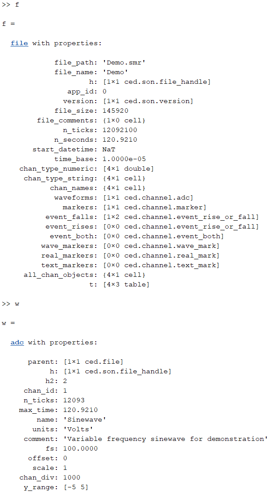
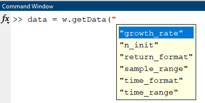
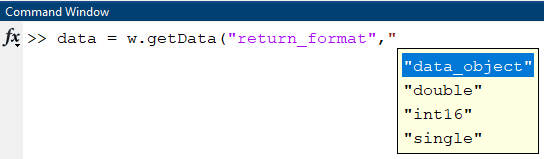

# MATLAB Spike2 Support #

This past summer I had the good fortune to have Dr. Aaron Mickle move his lab from U. Florida to the Medical College of Wisconsin (MCW). Like me, Aaron does bladder research. Aaron brings much needed expertise in biological methods (read: Jim and histology are not friends). I could go on and on about how great it is to have Aaron join MCW, but this post is about Spike2. Shortly after Aaron moved to MCW we started collaborating. For a lot of his physiological testing he uses [Spike2 from CED](https://ced.co.uk/products/spkovin).

I personally use [LabChart from ADInstruments](https://www.adinstruments.com/products/labchart) and have a lot of our analysis pipeline setup for working with LabChart files. In addition, although I'm sure exporting in Spike2 works better than my experience many years ago with Labchart that drove [my efforts at developing a LabChart reader](https://jimhokanson.com/blog/2023/2023_02__ADInstruments_SDK/), over the years I've come to appreciate being able to load a file directly rather than constantly exporting data. Additionally, if you don't own Spike2 but want to load the files, exporting doesn't work for you. With that in mind the following are some brief notes on my development of MATLAB code to read in Spike2 files.

# Status Quo of Spike2 Loading #

Status Quo: not great.

Many years ago I started writing this code. The reason why is lost to me, perhaps as a favor for a friend?. It relied on the "SON32" library [code here](https://github.com/JimHokanson/Spike-smr-reader). My impression is that this library was written by one Malcolm Lidierth, PhD, who at some point was at King's College London although it is unclear whether he was affiliated with CED. Why this came from someone not seemingly involved with CED is unclear to me. Regardless there are two points to note. First, the original code predated MATLAB objects, which I think makes the interface tougher to use. Second, some of the code involves direct binary parsing of the file, something that could prove useful if someone wanted to write a parser that worked on all operating systems.

Most implementations of code that I've found are basically very thin wrapppers around the old SON32 and even older, SON2, libraries. One additional approach, that may be out of date, is the use of Neuroshare. Neuroshare started out in 2001 as a SBIR grant from NINDS. At the time numerous companies were starting working on their own action potential (spike) capturing systems ([TDT, Plexon, Blackrock, CED, and others](https://neuroshare.sourceforge.net/contacts.shtml)). Users were not thrilled about trying to work with all of these different file formats. Neuroshare was started to create a standard interface that would allow loading files from each of the vendors. Supposedly CED wrote code for neuroshare loading, although at this point I would be surprised if the code worked with their newer file formats. Updates to the Neuroshare website seem to have stopped in 2011, and some of the code seems to not have been updated since 2003. 

A quick Google search of how to load Spike2 files into MATLAB did not turn up much. One Reddit post recommended trying my code. Yikes!

# Rewriting my Code #

I'm not sure if what I did qualifies as "rewriting" if my original "writing" probably took only an hour or two to write. Regardless, now that I was going to be working with these files more often, I wanted to see if I code make something a bit nicer.

Fortunately [CED provides code](https://ced.co.uk/upgrades/spike2matson) that can read Spike2 files into MATLAB. From what I can tell this is essentially "SON64." Unlike the previous version, this MATLAB code wraps compiled code. This may be helpful for speed but does appear to limit usage of this code to Windows.

There are three additional downsides of this code (besides the OS limitation). **First**, the code is organized loosely as a bunch of files. I personally find it easier to work with classes and methods. **Second**, the way the code is written is not very performant (more on this later). **Third**, and related to the first point, it forces the user to think too much about how to use the code, rather than "just working." This makes it easier for the person writing the library, but harder for users. As a user of my code I want it to be easy to use, even if that means it is more work to write.

As a bit of a disclaimer, I am very thankful that CED provides the code that they do. My "criticisms" are not meant to imply that they are unable to make their code better (I'm sure they could). Rather, my goal is to highlight issues that I see as an end user and to show how I address them.

## Bunch of Functions => Classes ##

This is part of an example script from the library. It loads a channel.

```
clear;
% add path to CED code
if isempty(getenv('CEDS64ML'))
    setenv('CEDS64ML', 'E:\repos\matlab_git\matlab_spike2\ced_provided_code\CEDS64ML');
end
cedpath = getenv('CEDS64ML');
addpath(cedpath);
% load ceds64int.dll
CEDS64LoadLib( cedpath );
% Open a file
fhand1 = CEDS64Open('Demo.smr');
if (fhand1 <= 0); unloadlibrary ceds64int; return; end

[ iOk, TimeDate ] = CEDS64TimeDate( fhand1 );

% get waveform data from channel 1
[ fRead, fVals, fTime ] = CEDS64ReadWaveF( fhand1, 1, 100000, 0 );

CEDS64CloseAll();
% unload ceds64int.dll
unloadlibrary ceds64int;
```

Using this script has a lot of overhead. In addition to adding the code to the path, which could be done ahead of time, you need to load the library, check the file handle validity, and then make a strange call to CEDS64ReadWaveF(). In comparison this is my code:

```
f = ced.file('Demo.smr');
w = f.waveforms(1);
data = w.getData();
```

Assuming the code is on the path, my code takes care of loading the underlying library. Grabbing the waveform is as simple as working with the variable 'f' which is a MATLAB class that represents the Spike2 file.

Here's the format of the file and of the waveform.



What's the name of the waveform? What are the units? Here's the code:

```
w.name
w.units
```

Nice and simple.

Want to get the event times? Here's the code:

```
ev1 = f.event_falls(1);
times = ev1.getTimes();
```

Note, this type of event only has times. At some point I will probably also write a method called `getData` that will shadow `getTimes`.

## Speeding Up the Base Code ##

The following code comes from `CEDS64ReadExtMarks.m`

```
	case 8 %textmarker
		[ iOk, Rows, Cols ] = CEDS64GetExtMarkInfo( fhand, iChan );
		if ( (iOk < 0) || (Cols ~= 1) ), return; end
		StrLen = (Rows); % calculate the length of the string
		InMarker = struct(CEDMarker());
		stringptr =  blanks(StrLen+8);
		
		%	---------------------------------------------
		%**** Initialize to the maximum number possible
		%
		%	This can be very inefficient
		%---------------------------------------------------
		ExtMarkers(iN,1) = CEDTextMark();               % resize in one operation
		for n=1:iN
			if (Time >= i64To)
				break;
			end
			[ iRead, OutMarker, sText ] = calllib('ceds64int', 'S64Read1TextMark', fhand, iChan, InMarker, stringptr, Time, i64Upto, maskcode);
			if (iRead > 0)
				Count = Count + 1;
				ExtMarkers(n,1) = CEDTextMark();
				ExtMarkers(n,1).SetTime( OutMarker.m_Time );
				ExtMarkers(n,1).SetCode( 1, OutMarker.m_Code1 );
				ExtMarkers(n,1).SetCode( 2, OutMarker.m_Code2 );
				ExtMarkers(n,1).SetCode( 3, OutMarker.m_Code3 );
				ExtMarkers(n,1).SetCode( 4, OutMarker.m_Code4 );
				ExtMarkers(n,1).SetData(sText);
				Time = OutMarker.m_Time + 1;
			else
				break;
			end
		end
		if Count > 0
			%*** Trim any excess
			ExtMarkers(Count+1:end) = [];
		else
			ExtMarkers = [];
		end
```

Basically this code initializes a bunch of objects of type `CEDTextMark`. How many does it initialize? It initializes as many as the maximum amount you could want. Want all of them? Then you have two options. First, you can ask for a low number, and if you get that number of events (instead of fewer), you can ask for more, repeating this process until the library says there are no more to return. This however is inconvenient and puts the work on you, the end user, to write the code. Alternatively, you can ask for a really large number that you know will always return all of the objects. However, as the code above shows, this will initialize that number of objects, and then at the end trim down to the number used. This has significant overhead.

A second issues is that the returned data is an object type. For small pieces of data like this I find structures are much more efficient. The `SetTime`, `SetCode`, and `SetData` methods are also overkill in my opinion. Although this would be fine, I think, in something like C++, MATLAB just doesn't do that great when working with thousands of tiny objects (note it does OK, but in this case I think the overhead outweights the benefits).

To address this I rewrote all of the data retrieval methods. First, I use a memory growth strategy, where I start with a rough guess of how many objects to return. If there are more objects then I double the memory, copy over what I have so far, and keep going. There is a max parameter but it can be used as the max you want, rather than dictacting how the memory should be allocated. All of this is technically controllable by optional inputs if the user wishes, although my guess is that the defaults are fine for most users.

The second change was to use structures for the returned data. I may eventually return objects but the objects would most likely contain multiple events/times/snippets, rather than one object per.

Unfortunately I don't have a test case ready but my recollection is that this led to overall speedups of 10 - 100x, on calls that took roughly 1 s without optimization (so 10 to 100 ms after the optimization).

## Ask (For Your Data) Nicely ##

It took me a while to figure out how to interact with many of the function calls. For example, when requesting waveform data, the input time range is tick based, rather than sample based. A tick is a sample for the highest sampling rate supported in the file, so a real sample (for a channel) will often only occur once after many ticks. In other words, asking for all data between ticks 2 and 2000 may only return 1 sample, depending on the sampling rate. This seems like unecessary work for the user, although perhaps I'm missing some use case where this is advantageous.

Additionally I was surprised that there can be gaps in the data collection, and that you don't know where those gaps are until you ask for them (or how many gaps there are, if any). If you ask for 1000 samples (after converting to the appropriate number of ticks), but then you only get 5 samples back, then you know that there is at least one gap in your data (e.g., from pausing collection). You then need to ask for more data which may or may not return all of the remaining data, or may return only a subset, indicating yet another pause.

Overall these are minutae that I don't think the end user is interested in and that my code tries to hide. I'll note because of the gaps I technically return an array of structures when requesting waveform data, with one element (one structure) per continuous bit of data.

# Limitations #

I am not a Spike2 power user. There are some filtering options, related to marker codes, that I am currently probably not supporting all that well.

# Optional Arguments in MATLAB #

I tried something new when writing this library. Normally for optional inputs I create an options structure. I then replace options using the optional inputs passed into the function. For example, here's some code with this in place:

```
	in.history = {};
	in.units   = 'Unknown';
	in.channel_labels = ''; %TODO: If numeric, change to string ...
	in.events  = [];
	in.y_label = '';
	in = sl.in.processVarargin(in,varargin);
	
	%Use the 'in' structure throughout the rest of the code
```

The end result of this code is that anything passed in via `varargin` replaces the defaults in the structure called `in`. I then use this structure throughout my code. If I want a new optional input I simply initialize it above the `processVarargin()` call.

I love using this approach and shudder when I see optional inputs handled by placing or not placing parameters as the 2nd, 3rd, 4th, 5th, 6th, etc. arguments in the function. Credit to Sergey Yakovenko, Phd (now at WVU) who introduced me to this approach. 

However, one downside of this is that MATLAB doesn't know that these are optional inputs. Thus if you try to call the function, you don't get any prompting. This type of prompting can be for the name of the optional argument. Additionally, if the optional value is one of a set of strings, you can actually get MATLAB to let you select the values. To enable this behavior requires using something that is sort of new in MATLAB called the `arguments` block (introduces in version 2019b). At this point I figure it has been long enough that I can start using this feature. So now instead of the `in` structure I use the `arguments` block. This is what this looks like:

```
	function d = getData(obj,in)
	%Hiding documentation ...
	arguments
		obj ced.channel.adc
		in.n_init (1,1) {mustBeNumeric} = 1e4
		in.growth_rate (1,1) {mustBeNumeric} = 2
		in.time_range (:,:) {h__sizeCheck(in.time_range)} = []
		in.sample_range (:,:) {h__sizeCheck(in.sample_range)} = []
		in.time_format {mustBeMember(in.time_format,{'none','numeric','datetime'})} = 'numeric'
		in.return_format {mustBeMember(in.return_format,{'int16','single','double','data_object'})} = 'double'    
	end
```

This approach allows for argument validation, but again the big wins for me are: 1) prompting of parameter names and 2) prompting of parameter values (for strings).

Here are some screenshots of what this looks like in action:





To bring up the help I pressed "tab", first after the "(" character and then after the "," character.

Overall I am pretty happy with the switch. It took a while to setup but my hope is that it makes things easier for the user to use.

Note, expert users may note I am skipping over `inputParser` which I never really used as it always felt clunky.

# Some Final Notes and Thoughts #

Because of the ticks/samples discrepancy I still need to do some testing to double check that everything is being loaded properly. Also, given my lack of experience using this system, along with some of the weirder data structures, I wasn't sure how to return the data in many instances. To get around this I let the user select from a variety of options. The downfall is that this introduces multiple code pathways that need to be tested more thoroughly.

I'll note for a recent grant application I wrote a conversion function that converts from the Spike2 file to a LabChart file! It works for me, although again it is not tested all that well and may be lacking in features.

I would also like to improve the overall plotting functionality of the library. I don't intend to support much data analysis in this library. I tend to think that analysis libraries and file loading libraries should be separate, allowing each to focus on doing their thing well. I do however appreciate it if the file loading library has good plotting functionality. I recently added this to the LabChart library (something I need to blog more about). It would be great to add the plotting functionality to this library, although at this point that is very low on my priority list.

Again, many thanks to CED for providing the code that they did. I asked them I could share their code on my repository, rather than forcing users to register to download their code. They responded that it was fine, which I appreciate greatly. I also asked for some sample files for all of the channel types and they responded quite quickly with examples. Thanks CED!


